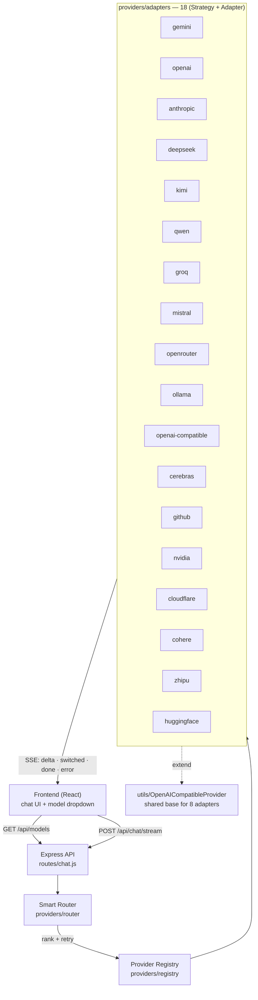
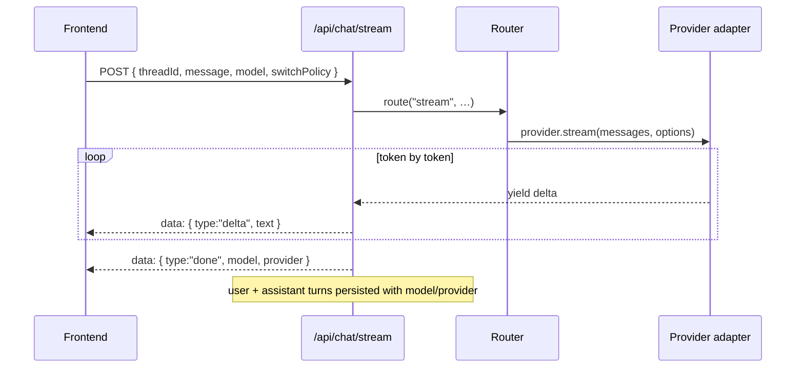
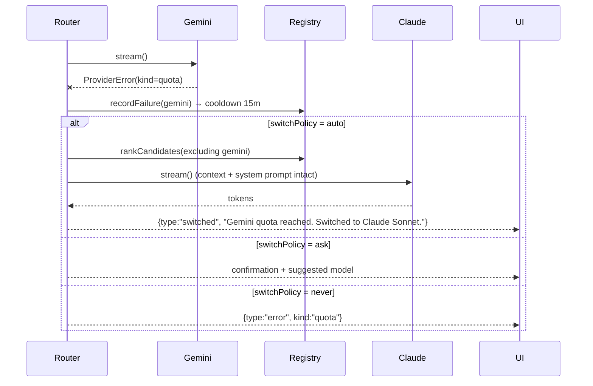
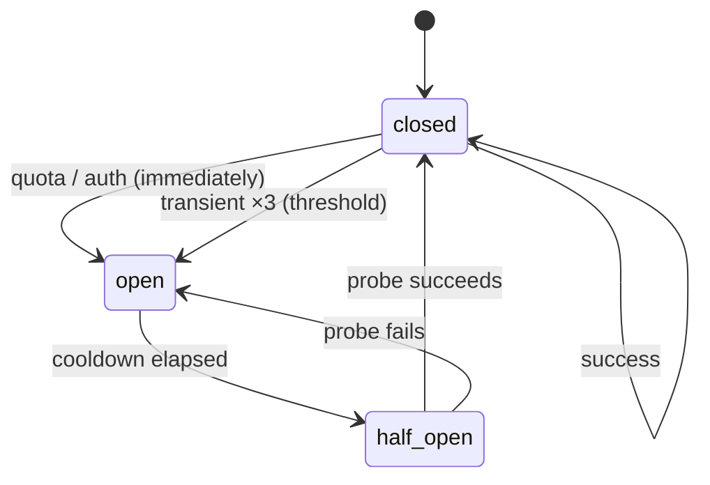

# NovaGPT — Multi-Model AI Platform

NovaGPT routes a conversation to any of a dozen model providers behind one
interface, streams the answer back, and fails over when a provider runs out of
quota or goes down — without losing the conversation. The frontend never knows
a provider-specific detail; it talks to the catalog and the router only.

---

## Architecture



Every adapter implements one contract, so the router is provider-agnostic and
a new provider is one folder.

---

## Supported providers (18)

Free-first: every provider below offers a permanently-free or free developer
tier except the three marked *paid* (they stay for users who bring their own
key). All new free providers speak the OpenAI dialect, so each is a ~15-line
adapter on `utils/OpenAICompatibleProvider.js`.

| Provider | Env key | Free tier | Notable limits |
|---|---|---|---|
| Google Gemini | `GEMINI_API_KEY` | Flash free tier | RPM/day limits on free tier |
| Groq | `GROQ_API_KEY` | Free dev tier | per-model RPM/day caps |
| Cerebras | `CEREBRAS_API_KEY` | ~1M tokens/day | model list varies over time |
| OpenRouter | `OPENROUTER_API_KEY` | `:free` models | shared free-pool rate limits |
| Ollama | `OLLAMA_BASE_URL` | Local, unlimited | your own hardware |
| GitHub Models | `GITHUB_MODELS_TOKEN` | Free (Azure-hosted) | low rate limits, eval use |
| NVIDIA NIM | `NVIDIA_API_KEY` | Free evaluation | ~40 req/min, eval only |
| Cloudflare Workers AI | `CLOUDFLARE_ACCOUNT_ID` + `CLOUDFLARE_API_TOKEN` | Free daily neurons | small context windows |
| Cohere | `COHERE_API_KEY` | Trial key | ~100 req/day, non-commercial |
| Zhipu GLM | `ZHIPU_API_KEY` | GLM-4-Flash free | non-commercial carve-out |
| Hugging Face | `HF_TOKEN` | Free serverless | cold starts, rate limits |
| Mistral | `MISTRAL_API_KEY` | Free experimental tier | La Plateforme limits |
| DeepSeek | `DEEPSEEK_API_KEY` | *paid* | — |
| OpenAI (GPT) | `OPENAI_API_KEY` | *paid* | — |
| Anthropic (Claude) | `ANTHROPIC_API_KEY` | *paid* | — |
| Kimi / Qwen | `KIMI_API_KEY` / `QWEN_API_KEY` | provider-dependent | region/limits vary |
| OpenAI-compatible | `CUSTOM_BASE_URL` | any endpoint you run | — |

> Note: free tiers commonly log prompts/responses for product improvement and
> restrict commercial use — check each provider's terms before production use.

Unconfigured providers are hidden from the UI and skipped by the router; adding
a key lights the provider up with no code change.

---

## Backend

```
Backend/
  providers/
    interfaces/Provider.js         abstract contract + error taxonomy
    registry/
      catalog.js                   model catalog (single source of truth)
      index.js                     live provider state + availability
    router/ModelRouter.js          ranking, execution, failover
    adapters/                        18 providers
      gemini/  openai/  anthropic/  deepseek/  kimi/  qwen/
      groq/  mistral/  openrouter/  ollama/  openai-compatible/
      cerebras/  github/  nvidia/  cloudflare/  cohere/  zhipu/  huggingface/
    utils/
      OpenAICompatibleProvider.js  shared base for OpenAI-dialect APIs
      reliability.js               resilientFetch · withRetry · CircuitBreaker
      env.js                       env validation + startup report
  routes/chat.js                   HTTP surface
  models/Thread.js                 threads + per-conversation settings
  test/
    providers.test.js              registry / router / failover / breaker
    integration.test.js            mocked-API: streaming / retry / quota / timeout
```

### The Provider contract

Every adapter extends `Provider` and implements:

| Method | Purpose |
|---|---|
| `generate(messages, options)` | one-shot completion |
| `stream(messages, options)` | async generator of text deltas |
| `vision(images, prompt, options)` | multimodal |
| `embeddings(inputs, options)` | vectors |
| `toolCalling(messages, tools, options)` | function calling |
| `listModels()` | models this provider can serve (live-probed, catalog fallback) |
| `health()` | liveness + latency probe |
| `supportsStreaming/Vision/Tools/Reasoning/Json/Embeddings()` | capability flags, data-driven from the catalog |

Unsupported capabilities throw `UnsupportedCapabilityError` rather than
returning empty output. Transport failures are normalised into `ProviderError`
with a `kind` of `quota · rate_limit · timeout · outage · api_error · auth` —
that taxonomy is what the router uses to decide whether failover would help.

### Add a provider (one folder)

1. Add its models to `providers/registry/catalog.js`.
2. Create `providers/adapters/<name>/index.js`. If it speaks the OpenAI dialect,
   that is the whole adapter:

   ```js
   import { OpenAICompatibleProvider } from "../../utils/OpenAICompatibleProvider.js";
   import { modelsFor } from "../../registry/catalog.js";

   export class AcmeProvider extends OpenAICompatibleProvider {
     constructor() {
       super({
         id: "acme",
         name: "Acme",
         apiKey: process.env.ACME_API_KEY,
         baseURL: "https://api.acme.ai/v1",
         models: modelsFor("acme"),
       });
     }
   }
   ```

3. Add the class to `ADAPTERS` in `providers/registry/index.js`.
4. Add brand visuals to `Frontend/src/data/providers.js`.

Providers with a bespoke API (Gemini, Anthropic) extend `Provider` directly and
implement the same surface.

### Streaming flow



### Failover flow



### Router priority

1. **User preference** — an explicitly chosen model always wins while usable.
2. **Required capabilities** — vision / tools / minimum context window.
3. **Availability** — configured and not inside a failure cooldown.
4. **Free quota** — free tiers preferred when capability-equal.
5. **Latency** — measured rolling average (falls back to catalog speed).
6. **Cost.**

### Failover

On a failover-worthy error the router retries the next-best compatible model
(up to two alternates). The conversation, system prompt, and generation
settings travel with the retry — nothing is lost.

Failover is never silent. The `switched` frame reaches the UI as a banner:

> Gemini 2.5 Flash quota reached. Switched to Llama 3.3 70B.
> **Continue · Switch back · Choose another model**

`switchPolicy` per conversation:

| Policy | Behaviour |
|---|---|
| `auto` | switch, then tell the user |
| `ask` | surface the proposal, wait for confirmation |
| `never` | show the provider error, do not switch |

Failures put a provider in cooldown (quota 15m, rate limit 60s, outage 2m,
timeout 30s) so the router stops sending traffic to a known-bad provider.

---

## Reliability (`providers/utils/reliability.js`)

One shared layer every adapter uses, so behaviour is identical across providers.

| Primitive | What it does |
|---|---|
| `resilientFetch` | timeout + external-signal cancellation + retry + error mapping — the single HTTP path for all REST adapters |
| `withRetry` | exponential backoff + full jitter; retries only transient kinds (`timeout · rate_limit · outage`); honours `Retry-After`; aborts on signal |
| `CircuitBreaker` | per-provider health gate (below) |
| graceful error mapping | HTTP status/body → `ProviderError { kind }` (`quota · rate_limit · timeout · outage · auth · api_error`) |
| request cancellation | client disconnect → `req.on("close")` → `AbortController` → router → adapter `fetch` |

### Circuit breaker



- **closed** — healthy, requests flow, `health = 1`.
- **open** — reject fast until cooldown elapses, `health = 0`; the router routes around it.
- **half-open** — one probe allowed (`health = 0.5`); success closes it.

Quota and auth open the breaker on the first failure (a retry won't help);
transient failures open it only after three in a row. The registry's
`startHealthMonitor()` re-probes non-closed providers every 60s so they
**recover automatically** once healthy again.

### Router ranking (updated)

`health → availability → free tier → latency → cost`, with a user-selected
model always winning while it stays usable. Health entering the ranking means a
degraded-but-not-yet-open provider is deprioritised before it fully fails.

### Capabilities

Adapters report capabilities honestly via `supportsStreaming()`,
`supportsVision()`, `supportsTools()`, `supportsReasoning()`, `supportsJson()`,
`supportsEmbeddings()` — all data-driven from the catalog and surfaced in
`/api/providers`. Structured output is native where the API supports it
(`response_format` for the OpenAI dialect, `responseMimeType` for Gemini) and
prompt-steered for Anthropic.

---

## HTTP surface

| Method | Route | Purpose |
|---|---|---|
| GET | `/api/thread` | list threads |
| GET | `/api/thread/:id` | messages in a thread |
| DELETE | `/api/thread/:id` | delete a thread |
| GET/PUT | `/api/thread/:id/settings` | per-conversation generation settings |
| POST | `/api/chat` | non-streaming completion |
| POST | `/api/chat/stream` | SSE stream (`delta·switched·done·error`) |
| GET | `/api/models` | catalog with live availability + latency |
| GET | `/api/providers` | registry snapshot |
| GET | `/api/providers/health` | probe every provider |

---

## Frontend

The chat is a deliberate reproduction of the ChatGPT web interface, so anyone
arriving from ChatGPT already knows how to use it. Dark theme only.

```
Frontend/src/
  context/
    ChatContext.jsx        threads, messages, catalog, settings, streaming
    ThemeContext.jsx       theme for the marketing + auth surfaces
  components/
    layout/ChatLayout.jsx  sidebar + thread + composer, responsive
    chat/
      ChatSidebar.jsx      conversation list, new chat, search, account
      ChatHeader.jsx       sidebar toggle, model dropdown, share
      ModelDropdown.jsx    the 12 models + failover preference
      ChatMessages.jsx     scroller, sticks to bottom while streaming
      MessageItem.jsx      user bubble / assistant prose + action row
      ChatInput.jsx        floating composer
      CodeBlock.jsx        language label + copy
      markdown.jsx         react-markdown overrides
    workspace/FailoverNotice.jsx   switch + error banner with actions
  services/api.js          every backend call, incl. the SSE reader
  data/providers.js        brand visuals per provider
  styles/                  design.css (tokens, marketing) · chat-ui.css (chat)
                           landing.css · auth.css
```

### Chat interface

| Element | Treatment |
|---|---|
| Layout | left conversation sidebar · centered thread · floating composer |
| Surfaces | app `#212121` · sidebar `#171717` · composer/bubble `#303030` |
| Column | 768px, centered |
| User turn | right-aligned bubble, 22px radius, max-width 70% |
| Assistant turn | full-width prose, no bubble, hover action row |
| Actions | copy · thumbs up/down · regenerate, 32px controls |
| Composer | 28px pill, attach · dictate · send, disclaimer beneath |
| Header | model dropdown left, Share right |
| Mobile | sidebar slides over a backdrop below 768px |

The model dropdown is intentionally plain: the twelve models, then a divider
and the failover preference. Temperature, top-p, max tokens and the system
prompt are **not** exposed in the interface — they live in thread settings and
are sent with each request.

### Model dropdown → catalog mapping

| Label | Model id | Provider |
|---|---|---|
| Gemini 2.5 Pro | `gemini-2.5-pro` | Google |
| Gemini Flash | `gemini-2.5-flash` | Google |
| Claude Sonnet | `claude-sonnet-4-5` | Anthropic |
| GPT | `gpt-4o` | OpenAI |
| DeepSeek | `deepseek-chat` | DeepSeek |
| Kimi | `moonshot-v1-128k` | Moonshot |
| Qwen | `qwen-plus` | Alibaba |
| Llama | `llama-3.3-70b-versatile` | Groq |
| Mistral | `mistral-large-latest` | Mistral |
| Groq | `llama-3.1-8b-instant` | Groq |
| OpenRouter | `openrouter/auto` | OpenRouter |
| Ollama | `llama3.2` | local |

The dropdown loads models **dynamically** from `/api/models` (no hardcoded
names) and **groups them by provider**. Only providers that are actually
configured appear — unconfigured ones are hidden entirely, so the UI never
exposes backend detail like "API key missing". Each row shows the model name and
a **Free/Paid** pill; a temporarily degraded model shows disabled with a neutral
"Unavailable". While a reply streams, the header shows the **active provider**.

### Environment

Copy `Backend/.env.example` to `Backend/.env` and fill in the keys you have.
Every key is optional and independent — add them incrementally; unset providers
are simply hidden. See the [Supported providers](#supported-providers-18) table
for what each unlocks and its free-tier limits.

```
MONGODB_URI=...
# frontier / paid (bring your own key)
GEMINI_API_KEY=...   OPENAI_API_KEY=...   ANTHROPIC_API_KEY=...
DEEPSEEK_API_KEY=... KIMI_API_KEY=...     QWEN_API_KEY=...   MISTRAL_API_KEY=...
# free tiers
GROQ_API_KEY=...        CEREBRAS_API_KEY=...   OPENROUTER_API_KEY=...
GITHUB_MODELS_TOKEN=... NVIDIA_API_KEY=...     COHERE_API_KEY=...
ZHIPU_API_KEY=...       HF_TOKEN=...
CLOUDFLARE_ACCOUNT_ID=... CLOUDFLARE_API_TOKEN=...
# local / custom (no key)
OLLAMA_BASE_URL=http://localhost:11434/v1
CUSTOM_BASE_URL=...   # any OpenAI-compatible endpoint
```

### Tests

```
cd Backend && npm test          # node --test: registry, router, all 3 failover policies
```

---

## Removed

**Outline / pin / star / collections** — `OutlineSidebar`, `buildOutline`, the
`isPinned` / `isBookmarked` message fields, `PUT /api/message/update`, and all
related state and styles.

**Workspace panel era** — the right sidebar, the ⌘K model command palette, the
in-interface settings dashboard (`WorkspacePanel`), `ThemeToggle` and the
light theme for chat, plus the old chat shell components (`ThreadsSidebar`,
`SearchField`, `EmptyState`, `EmptyGreeting`) and roughly 7KB of now-dead chat
CSS in `design.css`.

What replaced them: a ChatGPT-familiar chat surface, a plain header model
dropdown, and the failover notice. Threads carry `settings`; each assistant
message records the `model` and `provider` that produced it.
