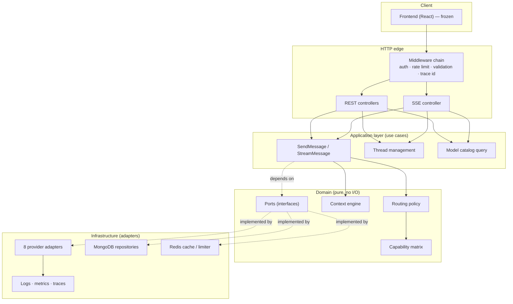
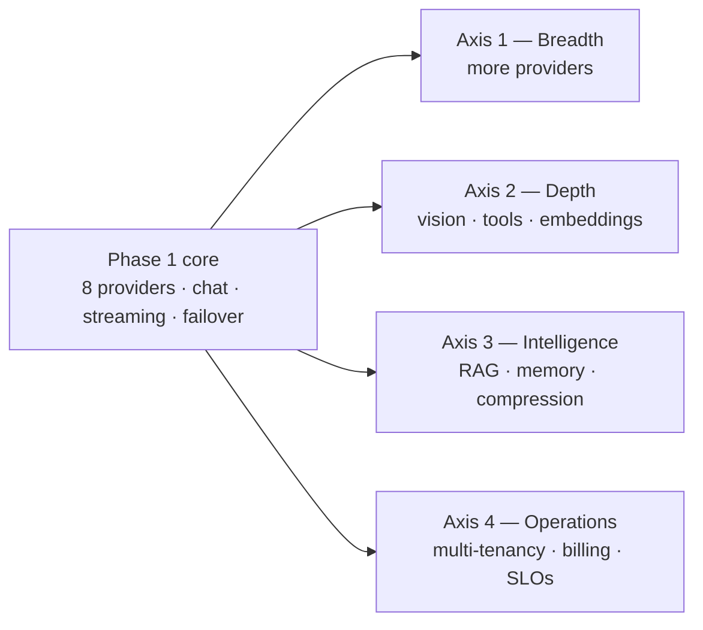

# 01 — System Overview

## Vision

NovaGPT is an open-source multi-model AI platform. A user opens one chat
interface, and behind it sits a fleet of model providers that the platform
manages on their behalf: choosing one, streaming its answer, and silently moving
to another when the first runs out of quota or falls over.

The thesis is that **the provider is an implementation detail, not a product
feature**. Today's frontier model is next quarter's mid-tier model, and today's
generous free tier is next quarter's paywall. A platform whose architecture
assumes a specific provider inherits that provider's roadmap, pricing, outages,
and rate limits. NovaGPT therefore treats "which model answered this" as a
routing outcome, not a hard-coded dependency.

The second thesis is that **free tiers, combined, are a production-grade
resource**. Any single free tier is unreliable — low rate limits, daily caps,
occasional outages. Eight free tiers behind a health-aware router with failover
is a system that answers requests reliably at near-zero marginal cost. This is
the difference between a demo and a platform, and it is what the backend
architecture exists to deliver.

## Goals

| Goal | What it means concretely | How we will know it holds |
|---|---|---|
| **Provider independence** | No provider name appears outside its own adapter folder. Removing a provider is deleting a directory and a catalog entry. | `grep -r "gemini" --exclude-dir=adapters src/` returns only catalog data |
| **Resilience** | A provider outage degrades quality, never availability. | Chaos test: kill any single provider, chat still answers |
| **Modularity** | A new provider is one folder plus one registry line, with no changes to the router, API, or storage layers. | Provider onboarding checklist ([03](03-provider-system.md)) touches ≤3 files |
| **Observability** | Every request can be reconstructed after the fact: which provider, why, how long, what it cost. | One trace id answers "why did this request pick Groq?" |
| **Security** | A leaked database is not a leaked API key. A hostile user cannot exhaust another user's quota. | Threat model in [10](10-security.md) has a mitigation per entry |
| **Extensibility** | Capabilities beyond chat (vision, tools, embeddings, RAG) are additions, not rewrites. | Capability matrix ([05](05-capability-matrix.md)) admits new axes without touching the router |
| **Maintainability** | An engineer new to the codebase can add a provider in under an hour using only these documents. | Onboarding dry-run during Phase 1 acceptance |

## Scope

**In scope for this backend:**

- Chat completion (streaming and non-streaming) across 8 providers.
- Intelligent routing: capability matching, health awareness, failover, retry,
  circuit breaking.
- Conversation persistence: threads, messages, per-conversation settings,
  sharing.
- A context engine: history assembly, token budgeting, trimming, compression.
- A unified streaming protocol normalised across every provider dialect.
- Provider health, capability advertisement, and a live model catalog.
- Authentication, authorization, rate limiting, and audit logging.
- Observability: structured logs, traces, metrics, cost and latency accounting.

**Explicitly out of scope (non-goals):**

| Non-goal | Why not |
|---|---|
| **Training or fine-tuning models** | NovaGPT is an inference orchestration layer. Training is a different product with different infrastructure economics. |
| **Hosting our own inference** | Self-hosting a 70B model costs more than the aggregate free tiers we route across. Ollama support exists for users who *want* local inference; we do not operate it. |
| **Being an OpenAI-compatible API gateway** | We are a product backend, not a proxy. Adopting the OpenAI wire format as our public contract would force our API surface to track theirs forever — see [ADR-012](15-decisions.md#adr-012--novagpt-does-not-expose-an-openai-compatible-public-api). |
| **Billing, invoicing, payment** | Phase 1 targets free tiers and bring-your-own-key. Metering is designed for ([08](08-storage.md#usage_records)) so billing can be added later without a schema migration. |
| **Multi-tenancy with hard isolation** | Phase 1 is single-tenant-per-deployment with per-user scoping. True tenant isolation (separate keys, separate quotas, separate data planes) is a Later concern, but the data model reserves a `tenantId` so it does not require a rewrite. |
| **Agentic loops / autonomous tool execution** | Tool *calling* is in the capability matrix; tool *execution* is a separate trust and sandboxing problem. Deferred deliberately. |
| **A frontend rewrite** | The frontend is frozen. The API contract in [09](09-api-design.md) is written to what it already consumes. |

## High-level architecture

The load-bearing property of this picture is the **direction of the dotted
arrows**: the application and domain layers depend on *ports* (interfaces they
own), and infrastructure implements those ports. Nothing in the domain imports
Mongoose, Express, or a provider SDK. [02](02-architecture.md) develops this in
full.

## Guiding principles

**1. Providers are plugins, not partners.**
Every provider-specific concern — wire format, error shape, streaming framing,
auth header — is confined to its adapter. If a provider concern leaks into the
router, the router has a bug regardless of whether it works.

**2. Failure is a routing input, not an exception.**
A quota error is not "the system broke", it is "this provider is unavailable for
15 minutes". The error taxonomy in [03](03-provider-system.md#error-taxonomy)
exists so the router can make that distinction structurally rather than by
matching error strings.

**3. Never fail silently, never succeed silently.**
If the router switches providers, the user is told which model actually answered
and why. Hiding a switch produces a worse product than showing it: a user who
notices a tone change with no explanation loses trust in the whole system.

**4. Data-driven over code-driven.**
Model capabilities, context windows, cost tiers, and speed scores are *data*
([05](05-capability-matrix.md)). Adding a model is a data change. Code paths
that branch on a model id are a design smell.

**5. Degrade, don't collapse.**
The database being down MUST NOT take down the model catalog. Redis being down
MUST NOT take down chat. Every dependency has a defined degraded mode
([13](13-deployment.md#degradation-matrix)).

**6. The boring choice, unless there's a reason.**
Node + Express + MongoDB is not exciting. It is well understood, matches the
existing codebase, and the interesting engineering in this system is in the
routing and streaming layers, not in the framework. Novelty budget is spent
where it buys something.

**7. Optimise for deletion.**
The strongest signal of good modularity is how cleanly a feature can be removed.
Each module in [02](02-architecture.md) is drawn so that deleting it fails at
compile/import time in a small, obvious set of places.

## Technology choices

| Concern | Choice | Why this, and what we rejected |
|---|---|---|
| **Runtime** | Node.js 20+ (LTS), ESM | The workload is I/O-bound fan-out to HTTP APIs with long-lived streams — precisely what an event loop is good at. Rejected Go (better CPU story, but this workload has no CPU story, and it would abandon the existing codebase and the shared-language advantage with the frozen React frontend). Node 20 gives native `fetch`, `AbortController`, `node:test`, and stable async iterators, which removes three dependencies. |
| **HTTP framework** | Express 5 | Already in use; ecosystem is unmatched; Express 5 fixes the async-error-handling wart that made Express 4 painful. Rejected Fastify (measurably faster routing, but our latency is dominated by upstream model APIs at 300ms–30s — saving 0.3ms of routing is noise) and NestJS (gives structure we are already imposing by hand, at the cost of heavy decorators and a DI container we do not need at this size). |
| **Language** | JavaScript with JSDoc types, checked via `tsc --checkJs` | Contentious, so stated plainly: this gives type checking at build time without a compile step at run time, and without rewriting a working codebase. The escape hatch is real — if the domain layer's types outgrow JSDoc's ergonomics, TypeScript is a per-file migration, not a rewrite. See [ADR-002](15-decisions.md#adr-002--javascript-with-jsdoc-types-instead-of-typescript). |
| **Primary datastore** | MongoDB 7 (Mongoose) | Conversations are documents: a thread with an embedded array of messages is one read and one write. The alternative (Postgres with a `messages` table) is the better fit *if* we needed relational queries across messages — we do not; every access is "give me this thread". Rejected Postgres for Phase 1, but see [08](08-storage.md#why-not-postgres) for the specific signals that would make us revisit. |
| **Cache / coordination** | Redis 7 | Needed for three things a single-process cache cannot do: rate limiting that survives horizontal scaling, circuit-breaker state shared across instances, and stream-resume buffers. Rejected in-process-only (breaks the moment we run two pods — and [13](13-deployment.md) requires that we can). |
| **Streaming transport** | Server-Sent Events | Unidirectional server→client text is exactly SSE's shape. It rides plain HTTP, survives proxies, and reconnects natively. Rejected WebSockets (bidirectional machinery, sticky-session requirements, and a second auth path — all for a channel that only flows one way) and long-polling (worse latency, worse UX for token streaming). See [ADR-005](15-decisions.md#adr-005--sse-over-websockets-for-streaming). |
| **Vector store** | Deferred; pgvector or Qdrant when RAG lands | Choosing a vector database before we have a retrieval workload is choosing blind. [06](06-context-engine.md#future-rag-integration) defines the port so the choice can be made late and cheaply. |
| **Testing** | `node:test` + `undici` MockAgent | Zero-dependency, built into the runtime, fast. Rejected Jest (heavy, its ESM story is still awkward, and its module mocking would let us mock in ways that hide integration bugs). |
| **Containerisation** | Docker + Docker Compose (dev), any OCI runtime (prod) | Compose gives a one-command local stack (API + Mongo + Redis). Production stays runtime-agnostic; nothing in the design assumes Kubernetes. |
| **Config** | Environment variables, validated at boot, typed schema | Twelve-factor. The validation-at-boot rule is load-bearing: a missing key MUST fail at startup with a readable message, never at 3am inside a request. |

## Supported providers (Phase 1)

Phase 1 targets **eight providers**, chosen so that the platform can serve a
real user with zero spend:

| # | Provider | Why it is in Phase 1 | Wire dialect | Notable constraint |
|---|---|---|---|---|
| 1 | **Google AI Studio (Gemini)** | Best free-tier context window in the market (1M tokens) and genuine multimodality. The default for long documents and vision. | Native SDK | Free-tier RPM/RPD caps; prompts may be used for product improvement on the free tier |
| 2 | **GroqCloud** | Fastest tokens/sec available anywhere at any price. The default when latency is what matters. | OpenAI-compatible | Per-model RPM/RPD caps; open-weight models only |
| 3 | **DeepSeek** | Strongest reasoning-per-dollar; a credible frontier alternative for coding and maths. | OpenAI-compatible | Paid (cheap); bring-your-own-key |
| 4 | **Qwen** | Best-in-class multilingual coverage, especially CJK, plus a large context window. | OpenAI-compatible | Region-dependent endpoints and limits |
| 5 | **Mistral AI** | European hosting (a real requirement for some deployments) and a free experimental tier. | OpenAI-compatible | Free tier is explicitly experimental and may change |
| 6 | **OpenRouter (free models)** | One key unlocks a rotating pool of `:free` models — the cheapest possible breadth, and a hedge against any single provider disappearing. | OpenAI-compatible | Shared free pool; rate limits vary by upstream model |
| 7 | **GLM (Zhipu AI)** | GLM-4-Flash is permanently free with a solid capability floor. A reliable failover destination. | OpenAI-compatible | Non-commercial carve-outs in the free terms |
| 8 | **NVIDIA NIM** | Free evaluation access to a broad catalog of open models; useful capability diversity. | OpenAI-compatible | Evaluation tier (~40 req/min), not for production volume |

### Why these eight

The set was not chosen by popularity. It was chosen to satisfy four constraints
simultaneously:

1. **Zero-cost floor.** Six of the eight have a permanently free or free
   developer tier. A deployment with no budget still works.
2. **Capability coverage.** Every axis in the capability matrix
   ([05](05-capability-matrix.md)) is covered by at least two providers, so
   failover never has to drop a required capability. Vision: Gemini, Qwen, GLM-4V.
   Huge context: Gemini, Qwen. Reasoning: DeepSeek, Qwen, Gemini Pro.
   Speed: Groq, GLM-4-Flash, NVIDIA.
3. **Failure independence.** The eight span four legal jurisdictions and at
   least six distinct infrastructure operators. A correlated outage across all
   eight requires something closer to an internet-wide event than a provider
   incident.
4. **One dialect where possible.** Seven of the eight speak the OpenAI Chat
   Completions dialect, so seven adapters share one base implementation and only
   Gemini needs bespoke translation. This is a deliberate onboarding filter:
   OpenAI-dialect providers are near-free to add, so we add many.

### Deliberately not in Phase 1

OpenAI, Anthropic, Cerebras, GitHub Models, Cloudflare Workers AI, Cohere,
Hugging Face, Kimi/Moonshot, and Ollama are **not Phase 1 providers**. They are
excellent, and several are trivially addable — that is exactly the point. Phase
1 is scoped to prove the architecture across eight providers with real
capability diversity; widening the provider set before the routing, capability,
and observability layers are proven adds surface area without adding evidence.
They are Phase 5 work in [14](14-roadmap.md).

> **Note on the current repository.** The existing `Backend/providers/` tree
> already contains adapters beyond these eight. That code predates this planning
> phase. The implementation plan in [14](14-roadmap.md) treats the Phase 1 eight
> as the supported, tested, documented set; adapters outside that set MUST be
> either brought up to the Phase 1 contract or moved behind an explicitly
> unsupported flag before release. This is tracked as
> [ADR-013](15-decisions.md#adr-013--handling-adapters-that-predate-this-plan).

## Future expansion strategy

Expansion is planned along four independent axes so that growth on one does not
destabilise the others.

**Axis 1 — Breadth (more providers).** Cheap by construction. An OpenAI-dialect
provider is a config object; a bespoke one is a single adapter file. The
onboarding process in [03](03-provider-system.md#provider-onboarding-process)
is the only gate. Growth here MUST NOT change the router.

**Axis 2 — Depth (more capabilities).** Vision, tool calling, and embeddings are
already ports on the provider interface. Adding a capability means adding an
axis to the capability matrix and a requirement to the routing request — the
router's ranking algorithm does not change, because it ranks over data.

**Axis 3 — Intelligence (context quality).** RAG, long-term memory, and
semantic compression all plug into the context engine's pipeline
([06](06-context-engine.md)) as stages. The engine is designed as an ordered
pipeline specifically so these can be inserted without rewriting assembly logic.

**Axis 4 — Operations (running it for others).** Multi-tenancy, quota
enforcement, billing, and SLOs. The data model reserves the fields these need
(`tenantId`, usage records) so the migration is additive rather than structural.

**The rule that keeps this honest:** an expansion that requires editing the
router, the context engine, *and* the storage layer at once is a signal that the
abstraction was wrong. When that happens, the correct response is to fix the
abstraction and record it in [15](15-decisions.md) — not to add the feature
across three layers and move on.
