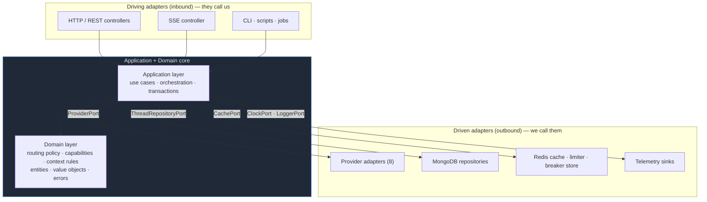
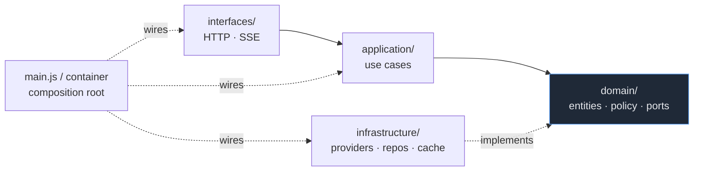
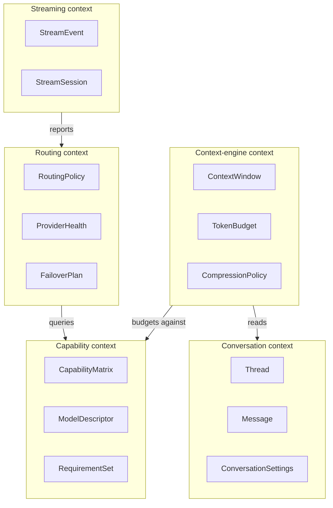
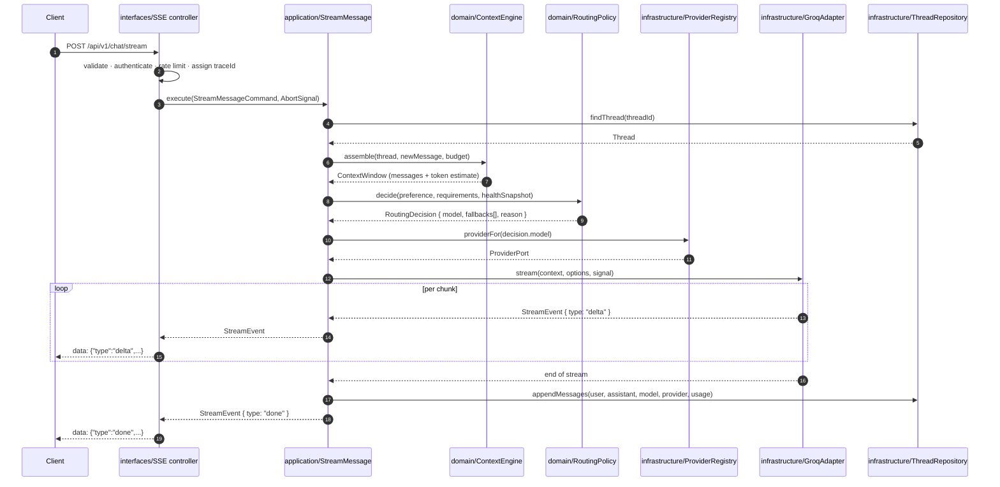
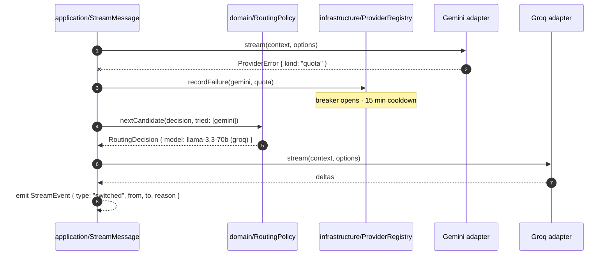

# 02 — Architecture

## The problem this architecture solves

NovaGPT's core logic — *which model should answer this, and what do we do when
it fails* — is the only part of the system with real intellectual content. It is
also the part most at risk of being buried under I/O concerns: HTTP parsing,
Mongoose documents, SDK-specific response shapes, SSE framing.

When routing logic is entangled with I/O, three things happen, and all three are
observable in most LLM-orchestration codebases:

1. **Routing becomes untestable.** Testing "does the router prefer a healthy
   free provider over a degraded paid one?" requires standing up HTTP servers
   and a database, so the test is slow, flaky, and eventually deleted.
2. **Provider quirks metastasise.** One provider returns `429` for quota and
   another returns `200` with an error body. If the router sees raw responses,
   the router learns both quirks — and every future provider adds another
   branch.
3. **Swapping infrastructure becomes a rewrite.** Moving from Mongo to Postgres,
   or from SSE to WebSockets, touches business logic that has no business
   knowing either exists.

Hexagonal architecture (Ports and Adapters) is the direct answer to all three.

## Hexagonal architecture

The system is organised as a **domain core** surrounded by **adapters**, with
**ports** as the only crossing points.



**The rule, stated once and enforced everywhere:** dependencies point *inward*.
Driving adapters know the application layer. The application layer knows the
domain and the port interfaces. **The domain knows nothing.** It has no imports
from `infrastructure/`, no `express`, no `mongoose`, no provider SDK, no
`process.env`, and no `Date.now()` (time arrives through a `ClockPort`).

### Why hexagonal, and not the alternatives

| Alternative | Why it was rejected |
|---|---|
| **Layered MVC** (`routes/` → `services/` → `models/`) | The default Node structure, and what the current codebase approximates. It fails on the dependency direction: `services/` imports Mongoose models, so business logic depends on the database. Testing routing then requires a database, which is exactly the failure mode we are trying to avoid. |
| **Clean Architecture** (entities / use cases / adapters / frameworks) | Substantially the same idea with more prescribed ceremony — four mandated rings, entity-vs-use-case distinctions that are ambiguous at this size. Hexagonal keeps the one rule that matters (dependencies point inward through ports) and drops the ceremony. |
| **Vertical slice / feature folders** | Genuinely good for CRUD-shaped products where features are independent. NovaGPT's features are *not* independent — chat, streaming, and catalog all route through the same provider layer. Slicing vertically would duplicate the routing abstraction per slice or create a shared kernel that becomes a layered architecture wearing a different hat. |
| **Microservices** | A router service, a provider service, a conversation service. This buys independent scaling we do not need and adds network hops, distributed tracing complexity, and partial-failure semantics to a system whose hard problem is *already* partial failure. Revisit when a single component's scaling profile genuinely diverges — see [ADR-003](15-decisions.md#adr-003--modular-monolith-over-microservices). |

The honest cost of hexagonal: **more files and more indirection**. A one-line
change can touch a port, an adapter, and a use case. We accept this because the
alternative — a router that imports Mongoose — makes the system's most important
logic its least testable logic.

## Layer responsibilities

### Domain layer (`src/domain/`)

**Contains:** entities (`Thread`, `Message`, `ModelDescriptor`), value objects
(`TokenBudget`, `Capability`, `ProviderId`), the routing policy, the capability
matrix, context-assembly rules, and the error taxonomy.

**MUST:**
- Be pure. Same inputs, same outputs, no I/O.
- Own the port *interfaces* it needs (the domain declares `ProviderPort`;
  infrastructure implements it).
- Express business rules as code, not as comments.

**MUST NOT:**
- Import anything from `application/` or `infrastructure/`.
- Import any npm package other than pure utilities with no I/O.
- Read `process.env`, call `Date.now()`, generate random values, or perform
  network or disk access.

**Why the purity rule is absolute:** it is the property that makes the routing
policy testable in microseconds with no fixtures. The moment one domain file
reads the clock directly, "test the 15-minute quota cooldown" requires either
fake timers or a 15-minute test. Injecting a `ClockPort` costs one constructor
parameter and makes that test one line.

### Application layer (`src/application/`)

**Contains:** use cases — one per meaningful operation. `SendMessage`,
`StreamMessage`, `ListThreads`, `GetModelCatalog`, `ShareThread`.

**Responsibilities:**
- Orchestrate: load a thread, build context, ask the router for a decision,
  invoke the provider through its port, persist the result, emit telemetry.
- Own the transaction boundary and the ordering of side effects.
- Translate domain errors into application-level outcomes.

**MUST NOT:** know about HTTP, SSE framing, status codes, Mongoose, or a
provider's wire format. A use case receives a plain command object and returns a
plain result object or throws a domain error.

**Why use cases rather than "services":** a service named `ChatService`
accumulates every chat-adjacent function until it is 900 lines and has eleven
reasons to change. A use case is named after one user-visible operation and has
exactly one reason to change. The test file for `StreamMessage` is *about*
streaming a message, and its length is a direct signal of that operation's
complexity.

### Infrastructure layer (`src/infrastructure/`)

**Contains:** every implementation of a port. Provider adapters, Mongo
repositories, the Redis cache, the HTTP client with retry and timeout, telemetry
exporters.

**Responsibilities:**
- Speak the outside world's language and translate to the domain's.
- Absorb every quirk. A provider that returns `200` with an error body is that
  adapter's problem and nobody else's.
- Map foreign errors into the domain's error taxonomy
  ([03](03-provider-system.md#error-taxonomy)) at the boundary — **never** let a
  raw SDK error escape into the application layer.

### Interface layer (`src/interfaces/`)

**Contains:** driving adapters. HTTP controllers, the SSE controller, middleware,
request validation schemas, response serialisers.

**Responsibilities:**
- Parse and validate input; reject malformed requests before a use case runs.
- Map use-case results to HTTP status codes and response bodies.
- Map domain errors to the error envelope in
  [09](09-api-design.md#error-format).
- Own cancellation: a client disconnect becomes an `AbortSignal` here and
  propagates inward.

**MUST NOT:** contain business logic. If a controller has an `if` that decides
*what the system does* rather than *how to say it over HTTP*, that `if` belongs
in a use case.

## Dependency flow



Reading the diagram: **every solid arrow points toward `domain/`.** The only
dotted arrows are `implements` (infrastructure satisfying a domain-owned
interface) and `wires` (the composition root, the single place in the system
allowed to know about all layers at once).

### The composition root

Exactly one module — `src/main.js`, plus a small container — constructs concrete
adapters and injects them. Nothing else in the codebase calls `new
MongoThreadRepository()` or reads `process.env`.

**Why this matters more than it looks:** it is what makes the dependency rule
*enforceable* rather than aspirational. A single lint rule (`no-restricted-imports`
forbidding `infrastructure/*` from `domain/**` and `application/**`) plus a
single composition root means an accidental violation fails CI instead of
quietly becoming the new normal.

### Enforcement

| Rule | Mechanism |
|---|---|
| `domain/` MUST NOT import `application/`, `infrastructure/`, `interfaces/` | ESLint `no-restricted-imports`, CI-blocking |
| `application/` MUST NOT import `infrastructure/`, `interfaces/` | Same |
| `domain/` MUST NOT import npm packages that perform I/O | Allowlist in the same rule |
| Only `main.js` and `container.js` may read `process.env` | ESLint `no-process-env` with two file exemptions |
| Every port has ≥1 fake implementation for tests | Convention, checked at review |

## Domain boundaries

The domain is subdivided into bounded contexts. Each owns its vocabulary and
communicates with others through explicit types, never by reaching into another
context's internals.



| Context | Owns | Explicitly does not own |
|---|---|---|
| **Routing** | Which model serves a request; health; failover and retry policy | How a model is invoked; what a model can do |
| **Capability** | What each model can do; the matrix; requirement matching | Whether a model is currently healthy |
| **Conversation** | Threads, messages, per-conversation settings, sharing | How a conversation becomes a prompt |
| **Context engine** | Turning a conversation into a bounded prompt; trimming; compression | Which model receives it |
| **Streaming** | The normalised event protocol; session lifecycle; cancellation | Provider wire formats |

**Why draw the boundary between Routing and Capability?**
They are tempting to merge — routing constantly queries capabilities. They stay
separate because they change for different reasons and at different rates.
Capabilities change when a provider ships a model (data, frequent, low risk).
Routing changes when we alter selection strategy (logic, rare, high risk). Fusing
them would mean every new model touches the file containing the ranking
algorithm, which is precisely the file that should be stable.

## Module interactions

### Streaming chat — the full path



Two properties to notice, because they are the point of the whole structure:

- **`RoutingPolicy` is pure.** It receives a health snapshot as an argument
  rather than querying the registry. It can therefore be tested exhaustively —
  every combination of health, capability, and preference — with no I/O.
- **`AbortSignal` threads all the way through.** A client disconnect at step 1
  reaches the provider's `fetch` at the bottom. Cancellation is a first-class
  path, not an afterthought; see [07](07-streaming-engine.md#cancellation).

### Provider failure and failover



The domain decides *whether and where* to fail over. The registry records *what
happened*. The adapter knows *nothing about failover at all*. Each of those three
can be changed without touching the other two.

## Package structure

```
Backend/
├── src/
│   ├── domain/                    # pure — zero I/O, zero framework
│   │   ├── conversation/
│   │   ├── routing/
│   │   ├── capability/
│   │   ├── context/
│   │   ├── streaming/
│   │   ├── errors/
│   │   └── ports/                 # interfaces the domain owns
│   ├── application/
│   │   ├── chat/                  # SendMessage · StreamMessage
│   │   ├── threads/
│   │   ├── catalog/
│   │   └── admin/
│   ├── infrastructure/
│   │   ├── providers/
│   │   │   ├── adapters/          # one folder per provider
│   │   │   ├── shared/            # OpenAI-dialect base, HTTP client
│   │   │   └── registry/
│   │   ├── persistence/mongo/
│   │   ├── cache/redis/
│   │   ├── telemetry/
│   │   └── config/
│   ├── interfaces/
│   │   └── http/                  # controllers · middleware · schemas
│   ├── container.js               # composition root — wiring
│   └── main.js                    # composition root — bootstrap
├── test/
├── docs/
└── package.json
```

Full per-directory rationale — what belongs in each, what does not, and why each
exists — is in [16-repository-structure.md](16-repository-structure.md).

## Design rationale

### Why ports are owned by the domain

The port interface `ProviderPort` lives in `domain/ports/`, not in
`infrastructure/providers/`. This looks backwards until you ask *who the
interface is for*.

The interface exists to describe **what the domain needs**, not what a provider
offers. If it lived in infrastructure, it would drift toward whatever the
provider SDKs happen to expose, and the domain would inherit their shape. Owned
by the domain, it says: "I need to stream text given messages and options, and I
need failures categorised into these six kinds." A provider that cannot meet
that contract is the adapter's problem to solve, not the domain's problem to
absorb.

This is the Dependency Inversion Principle applied where it actually pays off.

### Why the application layer exists at all

A fair objection: with a thin controller and a rich domain, why not have
controllers call the domain directly?

Because some logic is orchestration, not policy. "Load the thread, assemble
context, route, invoke, persist, emit telemetry, in this order, with these
failure semantics" is a real sequence with real correctness requirements — but it
is not a business rule, and it is not HTTP. It needs a home. Without the
application layer it lands in controllers (untestable, duplicated across REST
and SSE) or in the domain (which then needs I/O and stops being pure).

### Why not one module per provider, top to bottom

Considered: `providers/groq/` containing the Groq adapter, its routes, its
storage, its tests. Rejected because providers are not features — they are
*substitutable implementations of one feature*. Making each a vertical slice
would duplicate the routing and streaming logic eight times, and the eighth copy
would have drifted from the first.

### Where this architecture will hurt

Stated up front, so nobody is surprised:

- **File count.** A trivial field addition can touch a domain type, a port, an
  adapter, a repository mapper, and a response serialiser. This is the tax for
  the boundaries; it is worth paying on the routing path and feels like pure
  overhead on simple CRUD.
- **Mapping code.** Domain entities ≠ Mongoose documents ≠ API responses. Three
  shapes, two mappers. The alternative — leaking Mongoose documents to the API —
  couples the wire format to the schema and makes any migration a breaking API
  change.
- **Indirection when debugging.** "Where does the Groq request actually happen?"
  takes two extra hops to answer. Mitigated by the tracing design in
  [11](11-observability.md), where one trace id shows the full path across all
  layers.

We accept all three. The routing and failover logic is the product; it must be
the most testable code in the repository, and this is what makes it so.
