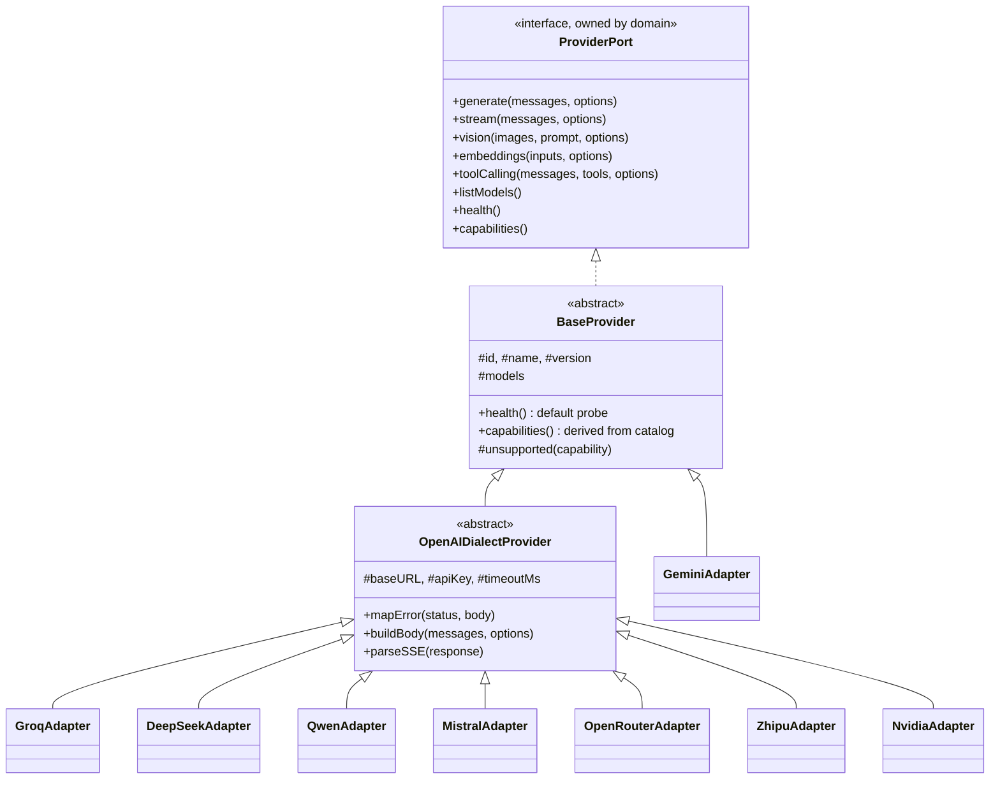
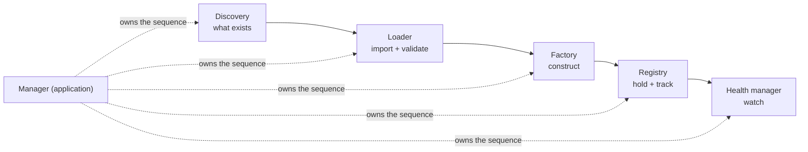
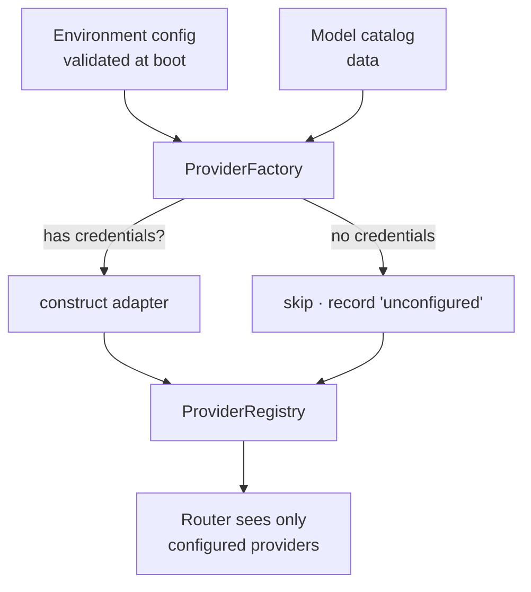
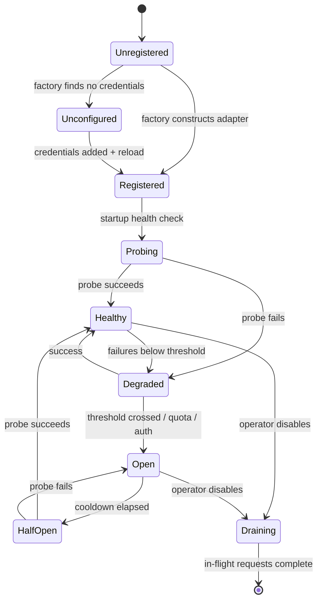
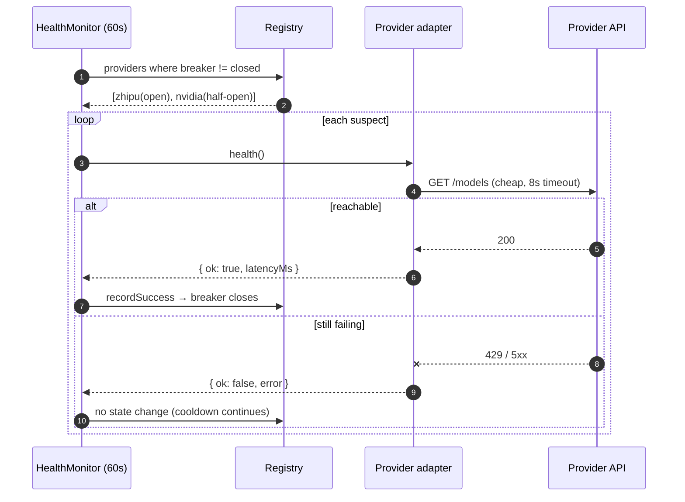
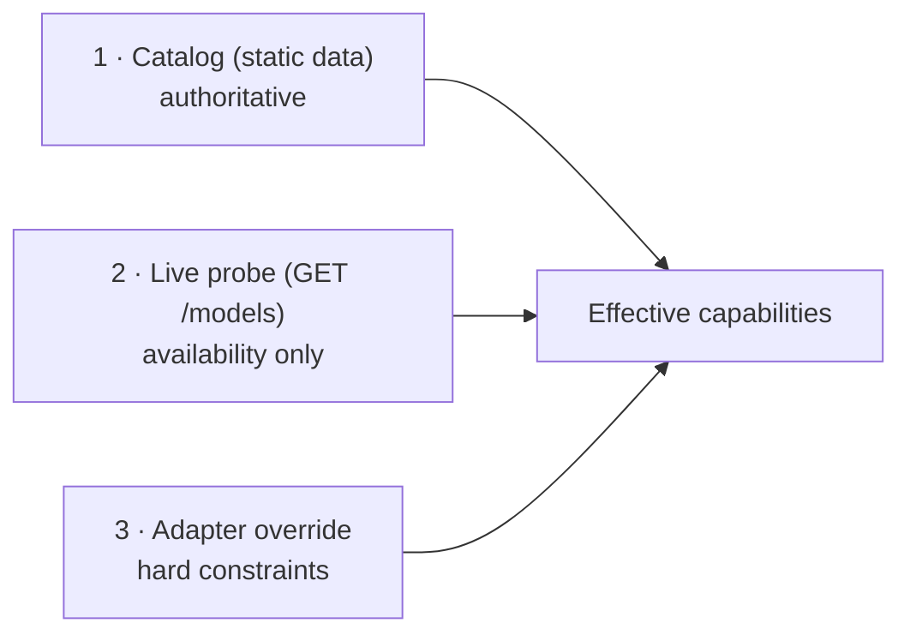
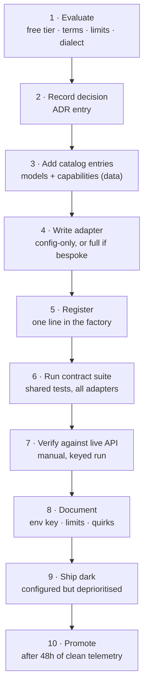

# 03 — Provider System

## The design goal, stated as a constraint

> Adding a ninth provider MUST NOT require reading, understanding, or editing the
> router, the context engine, the streaming layer, the API layer, or the storage
> layer.

Everything in this document exists to make that sentence true. If a proposed
change to the provider system would break it, the change is wrong.

## Provider abstraction

Every provider is reduced to a single interface — `ProviderPort` — owned by the
domain ([02](02-architecture.md#why-ports-are-owned-by-the-domain)). The router
never sees anything else.

### The contract

| Method | Shape | Notes |
|---|---|---|
| `generate(messages, options)` | → `{ text, usage, model, finishReason }` | One-shot completion |
| `stream(messages, options)` | → `AsyncIterable<StreamEvent>` | Normalised events, not raw text |
| `vision(images, prompt, options)` | → `{ text, usage, model }` | Multimodal |
| `embeddings(inputs, options)` | → `number[][]` | Vectors |
| `toolCalling(messages, tools, options)` | → `{ text, toolCalls[], model }` | Function/tool calling |
| `listModels()` | → `ModelDescriptor[]` | Live-probed where possible, catalog fallback |
| `health()` | → `{ ok, latencyMs, error? }` | Liveness probe |
| `capabilities()` | → `CapabilitySet` | Derived from the catalog ([05](05-capability-matrix.md)) |
| `get isConfigured()` | → `boolean` | Has the credentials it needs |
| `get descriptor()` | → `{ id, name, version, dialect }` | Identity and adapter version |

**`options` is a closed set** — `model`, `temperature`, `maxTokens`, `topP`,
`stop`, `json`, `jsonSchema`, `seed`, `signal`, `metadata`. Providers translate
what they support and ignore what they do not. A provider-specific parameter
MUST NOT be added to this object; if a provider needs one, it belongs in that
adapter's own configuration, not in the shared call signature.

**Why a closed options set:** the moment `options` becomes an open bag forwarded
to the provider, callers start passing provider-specific keys and the
abstraction is dead — silently, because it still compiles. A closed set forces
the question "is this a universal concept or a provider quirk?" to be answered at
design time.

### Unsupported capabilities

A capability a provider genuinely cannot perform MUST throw
`UnsupportedCapabilityError`. It MUST NOT return an empty result.

**Why this is a MUST:** an empty return is indistinguishable from a model that
had nothing to say. The router would treat it as success, the user would see a
blank reply, and the failover machinery — the entire point of the system — would
never engage. A typed throw makes the router's decision unambiguous: this is not
a transient failure, do not retry, re-route to a model that *has* the capability.

### Error taxonomy

Every failure crossing an adapter boundary MUST be a `ProviderError` carrying
one of six `kind` values. Raw SDK errors, `fetch` errors, and JSON parse errors
MUST NOT escape an adapter.

| `kind` | Meaning | Retry same provider? | Fail over? | Breaker action |
|---|---|---|---|---|
| `quota` | Credit/daily allowance exhausted | ❌ never | ✅ yes | Open immediately, 15 min |
| `rate_limit` | Too many requests, transiently | ✅ with backoff, honouring `Retry-After` | ✅ yes | Open after threshold, 60 s |
| `timeout` | No response within budget | ✅ once | ✅ yes | Open after threshold, 30 s |
| `outage` | 5xx, connection refused, DNS failure | ✅ with backoff | ✅ yes | Open after threshold, 2 min |
| `auth` | Bad, missing, or revoked credentials | ❌ never | ⚠️ yes, but log loudly | Open immediately, 5 min |
| `api_error` | 4xx that is our fault — malformed request, unknown model, content filter | ❌ never | ❌ **no** | Open after threshold, 30 s |

**The critical distinction is `api_error` vs everything else.** An `api_error`
means the *request* was bad. Sending the same bad request to a second provider
produces a second failure, plus latency, plus a wasted quota unit. Only
operationally-caused failures are failover-worthy. Getting this wrong is how a
router turns one user-visible error into eight.

**Why six kinds and not more:** each kind must correspond to a *distinct
decision*. `quota` and `rate_limit` differ in whether waiting helps. `auth` and
`api_error` differ in whether an operator needs paging. A seventh kind that maps
to the same decisions as an existing one adds classification work with no
behavioural payoff.

## Adapter pattern

### Two tiers, deliberately

**Tier 1 — `OpenAIDialectProvider`.** Seven of the Phase 1 eight speak the
OpenAI Chat Completions dialect. Their adapters are configuration: id, name,
base URL, env key, timeout. Zero behavioural code in the common case.

**Tier 2 — direct `BaseProvider` subclass.** Gemini has its own SDK, its own
message shape (`contents` with `parts`, `assistant` renamed to `model`), its own
system-prompt channel (`systemInstruction`), and its own error shapes. It gets a
full adapter.

**Why inheritance here, when composition is usually the better default:** the
shared layer is genuinely an *is-a* relationship — a Groq adapter *is* an
OpenAI-dialect provider — and the shared behaviour is large (request building,
SSE parsing, error mapping, ~200 lines) while the variation is tiny (five config
values). Composition would require re-wiring those five values through a
delegate in every adapter, which is more code for the same result. The
composition escape hatch remains available and is used where a provider is
*mostly* OpenAI-dialect but deviates: override the one method, keep the rest.

**The trade-off we accept:** a change to `OpenAIDialectProvider` affects seven
adapters at once. This is mitigated by the shared contract test suite
([12](12-testing.md#the-shared-provider-contract-suite)), which every adapter
runs — a base-class regression fails seven test files loudly, which is exactly
the behaviour we want.

### What an adapter is responsible for

| Responsibility | Example |
|---|---|
| **Wire translation, both directions** | Domain `messages[]` → Gemini `contents[]`, and back |
| **Auth** | Header shape, key source, key rotation |
| **Error mapping** | `429` + body matching `/quota|credit/` → `ProviderError(quota)` |
| **Stream normalisation** | Provider SSE frames → `StreamEvent` ([07](07-streaming-engine.md)) |
| **Capability honesty** | Report only what it can actually do |
| **Timeout and cancellation** | Honour the passed `AbortSignal` |

### What an adapter MUST NOT do

| Forbidden | Why |
|---|---|
| Decide about failover | That is routing policy; adapters have no view of the fleet |
| Retry across providers | An adapter knows one provider. Same-provider retry is fine and is handled by the shared HTTP client |
| Read or write conversation storage | Adapters are stateless |
| Log at `error` level for expected failures | A quota error is normal operation; the router logs the routing consequence |
| Trim, summarise, or mutate the context | The context engine owns the prompt; an adapter that silently drops messages makes token accounting a lie |

## The assembly chain

The plan described a factory and a registry. Implementation showed those two
names were covering four distinct jobs, and fusing them produced a class that
did filesystem work, dynamic imports, credential resolution, and live state
tracking — with four reasons to change and no way to test any one of them
alone. They are split accordingly:

| Component | Single job | Does **not** |
|---|---|---|
| **Discovery** | Answer *what adapters exist* — scan the adapters directory | Import them, read credentials, decide anything |
| **Loader** | Import a candidate and validate its exports | Construct an instance |
| **Factory** | Decide whether a provider *can* be built, and build it | Hold it, or know about the others |
| **Registry** | Hold instances plus live operational state | Decide which one to use |
| **Health manager** | Track health, passively and by probe | Open a breaker from a probe |
| **Manager** *(application layer)* | Own the sequence and the lifecycle | Any of the above jobs |

**Why discovery is filesystem-driven.** Dropping a folder into `adapters/`
registers a provider. There is no central array to forget to edit, and
therefore no way for the registration step to be half-done — which is what
makes *"create adapter, register adapter, nothing else"* literally true rather
than aspirational.

**Why loader failures are isolated.** One broken adapter must not stop the
other seven loading. A syntax error in an experimental provider would otherwise
take down a platform perfectly capable of running without it. Failures are
collected and reported, never thrown upward.

## Factory pattern

Adapters are never constructed with `new` outside the factory.

**Responsibilities of the factory:**

1. Read validated config (never `process.env` directly — config is parsed and
   validated once at boot, in one place).
2. Decide constructibility. Missing credentials → do not construct; record
   `unconfigured`.
3. Inject shared collaborators: HTTP client, clock, logger, catalog slice.
4. Return instances to the registry.

**Why a factory rather than adapters reading env in their constructors** (which
is what the current codebase does):

- **Testability.** A factory takes config as an argument, so a test constructs
  the whole provider fleet with fake credentials in one line. Adapters reading
  `process.env` require mutating global state in tests, which makes tests
  order-dependent.
- **One validation point.** Every credential is checked at boot with a readable
  error, rather than failing inside a request at 3am.
- **Config precedence becomes expressible.** Env var → config file → default,
  with per-provider overrides, in one place instead of eight.
- **Multiple instances of one adapter become possible.** Two OpenRouter keys, or
  a regional Qwen endpoint plus a global one, is a factory concern. Adapters
  reading env can only ever be singletons.

## Registry

The registry is the router's **view of the fleet**: every constructed adapter
plus its live operational state.

| Owns | Does not own |
|---|---|
| Adapter instances, keyed by provider id | Routing decisions |
| Circuit-breaker state per provider | Prompt construction |
| Rolling latency samples (last 20) | Conversation data |
| Success/failure counters, last error | The model catalog *content* (that is data) |
| The `providerFor(modelId)` lookup | Which model a user should get |

### The status projection

Internal state (breaker state, error kinds, counters) is projected to a small
set of statuses the API and UI understand:

| Status | Condition |
|---|---|
| `ready` | Configured, breaker closed or half-open |
| `quota_reached` | Breaker open, last failure `quota` |
| `rate_limited` | Breaker open, last failure `rate_limit` |
| `offline` | Breaker open, any other cause |
| `unconfigured` | No credentials |

**Why project rather than expose raw state:** the frontend must not learn the
internal state machine. Adding a breaker state later (e.g. `quarantined`) would
otherwise be a breaking API change. The projection is a stable contract over an
evolving internal model.

### One state object, not two

A circuit breaker and a lifecycle are usually modelled separately. Here they are
one `ProviderState`, because they answer a single question — *may the router
send this provider a request right now?* — and two objects answering it produce
two sources of truth that drift. A provider ends up `Draining` and `Closed` at
once, and the answer depends on which object you ask.

The merged object also makes the `Degraded` phase expressible: it is a breaker
concept (consecutive failures below threshold) *and* a lifecycle concept
(eligible but deprioritised), and neither object alone owns it.

### Distributed state

Breaker state is per-instance in Phase 1 and MUST move to Redis before running
more than one instance.

**The reasoning:** with N instances and per-instance state, a quota exhaustion
discovered by instance A is unknown to instances B..N, so the fleet keeps sending
doomed requests — N times the wasted calls and N times the user-visible errors,
converging slowly. Shared breaker state means one instance's discovery protects
all of them. This is why [13](13-deployment.md) makes Redis a hard prerequisite
for horizontal scaling rather than an optimisation.

## Provider lifecycle

| State | Router behaviour | Visible as |
|---|---|---|
| `Unconfigured` | Never selected | `unconfigured` |
| `Healthy` | Fully eligible, health score 1.0 | `ready` |
| `Degraded` | Eligible but deprioritised, score 0.5–1.0 | `ready` |
| `Open` | Rejected without a network call | `quota_reached` / `rate_limited` / `offline` |
| `HalfOpen` | One probe request allowed, score 0.5 | `ready` |
| `Draining` | No new requests; in-flight finish | `offline` |

**Why `Degraded` exists as a distinct state from `Healthy` and `Open`:** without
it the breaker is a cliff — a provider is perfect until it is dead. In reality a
provider that has failed once in the last minute is measurably more likely to
fail again. Feeding a continuous health score into ranking
([04](04-router.md#ranking)) means traffic shifts away *gradually* as a provider
degrades, which is both a better user experience and a gentler load pattern for
a provider that is already struggling.

**Why `Draining` exists:** without it, taking a provider out of rotation means
killing in-flight streams. Draining lets an operator disable a provider — for a
key rotation, a terms change, an incident — with zero user-visible errors.

### Health system

Two complementary mechanisms:

**1. Passive health (primary).** Every real request updates state: success
records latency and closes the breaker; failure records the kind and may open it.

*Why passive is primary:* it measures the exact operation users perform, at the
exact rate they perform it, for free. An active probe measures a cheap endpoint
that may succeed while completions fail, and costs quota that free tiers cannot
spare.

**2. Active probes (recovery only).** A background monitor probes **only
non-closed** providers, every 60 s.

*Why only non-closed:* probing healthy providers is pure waste — the passive
signal already covers them, and on a free tier every probe is a request a user
could have had. Probing suspect providers is what enables **automatic recovery**:
a provider whose daily quota resets at midnight returns to rotation within a
minute without human action.

**Probe design rules:**
- MUST use the cheapest endpoint that proves liveness (`GET /models`), never a
  completion.
- MUST use a short timeout (8 s), independent of the completion timeout.
- MUST NOT retry — a probe is a sample, and retrying distorts it.
- MUST NOT open a breaker on probe failure. A probe can only *improve* state.
  Otherwise a flaky probe endpoint takes down a working provider.

## Capability detection

Three sources, in strict precedence order:

**1. Catalog (primary).** `capabilities` are declared per model as data in the
catalog: vision, tools, streaming, JSON, context window, and the rest
([05](05-capability-matrix.md)).

*Why data and not code:* a new model is then a one-line data change reviewable by
anyone, and the capability matrix can be queried, tested, and diffed. Code-based
detection makes "which models support vision?" a question requiring a debugger.

**2. Live probe (availability only).** `listModels()` confirms which catalog
entries the endpoint currently serves — important for OpenRouter and NVIDIA,
whose free model lists rotate. The probe may **remove** a model from the live
set; it MUST NOT **add** capabilities to one.

*Why probes cannot grant capabilities:* `GET /models` returns identifiers, not
capability descriptions. Inferring "supports vision" from a model name is string
matching against a naming convention no provider guarantees. That inference will
be wrong, and it will be wrong at request time in front of a user.

**3. Adapter override.** An adapter may narrow capabilities it knows the catalog
overstates — e.g. a provider that serves a vision model but whose endpoint
rejects image parts. Overrides may only *remove*.

**The invariant:** a provider MUST NOT advertise a capability it cannot deliver.
Over-advertising causes a request to be routed and then fail, wasting a full
round trip and a quota unit. Under-advertising costs only a slightly suboptimal
route. The asymmetry is deliberate — when uncertain, advertise less.

## Versioning

Three independent version dimensions, deliberately decoupled:

| Dimension | Format | Changes when | Consumer |
|---|---|---|---|
| **Contract version** | `major.minor` on `ProviderPort` | The interface every adapter implements changes | Adapter authors |
| **Adapter version** | semver per adapter | That adapter's behaviour changes | Operators, changelog |
| **Model catalog version** | monotonic integer | Any catalog entry changes | Cache invalidation, clients |

**Contract compatibility rule:** adding an *optional* method to `ProviderPort`
is a minor bump — existing adapters inherit a default that throws
`UnsupportedCapabilityError`, which is correct behaviour. Changing an existing
method's signature is a major bump and requires updating all adapters in one
change.

*Why the default-throws design is what makes this cheap:* a new capability can be
added to the contract and implemented by one adapter, with the other seven
correctly reporting they do not support it, in a single small pull request. No
migration, no coordination.

**Provider API versioning.** Upstream providers change their APIs. Each adapter
pins the API version it targets in its descriptor and MUST record breaking
upstream changes in its own changelog. When a provider ships a breaking v2, the
policy is a **new adapter alongside the old** (`qwen`, `qwen-v2`) rather than an
in-place edit — the old one keeps working while the new one is validated, and the
catalog decides which models route where.

**Catalog versioning.** `catalogVersion` increments on every change and is
returned by `GET /api/v1/models`. Clients cache against it; a changed version
invalidates. This is what lets the frontend cache the catalog aggressively
without going stale when a model is added.

## Provider onboarding process

The gate every new provider passes. Designed to be completable in under an hour
for an OpenAI-dialect provider.

### Step detail

**1. Evaluate — the questions that must be answered before any code:**
- Is there a free or free-developer tier? What are the RPM/RPD/TPM limits?
- Do the terms permit our use? Commercial restrictions? Data-retention terms
  users should be told about?
- Does it speak the OpenAI dialect? (Determines one hour vs one day of work.)
- What does it add that we do not already have — a capability, a jurisdiction,
  a failure-independence axis? *A provider that adds only redundancy we already
  have is not worth the maintenance surface.*
- What is its error behaviour under quota exhaustion? (Often undocumented and
  discovered only by testing.)

**2. Record the decision.** A short ADR entry in
[15-decisions.md](15-decisions.md): why this provider, what it adds, what it
costs. *Why mandatory: without it, the provider list accretes and nobody can
later justify removing anything.*

**3. Catalog entries.** Model id, display name, capabilities, context window,
tier, cost band, speed and reasoning scores. Scores MUST be justified in the PR
description — a guessed score silently distorts routing for every user.

**4. Adapter.** OpenAI-dialect: a config object. Bespoke: a full adapter that
MUST map every error path into the taxonomy.

**5. Register.** One line in the factory's provider list.

**6. Contract suite.** Every adapter runs the same shared tests against a mocked
HTTP layer ([12](12-testing.md#the-shared-provider-contract-suite)): streaming
yields normalised events, `429` with a quota body maps to `quota`, `429` without
maps to `rate_limit`, timeouts map to `timeout`, abort propagates within 100 ms,
unsupported capabilities throw. **Non-negotiable — this suite is what makes the
router's assumptions true.**

**7. Live verification.** A manual keyed run: a real completion, a real stream, a
real cancellation, and — where safely reproducible — a real rate-limit response.
*Why manual: mocks encode what we believe the API does. Only a live call reveals
that a provider returns `200` with an error body.*

**8. Documentation.** Env key, free-tier limits, known quirks, terms caveats.

**9. Ship dark.** Configured and reachable, but ranked last so it receives
traffic only as a late failover. *Why: it accumulates real telemetry against real
traffic with a bounded blast radius.*

**10. Promote.** After 48 hours with acceptable error rate and latency, it enters
normal ranking. A provider that fails this gate stays dark or is removed —
"it mostly works" is not a passing grade for something the router will hand user
traffic to.

### Onboarding checklist

- [ ] Free tier and terms evaluated and recorded
- [ ] ADR entry added
- [ ] Catalog entries added with justified capability flags and scores
- [ ] Adapter implemented; all errors mapped to the taxonomy
- [ ] Registered in the factory
- [ ] Contract suite passes
- [ ] Live verification: completion, stream, cancel, rate limit
- [ ] `.env.example` and provider docs updated
- [ ] Shipped dark; 48 h telemetry reviewed
- [ ] Promoted to normal ranking
