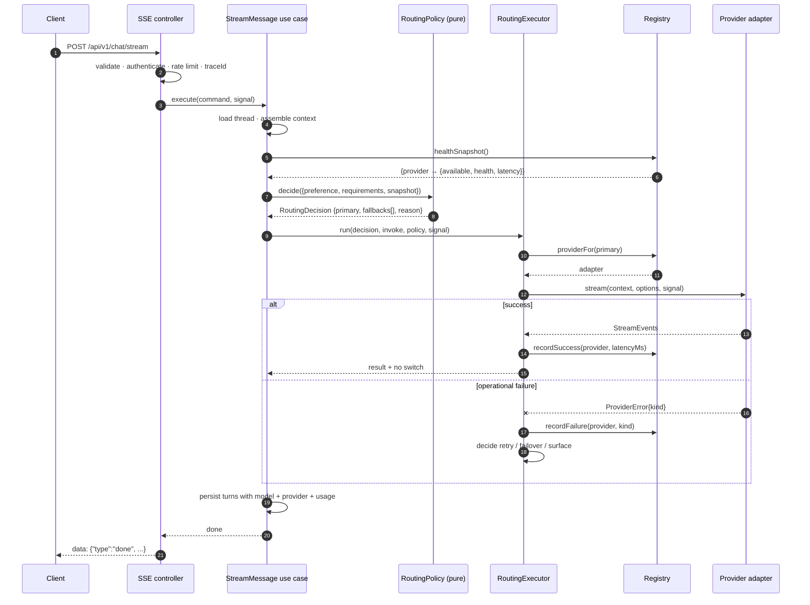
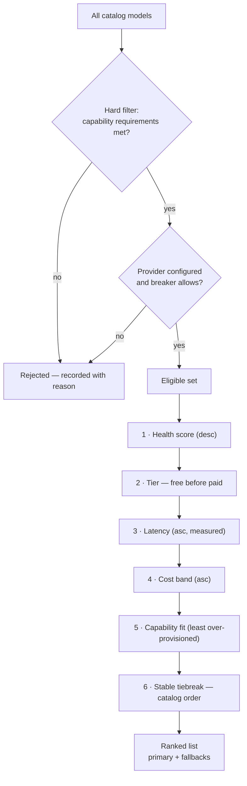
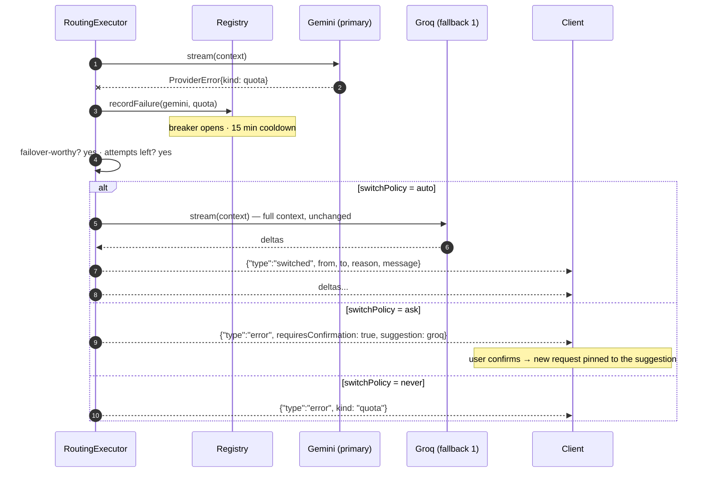
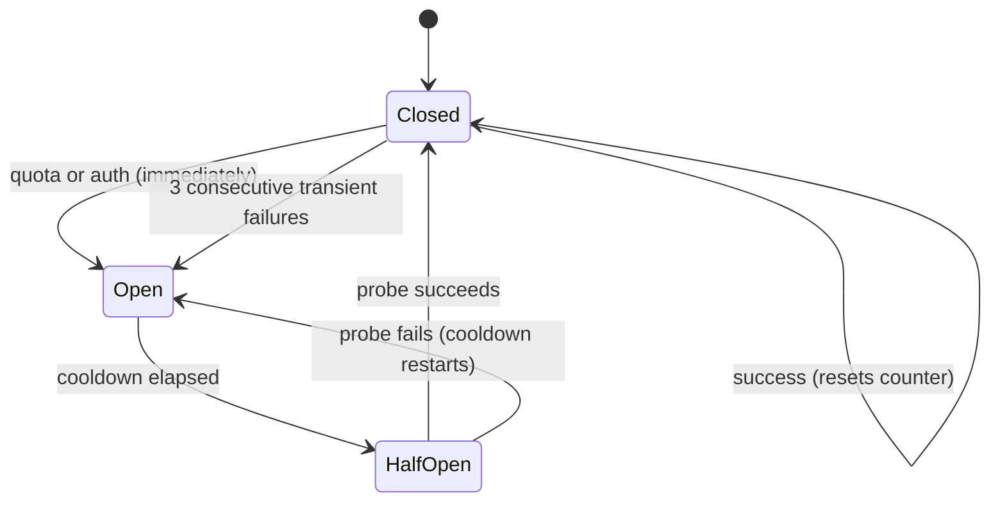

# 04 — Router

## What the router is

The router answers one question — **which model serves this request, and what
happens when it does not?** — and it is the single most important component in
NovaGPT. Every other subsystem exists to feed it good information or to carry out
its decisions.

It is split in two, deliberately:

| Component | Layer | Nature | Responsibility |
|---|---|---|---|
| **`RoutingPolicy`** | `domain/routing/` | Pure function | Given requirements, preference, and a health snapshot → a `RoutingDecision` |
| **`RoutingExecutor`** | `application/chat/` | Effectful | Carry out the decision: invoke, observe, retry, fail over, report |

**Why the split is load-bearing:** the policy is the part with subtle logic, and
it must be exhaustively testable — every combination of preference, capability,
health, and cost, in milliseconds, with no fixtures. The executor is the part
with I/O and is tested with fakes. Fusing them would make the interesting logic
reachable only through a network call, which is how routing logic becomes
untested and then wrong.

## Routing modes

| Mode | Trigger | Behaviour |
|---|---|---|
| **Manual (pinned)** | User selects a model in the UI | That model is used while usable. It is not overridden for being slower or pricier. |
| **Automatic** | No selection, or "Auto" | The policy ranks all capable models and picks the best. |
| **Constrained automatic** | Request declares requirements (vision, tools, min context) | Automatic, restricted to the models that satisfy every requirement. |
| **Failover** | Primary attempt failed operationally | Re-rank excluding tried providers, subject to `switchPolicy`. |

### Why a user's choice wins outright

An explicitly selected model is used even when the policy would prefer another —
overridden **only** when it is genuinely unusable (unconfigured, breaker open, or
incapable of a hard requirement).

The reasoning: a user who picks a model has information the router does not. They
may be comparing outputs, matching a colleague's result, or working around a
known weakness. A router that silently "improves" on that choice produces output
the user cannot reproduce or explain, which destroys trust in every part of the
system — including the parts that are working.

The router's job in manual mode is not to be smarter than the user. It is to
honour the choice and to be honest when it cannot.

## Request lifecycle



### The decision object

`RoutingDecision` is the policy's entire output and MUST be self-explanatory:

```
RoutingDecision {
  primary:      ModelDescriptor
  fallbacks:    ModelDescriptor[]   // pre-ranked, ordered
  reason:       string              // human-readable
  requirements: RequirementSet      // what was matched against
  consideredCount: number           // how many models were eligible
  rejected:     [{ modelId, why }]  // why each near-miss lost
}
```

**Why the decision carries its own rationale:** "why did my request go to Groq?"
is the single most common operational question in a multi-provider system.
Without a recorded rationale, answering it means re-deriving the state of eight
providers at a past moment — impossible. With it, one log line answers the
question. The `rejected` list is capped (top 5 near-misses) so the cost stays
bounded.

**Why fallbacks are computed up front, not lazily on failure:** the health
snapshot is taken once, so the primary and its fallbacks are ranked against a
*consistent* view. Re-querying health mid-failover can produce a fallback chosen
against a different world-state than the primary, which makes failover behaviour
irreproducible and untestable.

## Ranking

Automatic selection is a **lexicographic sort** — compare on the first criterion,
break ties with the second, and so on.



### Every criterion, and why it sits where it does

**Hard filter — capability requirements.** Not a ranking criterion but a gate. A
model that cannot do vision cannot serve a vision request at any speed or price.
Mixing this into scoring would let a fast, free, incapable model outrank a
capable one, and the request would fail at the provider. Hard requirements are
binary; binary constraints filter, they do not score.

**1 — Health, first.** A provider that is 40% likely to fail is worse than one
that is slower, because a failure costs the full attempt latency *plus* the
failover attempt. Health as a continuous score (not a boolean) means traffic
shifts away gradually as a provider degrades, rather than at a cliff.

**2 — Free tier before paid.** NovaGPT's premise is zero-cost operation
([01](01-system-overview.md#vision)). Between two healthy, capable models, using
the free one is strictly better for the operator and indistinguishable for the
user. Placed *after* health so we never prefer a broken free provider to a
working paid one — free is a preference, not a mandate.

**3 — Latency, measured.** Rolling average of the last 20 real requests, falling
back to the catalog's static `speed` score when there is no measurement yet.
*Why measured over static:* static scores are marketing numbers gathered under
ideal conditions. Measured latency reflects this deployment's region, this
network, this time of day, and this provider's current load — the only numbers
that describe what a user will actually experience.

**4 — Cost band.** Coarse bands (`Free`/`$`/`$$`/`$$$`) rather than
per-1K-token pricing. *Why coarse:* exact pricing changes constantly across eight
providers and would need continuous maintenance to stay accurate. Bands are
stable, good enough to order candidates, and do not rot. Exact cost accounting
belongs in usage records ([11](11-observability.md#cost-monitoring)), where it is
measured rather than predicted.

**5 — Capability fit.** Between two otherwise-equal models, prefer the one less
over-provisioned for the request. Routing a 200-token question to a 2M-context
model burns a scarce, expensive resource on a request that does not need it, and
starves the long-document request that arrives a minute later.

**6 — Stable tiebreak.** Catalog order. *Why explicit:* an unstable sort makes
identical requests route differently across restarts, which makes bug reports
irreproducible. Determinism is worth more here than any marginal gain from
randomising.

### What is deliberately not in the ranking

| Excluded | Why |
|---|---|
| **Model quality / benchmark score** | Benchmarks do not predict per-request quality, they are gamed, and they age badly. Users choose quality by picking a model; the router does not second-guess it. |
| **Random load-spreading** | Tempting for rate-limit avoidance, but it destroys reproducibility. Load spreading is achieved by health-driven demotion, which is *reactive to real signals* rather than blind. |
| **Time of day / quota prediction** | Modelling "Groq's daily quota resets at 00:00 UTC" is speculative optimisation against undocumented behaviour. The breaker already recovers automatically ([03](03-provider-system.md#health-system)). Revisit only with data showing it matters. |

## Fallback

### Which failures are failover-worthy

Only failures caused by the *provider's operational state*. A failure caused by
the *request* will fail identically everywhere.

| Kind | Fail over? | Reasoning |
|---|---|---|
| `quota` | ✅ | This provider is out; another is not |
| `rate_limit` | ✅ | Transient here, unrelated there |
| `timeout` | ✅ | Could be provider load |
| `outage` | ✅ | Provider is down |
| `auth` | ✅ (and page an operator) | Our key is broken; another provider still works, but a human must fix this |
| `api_error` | ❌ | The *request* was rejected. Retrying elsewhere multiplies one error into N |
| `UnsupportedCapability` | ❌ | Should never happen — indicates a capability-matrix bug, and must be surfaced, not masked |

**Why `auth` fails over but still pages:** the user should get an answer, and the
operator must learn the key is dead. Silently failing over would hide a broken
credential until every provider had one.

**Why `UnsupportedCapability` must not fail over:** it means the router selected a
model the catalog claimed was capable. Masking that with a failover hides a data
bug that will keep misrouting requests forever. It must be loud.

### Fallback flow



### Failover budget

**Maximum three attempts: one primary plus two fallbacks.**

Why exactly three:
- Each attempt costs real time. A user waiting through a 30 s timeout, then a
  second, then a third has waited 90 s for an error — a worse outcome than
  failing at 30 s with a clear message.
- If three independent providers fail on one request, the cause is almost
  certainly *not* provider-specific (a malformed request, an oversized context,
  a network partition). More attempts will not help and will delay the truth.
- Every attempt consumes a scarce free-tier quota unit. Burning three across a
  request that cannot succeed degrades service for every other user.

**Constant across attempts:** conversation history, system prompt, generation
settings, tool definitions. **Reset per attempt:** the accumulated stream buffer
([07](07-streaming-engine.md#failover-mid-stream)).

**Attempts never revisit a provider already tried in this request** — the tried
set is passed to the policy, which excludes it before ranking.

### Switch policies

Per-conversation, user-controlled:

| Policy | Behaviour | Who it is for |
|---|---|---|
| `auto` *(default)* | Switch, then tell the user which model answered and why | Almost everyone — availability matters more than model identity |
| `ask` | Surface the failure and the proposed alternative; wait for confirmation | Users comparing models, or where output must come from a specific model |
| `never` | Report the error; do not switch | Reproducibility-critical work; debugging a specific provider |

**Why `auto` is the default:** for the large majority of requests, getting a good
answer from a different good model beats getting an error. `ask` and `never` exist
because that is not universally true, and the user — not the router — knows which
case they are in.

**Failover is never silent, under any policy.** Under `auto` the client receives
a `switched` event before the new stream's tokens; the UI shows which model
actually answered. A user who notices a tone shift with no explanation loses
confidence in the system; a user who is told "Gemini hit its quota, Groq answered
instead" learns that the system works.

## Retry

Retry and failover are **different mechanisms for different failures** and are
frequently conflated.

| | Retry | Failover |
|---|---|---|
| Target | Same provider | Different provider |
| For | Transient blips: a single `429`, one 5xx, one timeout | Provider-level unavailability |
| Cost | One extra call, sub-second backoff | Full re-attempt, seconds |
| Where | Shared HTTP client, inside the adapter | Routing executor |
| Visible to user | No | Yes — always |

**Order of operations:** retry first (cheap, invisible, often sufficient), fail
over only when the same provider fails repeatedly. Inverting this would abandon
providers over single transient blips and cause needless model churn.

### Retry policy

| Parameter | Value | Reasoning |
|---|---|---|
| Retryable kinds | `timeout`, `rate_limit`, `outage` | These can succeed on a second attempt. `quota`, `auth`, `api_error` cannot |
| Max attempts | 2 retries (3 total) | Beyond this, the failure is not transient |
| Backoff | Exponential, base 300 ms, cap 4 s | Long enough for a transient blip; short enough that a user does not perceive a stall |
| Jitter | Full jitter (`random(0, backoff)`) | Without jitter, N clients that failed together retry together, producing a synchronised thundering herd that recreates the overload |
| `Retry-After` | Honoured when present, overriding backoff | The provider knows better than our heuristic. Ignoring it is how a rate limit becomes a ban |
| Cancellation | Aborts immediately on signal | A disconnected client's request must stop consuming quota now |

**Streaming is retried differently.** Establishing a stream may be retried; a
stream that has already emitted deltas MUST NOT be retried in place — the client
has those tokens. Mid-stream failure escalates to failover, which resets the
buffer and restarts cleanly. See
[07](07-streaming-engine.md#failover-mid-stream).

## Circuit breaker

The breaker prevents the pathology where a dead provider is retried by every
request, adding latency to every user and load to a provider that is already
failing.



| State | Requests | Health score |
|---|---|---|
| `Closed` | Flow normally | 1.0 |
| `Open` | Rejected without a network call | 0.0 |
| `HalfOpen` | One probe allowed | 0.5 |

### Cooldowns, and why each is that length

| Kind | Cooldown | Reasoning |
|---|---|---|
| `quota` | 15 min | Quotas reset on provider schedules (hourly/daily) we cannot see. 15 min balances "recover reasonably soon after an hourly reset" against "do not hammer a daily-capped provider". The active monitor probes during the window, so recovery is usually faster than the nominal cooldown |
| `rate_limit` | 60 s | Rate-limit windows are typically per-minute. One minute is the natural period |
| `outage` | 2 min | Provider incidents are rarely shorter; probing more often adds load to something already broken |
| `timeout` | 30 s | Often transient load. Short, so a healthy provider returns quickly |
| `auth` | 5 min | Requires human action. Long enough to stop the noise, short enough that a fixed key is picked up without a restart |
| `api_error` | 30 s | Usually our bug, not theirs. Short — the provider is probably fine |

### Threshold asymmetry

`quota` and `auth` open the breaker on the **first** failure. Transient kinds
require **three consecutive** failures.

The reasoning is about what a retry can achieve. A quota error is a *fact* about
the provider's state: it will not change in the next second, so a second attempt
is guaranteed waste. A timeout is a *sample*: it might be one slow request. Three
consecutive samples is the point where "unlucky" becomes "unhealthy".

**Consecutive, not windowed.** A provider that succeeds nine times and fails once
per ten is degraded but usable; the ranking demotes it via health score without
removing it. A provider that fails three times in a row is unusable. A windowed
rate would conflate these two very different situations.

## Timeout handling

Timeouts are layered, and every layer's budget is smaller than its parent's.

| Layer | Budget | Reasoning |
|---|---|---|
| Client (browser) | none | The user cancels by navigating or clicking stop |
| HTTP request (edge) | 300 s | Long-generation ceiling; a hung request eventually frees the connection |
| Router (whole request, all attempts) | 120 s | The point past which a user will not wait. Bounds retries and failovers in aggregate |
| Single provider attempt | 60 s (non-streaming) | Generous for a slow provider, short enough to leave budget for a failover |
| Time-to-first-token (streaming) | 20 s | A stream that has not started in 20 s is stuck; the *inter-token* timeout takes over afterwards |
| Inter-token (streaming) | 30 s | Detects a stalled stream. A total-duration cap would kill a legitimately long generation |
| Health probe | 8 s | A probe is a liveness sample, not work |

**Why the router budget is less than the HTTP budget:** the router must be able
to fail *cleanly* and return a useful error before the transport gives up. If the
transport times out first, the user sees a connection error instead of "all
providers are unavailable" — an actionable message replaced by an inscrutable
one.

**Why streaming uses two timeouts instead of one total duration:** a legitimate
long generation can run for minutes while emitting tokens steadily. A total cap
would truncate exactly the requests users value most. Time-to-first-token plus
inter-token detects *stalls* — which is the actual failure — without penalising
length.

## Provider prioritisation

Beyond automatic ranking, three explicit override mechanisms:

| Mechanism | Scope | Use |
|---|---|---|
| **Pinning** | One conversation | User selects a model; it wins while usable |
| **Priority weight** | Deployment | Operator biases ranking (e.g. "prefer EU-hosted") |
| **Dark mode** | Provider | New provider ranked last; receives only late-failover traffic ([03](03-provider-system.md#provider-onboarding-process)) |

**Priority weight is a bias, not an override.** It shifts a provider's position
in ranking; it cannot make an unhealthy or incapable provider eligible.

*Why bias and not hard priority:* a hard "always use Mistral first" rule breaks
the moment Mistral is degraded, and operators inevitably forget the rule exists
until it causes an incident. A bias expresses the same preference while leaving
the health machinery in control — the system stays safe by default.

## Every routing decision, enumerated

The complete decision table. Any behaviour not listed here is a bug.

| # | Situation | Decision | Why |
|---|---|---|---|
| 1 | User pinned a model; it is healthy and capable | Use it | Explicit intent beats inference |
| 2 | User pinned a model; breaker is open | Rank alternatives; apply `switchPolicy` | Unusable; the user gets an answer plus an explanation |
| 3 | User pinned a model; it lacks a required capability | Reject with a clear error; suggest a capable model | Silently substituting would give the user output from a model they did not choose, for a reason they cannot see |
| 4 | User pinned a model; provider unconfigured | Reject; list configured alternatives | Actionable — the fix is an env key |
| 5 | No preference; ≥1 model eligible | Rank; take the top | Standard automatic path |
| 6 | No preference; no eligible model | Error: "no provider available", listing why each was excluded | The diagnostic *is* the value |
| 7 | Requirements exclude all models | Error naming the unsatisfiable requirement | Distinguishes "nothing is up" from "nothing can do this" |
| 8 | Primary fails, `quota`, `auto` | Fail over to fallback 1; emit `switched` | Operational failure; alternatives exist |
| 9 | Primary fails, `api_error` | Surface the error; no failover | Request-caused; would fail identically elsewhere |
| 10 | Primary fails, `auth` | Fail over **and** log at error level for paging | User gets an answer; operator gets the alarm |
| 11 | Primary fails, `ask` policy | Return the proposal with the suggested model; do not switch | User asked to be consulted |
| 12 | Primary fails, `never` policy | Surface the error | User asked not to switch |
| 13 | All three attempts fail | Error listing every provider tried and its failure kind | Full diagnostic in one message |
| 14 | Client disconnects mid-stream | Abort immediately; do **not** fail over; do not persist | Nobody is listening; failing over would burn quota for no one |
| 15 | Provider returns an empty response | Treat as `outage`; fail over | Empty is not an answer. Common under silent quota exhaustion |
| 16 | Fallback also fails, same kind | Continue to fallback 2 if budget remains | Independent providers; correlated failure is possible but not assumed |
| 17 | Every provider unconfigured | Error: "add an API key to get started" | The only actionable message on a fresh install |
| 18 | Context exceeds every eligible model's window | Context engine trims first; if still over, error naming the smallest sufficient model | Failing at the provider wastes a round trip and a quota unit |
| 19 | Requirements satisfiable only by a paid provider, none configured | Error naming the capability and which providers offer it | Turns a dead end into a setup instruction |
| 20 | Half-open provider is selected and its probe fails | Reopen the breaker; fail over immediately | The probe *is* the request; a failed probe is a failed request |
