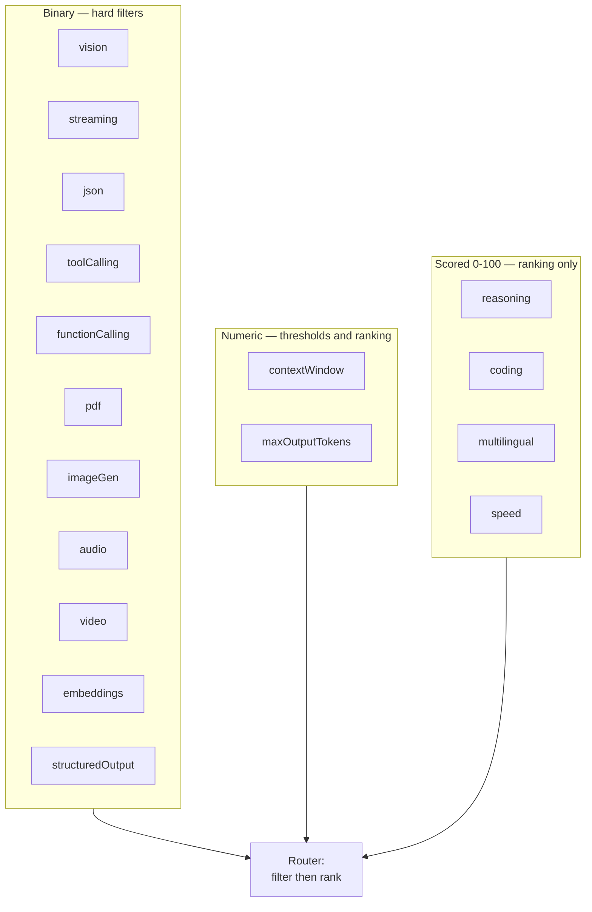
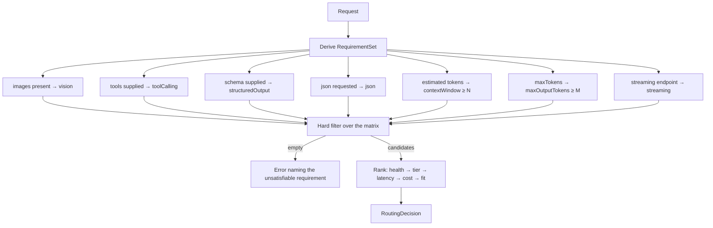

# 05 — Capability Matrix

## The problem

The router must answer "can this model serve this request?" before it sends
anything. There are only three ways to know:

1. **Try it and see.** Costs a full round trip, a quota unit, and — for a
   streaming request — a partially-rendered failure in front of the user.
2. **Hard-code it.** `if (model.startsWith("gemini")) canDoVision = true`. Wrong
   the day a text-only Gemini variant ships, and wrong invisibly.
3. **Declare it as data, and let the router query it.**

The third is the capability matrix. It is the only mechanism in the system that
lets the router make correct decisions *before* spending a request.

## Design principles

**Capabilities are data, never code.** Adding a model is a one-line data change,
reviewable by anyone, diffable in a pull request, and testable without a network
call. There is no code path in NovaGPT that branches on a model id.

**Capabilities attach to models, not providers.** A provider is not "a vision
provider" — Zhipu serves GLM-4-Flash (text) and GLM-4V-Flash (vision) with
different context windows. Attaching capabilities to providers would force the
router to either over-promise (route text-only work to a vision model) or
under-promise (never use the vision model). Provider-level capability is a
*derived* view: the union of its models'.

**Under-advertise when uncertain.** Over-advertising costs a failed request, a
wasted quota unit, and a user-visible error. Under-advertising costs a slightly
suboptimal route that the user never notices. The asymmetry is large, so the rule
is: if you have not verified it, do not claim it.

**Capabilities are versioned with the catalog.** Every change bumps
`catalogVersion` ([03](03-provider-system.md#versioning)), which invalidates
client caches. A stale capability cache silently misroutes requests.

## The capability axes

Capabilities fall into three kinds, and the kind determines how the router uses
them.



### Binary capabilities — hard filters

A binary capability is either present or absent. A request that requires one and
gets a model without it **fails at the provider**. These are filters, never
scores.

| Capability | Declares | Router use |
|---|---|---|
| `vision` | Accepts image inputs alongside text | Filter when the request has images |
| `streaming` | Supports incremental token delivery | Filter for `/chat/stream` |
| `json` | Guarantees syntactically valid JSON output (`response_format: json_object` or equivalent) | Filter when JSON mode is requested |
| `structuredOutput` | Enforces a caller-supplied **schema**, not merely valid JSON | Filter when a schema is supplied. Strictly stronger than `json` |
| `toolCalling` | Native tool/function-call protocol | Filter when tools are supplied |
| `functionCalling` | Legacy OpenAI `functions` parameter | Filter, legacy path only |
| `pdf` | Accepts PDF documents as native input (not pre-extracted text) | Filter for document requests |
| `imageGen` | Produces images | Filter — *no Phase 1 provider has this* |
| `audio` | Accepts audio input or produces speech | Filter — *no Phase 1 provider has this* |
| `video` | Accepts video input | Filter — *Gemini only in Phase 1* |
| `embeddings` | Produces vectors | Filter for the embeddings endpoint |

**Why `json` and `structuredOutput` are separate axes.** They are commonly
conflated and the difference is operationally significant. `json` guarantees
*parseable* output; `structuredOutput` guarantees *schema-conformant* output. A
caller that needs `{name: string, age: number}` and routes to a `json`-only model
gets valid JSON with the wrong shape — a bug that surfaces downstream, far from
its cause, and usually in production. Two axes make the router able to prevent
it.

**Why `toolCalling` and `functionCalling` are separate.** The legacy `functions`
parameter and the modern `tools` parameter are different wire protocols with
different response shapes. Several providers support one and not the other.
Collapsing them would make the router promise a protocol the adapter cannot
speak.

**Why capabilities are declared for things no Phase 1 provider has** (`imageGen`,
`audio`): the matrix is the contract for *future* providers as much as current
ones. An axis defined now means adding an audio provider later is a data change,
not a schema migration plus a router change. The cost of an unused axis is one
column of `false`.

### Numeric capabilities — thresholds and ranking

| Capability | Unit | Router use |
|---|---|---|
| `contextWindow` | tokens | Hard filter (`>= required`), then ranking (prefer the smallest sufficient) |
| `maxOutputTokens` | tokens | Hard filter against the requested `maxTokens` |

**Why context window is both a filter and a ranking input.** As a filter it is
absolute: a 24K-context model cannot serve a 30K-token conversation, and trying
wastes a round trip. As a ranking input it is a scarcity signal: routing a
200-token question to a 1M-context model consumes a rare resource that the next
request — a 400K-token document — genuinely needs. "Smallest sufficient window"
is the same principle as not allocating a 64 GB machine to run `echo`.

**`maxOutputTokens` is separate from `contextWindow` because they are separate
limits.** Several models advertise a 128K context but cap output at 8K. A model
that can *read* a long conversation but cannot *write* the requested reply length
will truncate mid-sentence — a failure that looks like a model quality problem
and is actually a routing bug.

### Scored capabilities — ranking only

Scores are `0–100`, relative, and **never** hard filters.

| Capability | Meaning |
|---|---|
| `reasoning` | Multi-step reasoning, maths, analysis |
| `coding` | Code generation and comprehension |
| `multilingual` | Non-English quality, especially CJK |
| `speed` | Relative tokens/sec under normal load |

**Why scores never filter.** A threshold like "reasoning ≥ 85" implies the scores
are calibrated across providers to a meaningful scale. They are not — they are
maintainer estimates from benchmarks and hands-on use. Using an uncalibrated
number as a hard gate produces confidently wrong exclusions. As a *tiebreaker*
among otherwise-equal candidates, the same imprecise number is useful: being
approximately right about ordering is enough when both options would have worked.

**Scores must be justified in the pull request that adds them.** A guessed score
silently biases routing for every user, forever, with no error to trace it back
to. The justification does not need to be rigorous — a benchmark reference or
"comparable to X, which scores Y" is enough — it needs to exist so a future
maintainer can re-evaluate it.

**`speed` is the static fallback for measured latency.** Once the registry has
real latency samples for a provider, measured data wins
([04](04-router.md#ranking)). `speed` only decides the ordering of models nobody
has called yet.

## Model descriptor schema

```
ModelDescriptor {
  id                  string    // provider's own model id — exact
  provider            string    // provider id
  displayName         string    // UI label

  capabilities {
    vision            boolean
    streaming         boolean
    json              boolean
    structuredOutput  boolean
    toolCalling       boolean
    functionCalling   boolean
    pdf               boolean
    imageGen          boolean
    audio             boolean
    video             boolean
    embeddings        boolean
  }

  limits {
    contextWindow     number    // tokens
    maxOutputTokens   number    // tokens
  }

  scores {
    reasoning         0-100
    coding            0-100
    multilingual      0-100
    speed             0-100
  }

  economics {
    tier              "free" | "paid"
    costBand          "Free" | "$" | "$$" | "$$$"
  }

  metadata {
    deprecated        boolean
    replacedBy        string?   // model id
    notes             string?   // free-tier caveats, terms restrictions
    verifiedAt        ISO date  // when capabilities were last confirmed
  }
}
```

**Why `verifiedAt` exists.** Capability data rots. A provider changes a model's
context window or removes a feature, and nothing in the system notices — the
matrix keeps asserting what was true six months ago. A timestamp lets a quarterly
audit ([11](11-observability.md)) list every model not verified recently. It is
the cheapest possible defence against silent data decay.

**Why `deprecated` and `replacedBy` exist.** Providers retire models with little
notice. Marking a model deprecated removes it from *automatic* selection while
leaving it usable for a user who has it pinned, and `replacedBy` lets the UI
suggest a migration. Deleting the entry outright would break pinned conversations
with an unhelpful "unknown model" error.

## The Phase 1 capability matrix

Representative models per provider. The authoritative version lives in the
catalog data file; this table is the design intent.

| Model | Provider | Vision | Tools | JSON | Schema | Context | Max out | Reason | Code | Multi | Speed | Tier |
|---|---|:-:|:-:|:-:|:-:|--:|--:|--:|--:|--:|--:|---|
| gemini-2.5-pro | Gemini | ✅ | ✅ | ✅ | ✅ | 2M | 8K | 94 | 90 | 88 | 74 | paid |
| gemini-2.5-flash | Gemini | ✅ | ✅ | ✅ | ✅ | 1M | 8K | 82 | 80 | 85 | 96 | free |
| llama-3.3-70b-versatile | Groq | ❌ | ✅ | ✅ | ❌ | 128K | 32K | 80 | 78 | 70 | 94 | free |
| llama-3.1-8b-instant | Groq | ❌ | ✅ | ✅ | ❌ | 128K | 8K | 72 | 68 | 62 | 99 | free |
| deepseek-chat | DeepSeek | ❌ | ✅ | ✅ | ✅ | 128K | 8K | 90 | 94 | 74 | 80 | paid |
| deepseek-reasoner | DeepSeek | ❌ | ❌ | ❌ | ❌ | 128K | 8K | 96 | 92 | 72 | 55 | paid |
| qwen-plus | Qwen | ✅ | ✅ | ✅ | ❌ | 256K | 8K | 83 | 82 | 96 | 85 | paid |
| mistral-large-latest | Mistral | ❌ | ✅ | ✅ | ✅ | 128K | 8K | 85 | 84 | 82 | 86 | paid |
| open-mistral-nemo | Mistral | ❌ | ✅ | ✅ | ❌ | 128K | 8K | 76 | 72 | 78 | 90 | free |
| openrouter/auto | OpenRouter | ✅ | ✅ | ✅ | ❌ | 200K | 8K | 88 | 86 | 80 | 80 | paid |
| glm-4-flash | Zhipu | ❌ | ✅ | ✅ | ❌ | 128K | 4K | 80 | 78 | 90 | 90 | free |
| glm-4v-flash | Zhipu | ✅ | ❌ | ❌ | ❌ | 8K | 2K | 78 | 62 | 86 | 84 | free |
| meta/llama-3.3-70b-instruct | NVIDIA | ❌ | ✅ | ✅ | ❌ | 128K | 8K | 80 | 78 | 70 | 82 | free |

*Every model above supports `streaming: true`. `pdf`, `imageGen`, `audio`,
`embeddings` are `false` except where noted in the catalog; `video` is Gemini-only.*

### Coverage analysis — why this set is sufficient

The set was validated against one rule: **every capability must be served by at
least two providers**, so failover never has to drop a required capability.

| Capability | Providers offering it | Failover viable? |
|---|---|---|
| Vision | Gemini, Qwen, Zhipu (GLM-4V), OpenRouter | ✅ 4 |
| Tool calling | Groq, DeepSeek, Qwen, Mistral, OpenRouter, Zhipu, NVIDIA, Gemini | ✅ 8 |
| JSON mode | All except GLM-4V and deepseek-reasoner | ✅ |
| Schema-enforced output | Gemini, DeepSeek, Mistral | ✅ 3 |
| Context ≥ 128K | Every provider except GLM-4V | ✅ |
| Context ≥ 1M | Gemini only | ⚠️ **single point of failure** |
| Strong reasoning (≥90) | Gemini Pro, DeepSeek | ✅ 2 |
| Strong multilingual (≥90) | Qwen, Zhipu | ✅ 2 |
| Very high speed (≥94) | Groq ×2, Gemini Flash | ✅ 3 |

**The one identified gap: context above 256K is Gemini-only.** A conversation
needing more than 256K tokens has no failover destination — if Gemini is down,
the request fails. This is a known, accepted Phase 1 risk, with two mitigations:
the context engine compresses aggressively before declaring a large-window
requirement ([06](06-context-engine.md)), and the roadmap flags a second
large-context provider as the highest-value Phase 5 addition
([14](14-roadmap.md)).

Documenting the gap is the point. An undocumented single point of failure is
discovered during an incident.

## How routing uses the matrix



### Requirements are derived, not declared

The client does **not** send `requiresVision: true`. It sends images. The backend
derives the requirement.

**Why derivation beats declaration:**
- A client that forgets to declare a requirement gets a wrong route and a
  confusing failure. Derivation cannot be forgotten.
- A client that over-declares (`requiresVision` on a text request) needlessly
  shrinks the candidate set and degrades routing quality.
- Derivation rules live in one place and are unit-testable. Declaration rules
  live in every client, forever, including clients we do not control.

The frontend never needs to know which models support what — which is the same
provider-independence property the whole architecture is built on, applied to the
client boundary.

### Capability fit as a ranking input

Among candidates that all satisfy the hard filter, prefer the **least
over-provisioned**:

```
fitPenalty = (contextWindow / requiredTokens)
           + (unrequested binary capabilities present) * weight
```

**Why penalise unrequested capabilities:** a vision-capable model is typically
larger, slower, and scarcer than a text-only equivalent. Spending it on a text
request is worse for the user (slower) and worse for the fleet (the vision
request that arrives later finds the quota gone).

### Errors the matrix makes possible

Because requirements are checked *before* dispatch, failures are specific rather
than generic:

| Situation | Message |
|---|---|
| Vision request, no vision provider configured | "Image input needs a vision model. Configure Gemini, Qwen, or Zhipu." |
| 300K-token context, largest window is 256K | "This conversation is too long for any available model. The largest available window is 256K tokens (Qwen)." |
| Schema output, no schema-capable provider up | "Schema-enforced output needs Gemini, DeepSeek, or Mistral. All are currently unavailable." |
| Pinned model lacks a required capability | "Llama 3.3 cannot read images. Switch to Gemini Flash, or remove the attachment." |

Every one of these names the constraint *and* the fix. Compare with what a
try-and-see architecture produces: a provider error string, after a round trip,
after the user has waited.

## Maintaining the matrix

| Trigger | Action |
|---|---|
| Provider ships a model | Add an entry with justified capabilities and scores |
| Provider changes a limit | Update the entry, bump `verifiedAt`, bump `catalogVersion` |
| Provider deprecates a model | Set `deprecated: true`, set `replacedBy`. **Never delete** — pinned conversations reference it |
| A routing failure implicates the matrix | Treat as a bug with the same severity as a code bug; add a regression test |
| Quarterly | Audit every entry with a stale `verifiedAt`; re-confirm against provider docs |

**Matrix bugs are code bugs.** An incorrect capability flag causes user-visible
failures the router cannot prevent, and it does so silently until someone
notices. It gets the same review, the same regression test, and the same
severity as a defect in the routing algorithm itself.
