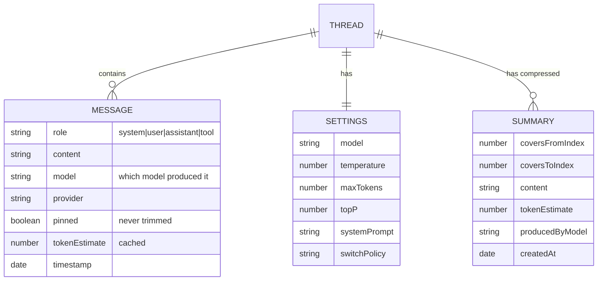
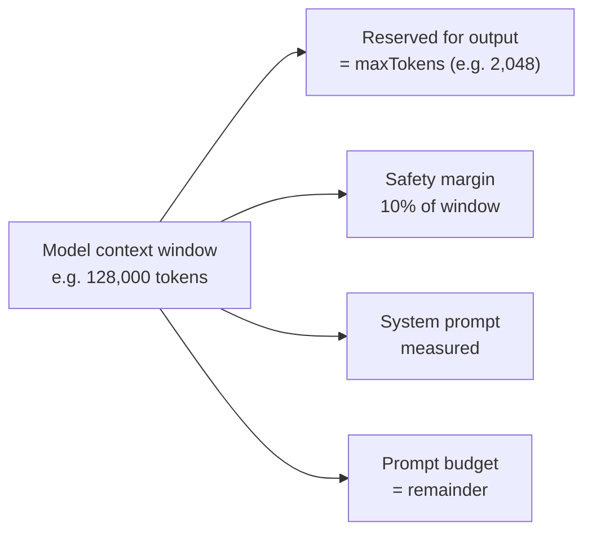
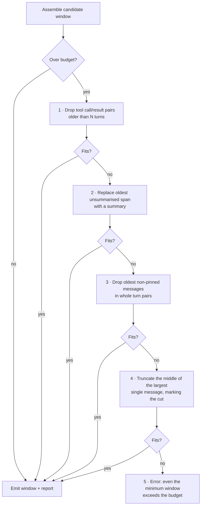
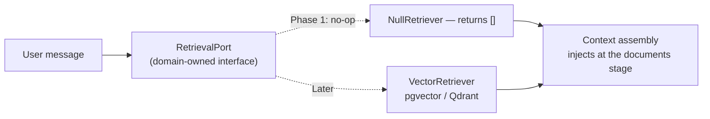

# 06 — Context Engine

## What it is

The context engine turns a **stored conversation** into a **bounded prompt** that
fits the target model's window, preserves what matters, and reports exactly what
it did.

It is the component that decides what the model gets to see. Every quality
complaint that is not a model complaint is a context complaint: the model
"forgot" something, "ignored" an instruction, or "lost the thread". Those are
context-engine outcomes.

## Design principles

**Deterministic.** Same conversation, same budget, same model → byte-identical
prompt. *Why:* a non-deterministic context engine makes every quality regression
unreproducible. If a user reports a bad answer, we must be able to reconstruct
the exact prompt that produced it.

**Explicit, never silent.** Every trimmed message, every compression, every
injection is recorded in a `ContextReport` returned alongside the window. *Why:*
silent trimming is the single most confusing failure mode in chat products — the
model "forgets" something the user can still see on screen. If we cannot explain
it, we cannot debug it, and the user cannot understand it.

**Pure.** The engine is domain code: no database access, no network calls, no
clock. It receives a conversation and returns a window. *Why:* it makes
"what happens to a 200-message thread at a 128K budget?" a unit test rather than
an integration test.

**Model-aware, provider-agnostic.** The engine budgets against the *target
model's* window and tokeniser characteristics, but knows nothing about which
provider serves it.

## Conversation management

### The data model



**Why `tokenEstimate` is cached on the message.** Estimation is the engine's
hot path — assembling a 200-message thread means 200 estimations on every turn.
The count for a message never changes after it is written, so computing it once
at write time turns a per-request O(n) cost into O(1). Recomputing on every
request is the difference between a 2 ms and a 40 ms assembly step, on every
single message the user sends.

**Why summaries are separate documents, not rewritten messages.** Compression
must be **non-destructive**. If summarising replaced the original messages, the
user's scrollback would silently change, a better compression strategy could
never be applied retroactively, and a compression bug would be unrecoverable data
loss. Storing summaries alongside the originals means the engine chooses at
assembly time which representation to use, and the raw history is always intact.

**Why messages carry `model` and `provider`.** With failover, different turns in
one conversation come from different models. The user must be able to see which
model said what — otherwise a tone or quality shift is inexplicable — and
debugging a bad answer requires knowing which model produced it.

## Context windows and budgeting

The model's advertised window is **not** the prompt budget. Four things share it.



```
promptBudget = contextWindow
             - maxOutputTokens        // the reply must fit
             - systemPromptTokens     // always included
             - safetyMargin           // 10% of window, min 512, max 8000
```

**Why reserve output tokens.** Context windows are shared between input and
output. Filling the window with prompt leaves no room for a reply, and the
provider either errors or truncates mid-sentence. The failure looks like a model
quality problem and is actually an arithmetic bug.

**Why a 10% safety margin.** Token estimation is an approximation
([below](#token-estimation)), and providers count differently — message
envelopes, role markers, tool schemas, and image tokens all add overhead we
cannot see from outside. A prompt estimated at exactly 128,000 tokens will
sometimes be 130,000 real tokens and be rejected. The margin turns a hard failure
into a slightly shorter prompt. Capped at 8,000 so that huge windows do not waste
100K tokens of margin.

**Why the margin is percentage-based.** Estimation error scales with content
length. A fixed margin is wastefully large for an 8K window and dangerously small
for a 1M one.

## Token estimation

Exact tokenisation is impossible: every provider uses a different tokeniser, most
do not publish theirs, and shipping eight tokenisers would add tens of megabytes
of vocabulary files to serve an estimate the safety margin already covers.

**Three-tier strategy:**

| Tier | Method | Accuracy | Used for |
|---|---|---|---|
| 1 | Heuristic: `chars / 3.6`, script-aware | ±15% | Every estimate by default |
| 2 | Provider-reported `usage` from the previous turn | Exact, but retrospective | Calibrating tier 1 per conversation |
| 3 | Real tokeniser (`tiktoken`) | ±2% | *Later* — only if measurements justify the dependency |

### The heuristic, and why it is shaped this way

```
estimate(text) = ceil(weightedChars / 3.6) + perMessageOverhead(4)
```

- **3.6 chars/token** for English prose — empirically between GPT-family (~4.0)
  and Llama-family (~3.5) tokenisers. Chosen slightly low so estimates skew
  *high*, which is the safe direction.
- **Script weighting:** CJK characters count as ~1 token each (they are not
  ~3.6 chars/token in any tokeniser); code and markup count higher than prose
  because punctuation and identifiers fragment badly.
- **Per-message overhead** of 4 tokens for role markers and message delimiters,
  which every chat format adds and which is invisible in the content.

**Why estimate high rather than low.** Underestimating means the provider rejects
the request after a full round trip — wasted latency, wasted quota, user-visible
error. Overestimating means slightly more trimming than strictly necessary, which
the user does not notice. Asymmetric costs justify an asymmetric heuristic.

### Self-calibration

Providers return actual `promptTokens` in their usage data. The engine compares
its estimate against the truth and maintains a per-conversation correction
factor:

```
correction = clamp(actualTokens / estimatedTokens, 0.7, 1.4)
```

After one turn, the estimate for *this* conversation — with its specific
language, code density, and formatting — is far more accurate than any generic
heuristic. Clamped to prevent one anomalous response (a tool-call-heavy turn, a
truncated reply) from poisoning the factor.

**Why per-conversation and not global:** a conversation is homogeneous — mostly
Python, or mostly Japanese, or mostly prose. A global factor averages across all
of those and is right for none of them.

## History trimming

When the assembled prompt exceeds the budget, the engine trims. **Order is
strictly defined and never varies.**



### Why this order

**1. Tool artefacts first.** Tool calls and their results are the highest
token-per-value content in a conversation — a search result can be thousands of
tokens whose *conclusion* is already restated in the assistant's reply. Dropping
them loses the least meaning per token recovered.

**2. Summarise before dropping.** A summary preserves the *substance* of old
turns at ~10% of the tokens. Dropping loses it entirely. Summarising costs an
extra model call, which is why it comes second rather than first — but it is
always better than deletion when the budget allows it.

**3. Whole turn pairs, oldest first.** Never drop a user message while keeping
the assistant reply to it, or vice versa. An orphaned reply reads as the model
answering a question that was never asked, and models trained on well-formed
dialogue behave badly on malformed history. Oldest-first because recency
correlates strongly with relevance in conversation.

**4. Truncate the middle, not the end.** When one message alone is too large
(a pasted file, a long log), cut from the middle and mark it:
`[... 4,200 tokens omitted ...]`. The beginning carries the setup and the end
carries the conclusion; the middle is the most compressible region. The marker is
mandatory — an unmarked truncation makes the model confidently reason about
content it never received.

**5. Fail loudly.** If the system prompt, the pinned messages, and the newest
user message together exceed the budget, there is nothing left to trim. Error
with a message naming what is too large and which model has a bigger window
([05](05-capability-matrix.md#errors-the-matrix-makes-possible)).

### The invariants

Trimming MUST NOT violate any of these:

| Invariant | Why |
|---|---|
| The system prompt is always present | It carries behavioural instructions; dropping it changes the model's persona mid-conversation |
| The newest user message is always present | It is the request. Without it there is nothing to answer |
| Pinned messages are always present | The user explicitly marked them as required context |
| Messages stay in chronological order | Reordering destroys causal structure |
| Turn pairs are dropped together | No orphaned questions or answers |
| Every removal appears in the `ContextReport` | Silent removal is the failure mode we are designing against |

## Pinned messages

A user may pin any message; pinned messages are **never trimmed**.

**Why this is a user-facing control rather than an automatic heuristic.**
Relevance is not inferable from text. A user who pastes a schema on turn 3 and
asks about it on turn 40 knows that schema is load-bearing; no recency or
similarity heuristic reliably knows that. Automatic importance detection would be
wrong sometimes, silently, and in a way the user cannot correct. A pin is a
direct, correctable expression of intent.

**Guardrails:**
- Pinned content is capped at **40% of the prompt budget**. Beyond that, pinning
  would crowd out the recent conversation and the model would answer with stale
  context.
- Exceeding the cap warns the user and pins are honoured newest-first up to the
  limit — it does not silently ignore pins.
- Pinning is per-message, never per-turn: a user can pin a schema without pinning
  the model's commentary about it.

## Compression and summaries

### Trigger

Compression runs when a conversation crosses **70% of the prompt budget** —
proactively, not at the moment of overflow.

**Why 70% and not at the limit.** Compression requires a model call, which takes
seconds. Doing it at overflow adds that latency to the very request that needed
the space, in the user's critical path. At 70%, compression runs *between* turns
(or asynchronously after a turn completes), so the user never waits for it.

### What gets summarised

The **oldest contiguous unsummarised span**, leaving the most recent N turns
(default 6) always in full fidelity.

**Why preserve recent turns verbatim.** Recent turns are what the current
question is about. Summarising them loses the exact wording, the code snippets,
the specific numbers — precisely what the model needs for the next reply.
Summarising old turns loses detail the conversation has already moved past.

### Summary requirements

A summary MUST preserve:
- Decisions reached and constraints established
- Named entities: file paths, identifiers, versions, URLs
- Unresolved questions and open threads
- The user's stated goals and preferences

A summary MUST NOT preserve:
- Conversational scaffolding ("sure, I can help with that")
- Restatements of content that appears verbatim later
- The model's own hedging and caveats

**Target compression ratio: ~10:1.** Below ~5:1 the summary is not saving enough
to justify the model call. Above ~20:1 too much is being lost to be useful.

### Which model summarises

The **cheapest, fastest capable model available** — not the conversation's
model. Summarisation is a mechanical transformation, not a reasoning task, and it
happens off the critical path. Spending a scarce frontier-model quota unit on it
would starve the requests that need it.

The summary records `producedByModel` so a bad summary can be traced to its
source.

### Compression risks, stated honestly

| Risk | Mitigation |
|---|---|
| Summary omits something later turns depend on | Originals are never deleted; pinning is available; the report shows what was compressed |
| Summarising a summary compounds loss | Summaries are produced from **originals**, never from other summaries |
| Summarisation model hallucinates a detail | Constrained prompt, low temperature, and the summary is labelled as a summary in the prompt so the model treats it as secondary evidence |
| Compression cost exceeds its benefit | Skipped entirely when the conversation is under 70% budget; skipped when the estimated saving is under 2,000 tokens |

## Memory injection

Memory is content injected into a prompt that did not come from this
conversation's history.

| Kind | Source | Scope | Phase |
|---|---|---|---|
| **System prompt** | Thread settings | This conversation | 1 |
| **User profile** | User preferences (name, tone, language) | All conversations | Later |
| **Long-term memory** | Extracted facts from past conversations | All conversations | Later |
| **Retrieved documents** | RAG over a corpus | Query-dependent | Later |

### Injection order, and why it is fixed

```
[ system prompt ]
[ user profile / long-term memory ]
[ retrieved documents ]
[ conversation summary ]
[ recent messages, verbatim ]
[ newest user message ]
```

Ordered by **stability, most stable first**. The system prompt never changes;
profile changes rarely; retrieved documents change per query; conversation
changes every turn.

**Why stability order matters practically:** it is what makes prompt caching
viable. Providers that cache prompt prefixes (a growing number do) can only reuse
a cache when the prefix is byte-identical. Putting volatile content early
invalidates the cache on every turn and forfeits a large latency and cost saving.
This ordering is chosen now, before caching is implemented, because retrofitting
it later would mean changing every prompt the system produces.

**Memory is budgeted, not unbounded.** Injected memory is capped at 25% of the
prompt budget. Memory that crowds out the conversation makes the model answer
from general knowledge instead of from what the user just said.

## Future RAG integration

RAG is deferred, but the extension point is designed now so it is an insertion
rather than a rewrite.



**Why define the port now and implement nothing.** The pipeline stage, the
budget allocation, and the report field all exist from day one, with a null
implementation. Adding real retrieval later means writing one adapter and
changing one line in the composition root. Retrofitting a retrieval stage into an
assembly function that was never designed for it means rewriting the assembly
logic and re-testing every trimming path.

**Why the vector database choice is deferred.** Choosing pgvector vs Qdrant vs
Milvus without a retrieval workload is choosing blind. The decision depends on
corpus size, query rate, filtering needs, and whether we already run Postgres —
none of which are known yet. The port makes the choice cheap and late, which is
exactly what you want for a decision you cannot yet make well.

## The context report

Every assembly returns a report alongside the window:

```
ContextReport {
  targetModel        string
  contextWindow      number
  promptBudget       number
  estimatedTokens    number
  correctionFactor   number

  included { systemPrompt, pinned, summaries, messages, memory, documents }  // counts
  trimmed  [{ messageId, reason, tokensSaved }]
  compressed [{ fromIndex, toIndex, originalTokens, summaryTokens }]
  truncated  [{ messageId, tokensOmitted }]

  warnings string[]   // e.g. "pinned content used 38% of the budget"
}
```

**This report is the product of the whole document.** It is:
- **Logged** with the request, so a bad answer can be traced to the exact context
  that produced it.
- **Surfaced to the user** when meaningful ("earlier messages were summarised to
  fit"), so context loss is never a mystery.
- **Asserted in tests** — trimming tests check the report, not just the window,
  which is what makes the invariants above enforceable.
- **The metric source** for context health ([11](11-observability.md)):
  compression rate, trim frequency, and estimation error are all derived from it.

An engine that trims without reporting is an engine whose behaviour nobody can
explain — including the people who wrote it.
