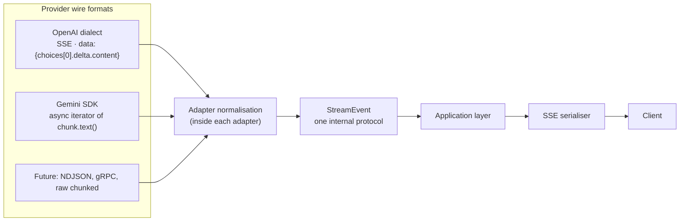
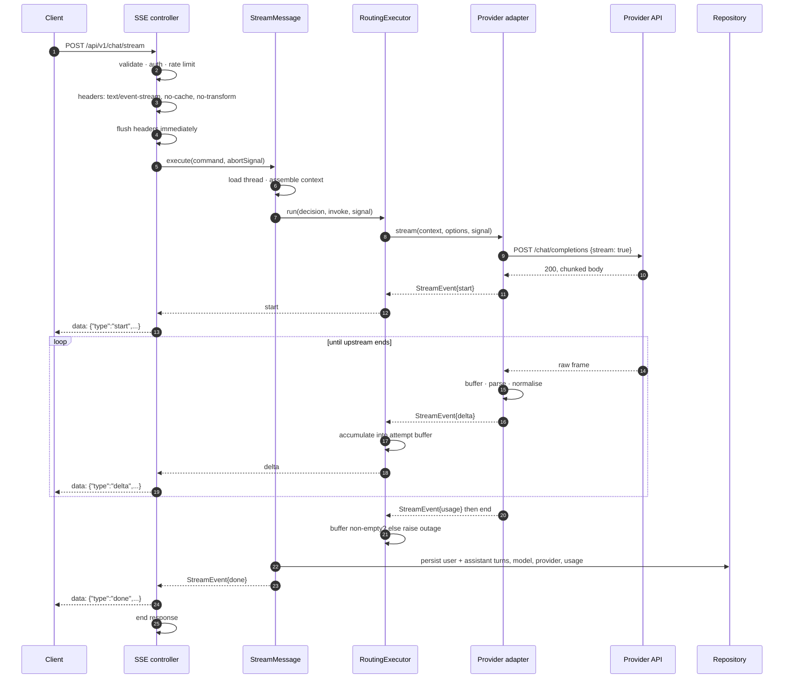
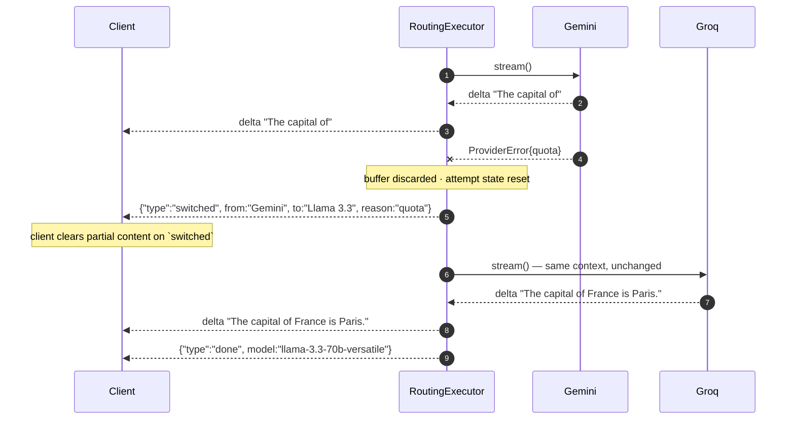
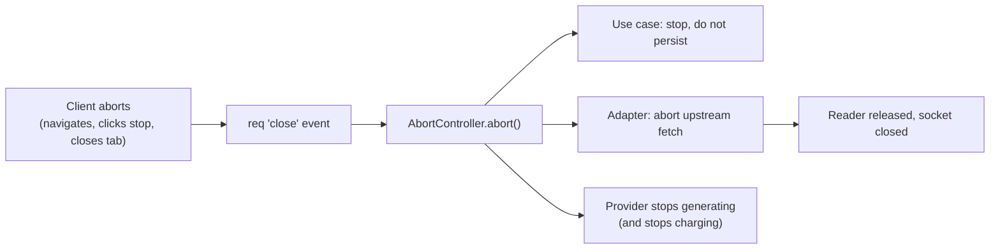
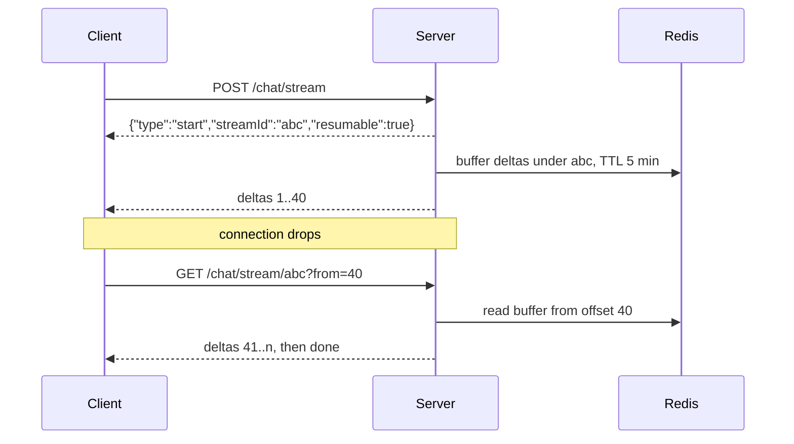

# 07 — Streaming Engine

## Why streaming is architecturally load-bearing

Streaming is not a UX polish item. It changes the failure model of the entire
system.

In a request/response world a failure is atomic: the request either produced an
answer or it did not, and the client saw nothing until it was decided. In a
streaming world a failure can arrive **after the client has already rendered 400
tokens**. Failover, retry, persistence, and cancellation all have to answer a
question that does not exist in the non-streaming case: *what do we do about the
output already delivered?*

Every design decision in this document follows from that question.

## Unified streaming

Eight providers, at least three streaming dialects, one internal event protocol.



**The rule: normalisation happens in the adapter, at the earliest possible
point.** Nothing above the adapter ever sees a provider's frame shape.

**Why normalise at the adapter and not centrally.** A central normaliser would
need a branch per provider — which is provider knowledge living outside the
provider's folder, the exact leak the architecture exists to prevent
([03](03-provider-system.md)). It would also grow a branch with every new
provider, making the shared file the most-edited and most-conflicted file in the
repository.

**Why an internal event protocol rather than yielding plain strings** (which the
current implementation does): a raw string can only express "here is more text".
It cannot express usage data, a tool call, a reasoning trace, a provider switch,
or a finish reason. Providers already emit all of these. Yielding strings forces
that information to be either discarded or smuggled through side channels; both
are worse than defining an event type once.

## Stream events

### The event protocol

| Event | Payload | Meaning | Frequency |
|---|---|---|---|
| `start` | `{ model, provider, traceId }` | Stream established; the client can render a header | Once |
| `delta` | `{ text }` | Incremental content | Many |
| `reasoning` | `{ text }` | Reasoning-trace content, rendered separately | Many, model-dependent |
| `tool_call` | `{ id, name, arguments }` | Model requested a tool | 0..n |
| `switched` | `{ from, to, reason, message }` | Failover occurred; content restarts | 0..1 per failover |
| `usage` | `{ promptTokens, completionTokens }` | Token accounting | Once, at end, when available |
| `done` | `{ model, provider, finishReason }` | Stream complete | Once |
| `error` | `{ kind, message, requiresConfirmation?, suggestion? }` | Terminal failure | Once |
| `ping` | `{}` | Keep-alive | Every 15 s of silence |

**Terminal invariant:** exactly one of `done` or `error` ends every stream. Never
both, never neither.

**A terminal event is withheld until the attempt is validated.** The executor
emits `done` only after the attempt is known to have produced content — never
from inside the attempt itself. Implementation found the alternative to be
visibly broken: an empty stream forwarded its provider's `done`, the client
finalised the message, and the retry then delivered a second `start`. The
client has no way to recover from that. A client that receives neither is left with a spinner it can
never resolve; a client that receives both cannot tell whether it succeeded.

**Why `reasoning` is a distinct event from `delta`.** Reasoning models emit
chain-of-thought that is qualitatively different from the answer — users want it
collapsible, and it should not be persisted as the assistant's reply. If it
arrived as `delta` the client would have to guess where thinking ends and the
answer begins, which is a parsing problem the wire protocol can simply avoid.

**Why `usage` is separate from `done`.** Some providers send usage in a final
frame before terminating; others never send it at all. Making it a separate,
optional event means the terminal `done` has one job and does not need a nullable
field whose absence is ambiguous between "not supported" and "not yet received".

**Why `ping`.** Proxies, load balancers, and mobile networks close idle
connections, often at 30–60 s. A model that thinks for 40 s before its first
token would have its connection closed by infrastructure, producing a failure
that never reaches the application. A 15 s keep-alive is comfortably inside every
common idle timeout. SSE comment frames (`: ping`) are ignored by
`EventSource`-style clients at zero parsing cost.

### Wire format

Server-Sent Events, one JSON object per frame:

```
data: {"type":"start","model":"llama-3.3-70b-versatile","provider":"groq"}

data: {"type":"delta","text":"Hello"}

data: {"type":"done","model":"llama-3.3-70b-versatile","finishReason":"stop"}

```

**Why one JSON object per frame rather than raw text deltas:** the frame is
self-describing, so adding an event type is backward-compatible (unknown types
are ignored by clients) and no out-of-band framing convention is needed to tell
content from control.

**Why SSE and not WebSockets** — the full comparison is in
[ADR-005](15-decisions.md#adr-005--sse-over-websockets-for-streaming). Summary:
the channel is unidirectional, SSE is plain HTTP (so it inherits auth, proxies,
CORS, and observability for free), and WebSockets would add a second connection
lifecycle, sticky-session requirements, and a separate auth path to buy
bidirectionality we do not use.

## Provider normalisation

Each adapter converts its provider's frames into `StreamEvent`s. The
transformations are provider-specific; the rules are not.

| Provider dialect | Raw shape | Normalisation |
|---|---|---|
| OpenAI dialect (7 of 8) | `data: {"choices":[{"delta":{"content":"..."}}]}`, terminated by `data: [DONE]` | Extract `delta.content` → `delta`; `finish_reason` → `done`; `usage` frame → `usage` |
| Gemini | Async iterator; `chunk.text()` | Each non-empty text → `delta`; `usageMetadata` → `usage`; iterator end → `done` |

### Normalisation rules every adapter follows

| Rule | Why |
|---|---|
| Empty deltas MUST be dropped, not forwarded | Providers emit empty content frames as keep-alives. Forwarding them creates client-side no-op renders and pollutes token accounting |
| Partial SSE frames MUST be buffered until complete | TCP splits frames arbitrarily. Parsing a half-frame throws away real content — a bug that appears only under network conditions no test reproduces by default |
| Malformed frames MUST be skipped, not fatal | A single unparseable keep-alive or comment must not kill a working stream |
| Provider terminators (`[DONE]`) MUST NOT leak | They are wire artefacts, not content |
| The upstream reader MUST be released on early exit | A `return` or `throw` inside the loop without cancelling the reader leaks a socket per abandoned stream — invisible until connection exhaustion under load |
| A stream that ends with zero content is an error, not a success | Silent quota exhaustion frequently manifests as an empty `200` stream. Treating it as success shows the user a blank reply; treating it as `outage` triggers failover ([04](04-router.md), decision 15) |

## The full streaming lifecycle



### Headers, and why each is required

| Header | Value | Why |
|---|---|---|
| `Content-Type` | `text/event-stream` | Selects SSE parsing on the client |
| `Cache-Control` | `no-cache, no-transform` | `no-transform` is the critical one — it stops proxies and CDNs from buffering or compressing the stream, which would defeat streaming entirely by delivering everything at the end |
| `Connection` | `keep-alive` | Holds the connection open |
| `X-Accel-Buffering` | `no` | nginx-specific; nginx buffers proxied responses by default and will otherwise hold the whole stream |

**Headers MUST be flushed before the first token.** Without an explicit flush,
Node may hold headers until the first body write, so the client cannot begin
rendering — and a slow time-to-first-token becomes indistinguishable from a
broken connection.

## Failover mid-stream

The hardest case in the system, and the reason the buffering rules exist.



### The rules, and why each alternative is worse

**1. The per-attempt buffer is reset on failover.** Each attempt accumulates into
its own buffer; on failure that buffer is discarded.

*The alternative* — concatenating the partial output of attempt 1 with the full
output of attempt 2 — produces text like *"The capital of The capital of France
is Paris."* Two models do not continue each other's sentences; they restart. This
is the single most important rule in this document.

**2. The `switched` event is emitted before the new stream's tokens.** The client
must be told to clear its partial render *before* new content arrives.

*The alternative* — emitting the switch notice after — leaves the client
interleaving two models' output for the duration of the round trip, which is
visibly broken.

**3. Only the successful attempt is persisted.** Partial output from a failed
attempt is never written to the thread.

*The alternative* — persisting partial output — corrupts the conversation
history with half a sentence from a model that failed, and that fragment then
becomes context for every subsequent turn.

**4. Failover is bounded by the same three-attempt budget as non-streaming**
([04](04-router.md#failover-budget)). A user watching text appear, vanish, and
restart three times has a worse experience than one clear failure.

**5. A stream that has already emitted deltas is never retried against the same
provider.** Same-provider retry is only valid *before* the first delta. Once
content is out, the only options are continue or fail over. Retrying in place
would replay content the client already has.

## Cancellation

Cancellation is a first-class path, not an error case. It is also the most
commonly under-implemented part of a streaming system, because nothing visibly
breaks when it is wrong — the cost is invisible: burned quota, leaked sockets,
and provider bills for output nobody read.



**Requirements:**

| Requirement | Why |
|---|---|
| The signal MUST reach the provider's `fetch`, not just the local loop | Stopping local iteration while the provider keeps generating burns the full quota unit for output nobody sees |
| Cancellation MUST NOT trigger failover | The user cancelled. Trying another provider is spending quota on a request that was explicitly abandoned ([04](04-router.md), decision 14) |
| A cancelled stream MUST NOT be persisted | A half-written assistant turn corrupts the thread and poisons future context |
| The stream reader MUST be released in a `finally` | Otherwise every cancelled stream leaks a socket. Under load this exhausts the connection pool and looks like an unrelated outage |
| Cancellation MUST complete within ~100 ms | It is asserted in the contract test suite ([12](12-testing.md)) |
| A cancelled request MUST NOT count as a provider failure | The provider did nothing wrong; recording a failure would open a breaker on a healthy provider |

That last rule is subtle and worth stating explicitly: conflating "the user
stopped" with "the provider failed" means a user who cancels three long
generations in a row takes a healthy provider out of rotation for everyone.

## Backpressure

A fast provider can produce tokens faster than a slow client can consume them.
Unbounded, this buffers the entire response in server memory — per concurrent
stream.

| Layer | Mechanism |
|---|---|
| Provider → adapter | The `ReadableStream` reader is pull-based; not calling `read()` propagates backpressure to TCP naturally |
| Adapter → application | The async generator is pull-based; the consumer's pace sets the producer's |
| Application → HTTP | `res.write()` returns `false` when the socket buffer is full; the writer MUST await `drain` before continuing |
| Overflow policy | If the outbound buffer exceeds 1 MB, abort the stream with `error` rather than growing memory |

**Why async generators throughout.** They give backpressure for free — the
`for await` loop cannot run ahead of its consumer. The alternative (an
event-emitter push model) requires manual pause/resume plumbing at every hop, and
gets it wrong under exactly the conditions that matter.

**Why an overflow limit rather than unbounded buffering.** A client that stops
reading but does not disconnect (a suspended mobile tab, a wedged proxy) would
otherwise pin server memory for the full generation. One such client is
harmless; a thousand is an out-of-memory kill that takes down every other stream
on the instance. A hard cap converts an availability incident into one failed
request.

## Reconnect and recovery

### Phase 1: no resume

If the connection drops mid-stream, the partial reply is lost and the user
retries. This is a deliberate Phase 1 limitation, stated plainly rather than
hidden.

**Why not build resume immediately:** resume requires server-side buffering of
in-flight generations keyed by a resumable id, with a TTL, shared across
instances (Redis) — real infrastructure and real failure modes. Building it
before we know how often connections actually drop is optimising against a
guessed frequency. The metric `stream_disconnect_rate`
([11](11-observability.md)) exists specifically to answer that question with
data.

**Client-side mitigations available now:** deltas are rendered as they arrive, so
a drop at 90% still leaves the user 90% of the answer on screen; the retry is one
click; and the `ping` keep-alive prevents the most common cause of drops (idle
timeouts).

### Later: resumable streams

Designed now so it can be added without a protocol change:



Every element this needs — a `start` event to carry `streamId`, a delta sequence
implied by frame order, a Redis dependency already in the stack — exists in the
Phase 1 design. Adding resume is additive: new endpoint, new optional field, no
change to any existing event.

## Error propagation

### The rule

A streaming error MUST arrive as an `error` **event**, not as an HTTP error
status.

**Why:** headers were sent with `200 OK` before the first token — that is what
streaming means. The status code is already committed and cannot be revised. A
client that expects errors as status codes will hang forever on a stream that
failed at token 300.

The one exception: a failure *before* the first byte (validation, auth, rate
limit, no provider available) is a normal HTTP error with a proper status, since
nothing has been committed yet.

### Error stages

| Stage | Delivery | Client behaviour |
|---|---|---|
| Before headers | HTTP 4xx/5xx + JSON envelope | Standard error handling |
| After headers, before first delta | SSE `error` event | Show the error; nothing to discard |
| Mid-stream, failover-worthy | `switched` event, then new content | Clear partial, continue |
| Mid-stream, terminal | SSE `error` event | Keep partial content, show the error beneath it |
| Provider returns empty stream | Treated as `outage`, so failover or `error` | Never rendered as a blank success |

**Why partial content is kept on a terminal mid-stream error.** The user can see
those 400 tokens; discarding them is destroying something they may want, and it
makes the failure look total when it was partial. The error is shown *beneath*
the partial content, which communicates exactly what happened: this is
incomplete, and here is why.

### Errors MUST NOT leak internals

An SSE `error` event carries the same sanitised envelope as a REST error
([09](09-api-design.md#error-format)): a `kind`, a human-readable message, and a
trace id. Never a stack trace, an upstream URL, a raw provider body, or anything
derived from a key. Stream errors are just as reachable by an attacker as REST
errors, and are more often forgotten in sanitisation review.
