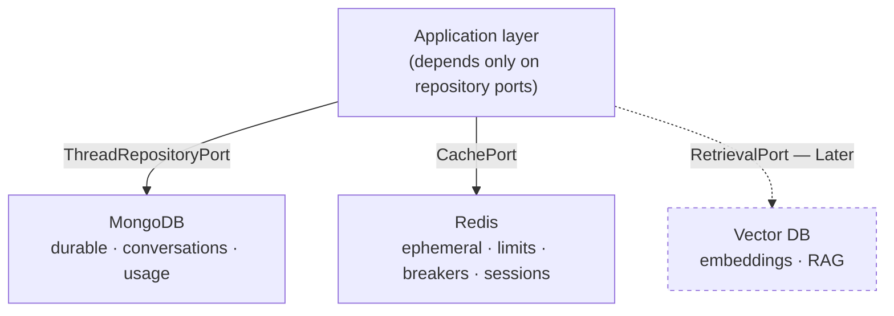
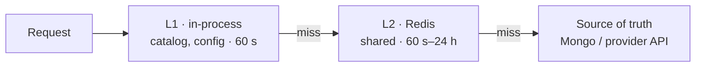

# 08 — Storage

## Storage topology



| Store | Holds | Loss tolerance | Phase |
|---|---|---|---|
| **MongoDB** | Threads, messages, settings, users, usage records, audit log | Zero — this is the product's memory | 1 |
| **Redis** | Rate-limit counters, circuit-breaker state, catalog cache, stream buffers, sessions | Full — everything reconstructs | 1 |
| **Vector DB** | Document embeddings for RAG | Rebuildable from source documents | Later |

**The load-bearing rule: the application depends on repository *ports*, never on
Mongoose.** Every query in this document is an implementation detail of the
Mongo adapter. Replacing Mongo with Postgres would mean writing a new adapter and
changing one line in the composition root — the use cases would not change. That
property is what makes the "MongoDB or Postgres?" decision reversible rather than
permanent.

## MongoDB

### Why MongoDB

| Reason | Detail |
|---|---|
| **The aggregate matches the document** | A thread with its messages is one document. Loading a conversation is one read; appending a turn is one write. In a relational model this is a join plus an insert, on the hottest path in the product |
| **The schema is genuinely fluid** | Per-conversation settings, message metadata, and provider-specific fields change every release during Phase 1. Adding a field is a code change, not a migration window |
| **Continuity** | Already in the codebase, already understood by the team, already in the deployment. Migrating for theoretical purity would spend the entire Phase 1 budget on a change with no user-visible benefit |
| **Operational simplicity** | Managed free tiers (Atlas M0) that fit NovaGPT's zero-cost premise |

### Why not Postgres

Postgres is the better choice for many workloads, and honesty about that matters
more than defending a decision.

**Where Postgres would win:** relational integrity across users, threads, and
usage; real transactions across collections; SQL for analytics; `pgvector` making
the RAG decision free; and stricter schema enforcement.

**Why it does not win here, yet:** NovaGPT's access pattern is almost entirely
"give me this one thread with its messages" and "append to this thread". That is
document-shaped. The relational advantages apply to queries we do not run — and
the strongest one, analytics, is better served by exporting usage records to a
warehouse than by keeping conversations relational.

**The signals that would make us switch** — recorded now so the decision is made
on evidence rather than fashion:

1. A thread document approaching the 16 MB BSON limit in real usage.
2. Cross-entity queries becoming common (e.g. "all messages across all users
   mentioning X"), which is a relational query wearing a document disguise.
3. RAG landing and `pgvector` proving sufficient — that would collapse two stores
   into one, which is a real operational win.
4. Multi-tenancy requiring transactional guarantees across collections.

See [ADR-004](15-decisions.md#adr-004--mongodb-for-conversations-with-a-documented-exit).

### Collections

#### `threads`

```
{
  _id, threadId (uuid, unique),
  userId, tenantId,                     // tenantId reserved, unused in Phase 1
  title,
  messages: [ Message ],                // embedded
  summaries: [ Summary ],               // embedded — see 06
  settings: { model, temperature, maxTokens, topP, systemPrompt, switchPolicy },
  pinned, archived,
  shareId (nullable, indexed),
  messageCount, totalTokens,            // denormalised counters
  createdAt, updatedAt, lastMessageAt
}
```

**Why messages are embedded rather than a separate collection.** Messages are
never queried independently of their thread, they are always loaded together, and
they are immutable once written. Embedding makes the read one operation and gives
atomic append. A separate collection would add a join to the hottest read path in
exchange for flexibility we do not use.

**The known limit:** BSON caps a document at 16 MB. At an average of ~2 KB per
message that is roughly 8,000 messages — far beyond any realistic conversation,
but not infinite.

**The mitigation, designed now:** when `messageCount` exceeds 1,000, older
messages overflow into a `message_archives` collection, referenced from the
thread. The context engine already only reads recent messages plus summaries
([06](06-context-engine.md)), so overflow is invisible to the hot path; only
full-history export touches the archive. Designing this now costs nothing;
discovering the limit in production costs an incident and an emergency migration.

**Why `messageCount` and `totalTokens` are denormalised.** The thread list
displays them, and computing them from the embedded array means loading every
message of every thread to render a sidebar. They are maintained on append, in
the same atomic update.

#### `users`

```
{ _id, userId, email (unique), passwordHash, role,
  providerKeys: [ { provider, encryptedKey, keyId, addedAt, lastUsedAt } ],
  preferences: { defaultModel, switchPolicy, language },
  createdAt, lastActiveAt }
```

**User-supplied provider keys are encrypted at rest with envelope encryption**
([10](10-security.md#api-key-management)). The plaintext key never touches disk
in any form, including logs.

#### `usage_records`

One record per provider call. **Append-only, never updated.**

```
{ _id, timestamp, traceId,
  userId, threadId, tenantId,
  provider, model,
  operation: "generate|stream|vision|embeddings|toolCalling",
  promptTokens, completionTokens, totalTokens,
  estimatedCostUsd,
  latencyMs, timeToFirstTokenMs,
  outcome: "success|failure|cancelled",
  failureKind,
  attemptNumber, switchedFrom }
```

**Why a separate collection rather than fields on the message.** Usage is
time-series data with a completely different lifecycle from conversations: it is
written far more often (every attempt, including failures), queried by different
dimensions (provider and time, not thread), and retained on a different schedule.
Storing it inside threads would make every analytics query a full scan of every
conversation, and would tie usage retention to conversation retention.

**Why failed and cancelled attempts are recorded too.** They cost real quota. A
usage table that only records successes cannot answer "how much of our Groq quota
is being burned by failed attempts?" — which is exactly the question that
justifies a routing change.

**Why `traceId`, `attemptNumber`, and `switchedFrom` are here.** Together they
reconstruct a full request: three records sharing a `traceId` with ascending
`attemptNumber` *is* the failover story, queryable without reading logs.

#### `audit_log`

Append-only, security-relevant events ([10](10-security.md#audit-logging)).

```
{ _id, timestamp, actorId, actorIp, action, resourceType, resourceId,
  outcome, metadata, traceId }
```

#### `message_archives`

Overflow storage for long threads. Written only when a thread exceeds the
embedding threshold.

### Indexes

Every index is justified by a specific query. An index without a query is write
amplification and storage cost for nothing.

| Collection | Index | Serves |
|---|---|---|
| `threads` | `{ threadId: 1 }` unique | Load a thread — the hottest query |
| `threads` | `{ userId: 1, archived: 1, updatedAt: -1 }` | Sidebar list: this user's active threads, newest first |
| `threads` | `{ shareId: 1 }` sparse | Public share lookup. Sparse because most threads are unshared |
| `threads` | `{ userId: 1, pinned: -1, updatedAt: -1 }` | Pinned-first sidebar ordering |
| `usage_records` | `{ userId: 1, timestamp: -1 }` | Per-user usage over time |
| `usage_records` | `{ provider: 1, timestamp: -1 }` | Provider dashboards |
| `usage_records` | `{ traceId: 1 }` | Reconstruct one request across attempts |
| `usage_records` | `{ timestamp: 1 }` TTL | Retention |
| `audit_log` | `{ actorId: 1, timestamp: -1 }` | "What did this user do?" |
| `audit_log` | `{ timestamp: 1 }` TTL | Retention |
| `users` | `{ email: 1 }` unique | Login |

**Why the compound index order is `userId, archived, updatedAt`.** Compound
indexes follow the ESR rule — **E**quality, **S**ort, **R**ange. `userId` and
`archived` are equality matches; `updatedAt` is the sort. Ordering it any other
way forces an in-memory sort, which Mongo aborts entirely above 32 MB — meaning
the sidebar query would fail for exactly the heaviest users.

**Why `shareId` is sparse.** Most threads have `shareId: null`. A non-sparse
index would store an entry for every thread to serve a rare lookup, tripling the
index for no benefit.

**Deliberately absent: a text index on message content.** Full-text search across
messages is not a Phase 1 feature, and a text index on a large embedded array is
expensive to maintain on every write. When search lands, it should be evaluated
against Atlas Search or a dedicated engine rather than assumed into Mongo.

### Write patterns

| Operation | Pattern | Why |
|---|---|---|
| Append a turn | `$push` both messages + `$inc` counters + `$set updatedAt`, one atomic update | One round trip; no read-modify-write race between concurrent sends |
| Update settings | `$set` on specific paths | Never overwrite the whole subdocument — a concurrent update would be silently lost |
| Create a thread | `upsert` on `threadId` | Idempotent; a retried request cannot create a duplicate |
| Record usage | Plain insert, **fire-and-forget** | Usage accounting must never add latency to, or fail, a user's request |

**Why usage writes are fire-and-forget.** If the usage insert fails, we lose one
analytics record. If it blocks the response, every user waits on an analytics
write. The failure is logged and the request proceeds. Correctness of analytics
is worth less than latency and availability of chat.

## Redis

### What Redis holds, and why each item cannot live in Mongo

| Data | Structure | TTL | Why not Mongo |
|---|---|---|---|
| Rate-limit counters | Sorted set (sliding window) | window length | Every request would be a Mongo write. At any real request rate this is the dominant write load, for data that is worthless after 60 s |
| Circuit-breaker state | Hash per provider | cooldown | Must be shared across instances and read on **every** routing decision. Mongo latency (5–20 ms) on the hot path would dominate routing time |
| Model catalog cache | String (JSON) | 60 s | Read on every catalog request; changes rarely. Redis makes it sub-millisecond |
| Provider health snapshot | Hash | 60 s | Same as breaker state — read per request |
| Session tokens | String | session length | Needs instant revocation, which means a lookup per request |
| Stream resume buffers (Later) | List | 5 min | High write rate, short life, zero durability requirement |
| Idempotency keys | String | 24 h | Must be checked before every mutating request |

**The pattern:** Redis holds data that is **read on the hot path**, **written
frequently**, and **worthless after minutes**. Mongo holds data that must survive
a restart. Anything that fits both descriptions belongs in Redis with a
periodic flush to Mongo — but nothing in Phase 1 does.

### Redis must be optional, and what that costs

Redis being down MUST NOT take down chat. Defined degraded behaviour:

| Function | Redis down |
|---|---|
| Rate limiting | Falls back to per-instance in-memory counters. Limits become per-instance rather than global — looser, but not absent |
| Circuit breakers | Falls back to per-instance state. Each instance rediscovers failures independently; recovery is slower and more requests are wasted, but routing still works |
| Catalog cache | Serves directly from memory. Slightly higher CPU, no user impact |
| Sessions | **Hard dependency.** If sessions are in Redis, auth fails |
| Stream resume | Unavailable. Streams still work, they just cannot resume |

**The session exception is why the design uses stateless JWTs with a short TTL
plus a Redis-backed revocation list** rather than Redis-backed session state.
Normal auth then works without Redis; only *revocation* degrades — a revoked
token stays valid until it expires (minutes). That is a bounded, acceptable
degradation. Session state in Redis makes Redis a hard availability dependency
for the entire product, which contradicts the "degrade, don't collapse" principle
([01](01-system-overview.md#guiding-principles)).

## Caching

Three layers, each with an explicit invalidation strategy. **A cache without a
defined invalidation strategy is a bug with a latency benefit.**



| Cached | Layer | TTL | Invalidation | Why cacheable |
|---|---|---|---|---|
| Model catalog + status | L1 + L2 | 60 s | `catalogVersion` bump | Read on every page load, changes rarely |
| Provider health snapshot | L1 | 5 s | Time only | Read per routing decision; 5 s staleness is well inside breaker cooldowns |
| Thread list | L2 | 30 s | Invalidated on any write to a user's thread | Sidebar polling would otherwise hit Mongo constantly |
| User record | L2 | 5 min | Invalidated on profile change | Read on every authenticated request |
| Provider `listModels()` | L2 | 1 h | Time only | An upstream API call; expensive and rate-limited |

**Deliberately not cached: completions.** Semantic response caching (returning a
stored answer for a similar prompt) is tempting and wrong for a chat product.
Identical prompts legitimately produce different answers at non-zero temperature;
users expect regeneration to regenerate; and conversation context makes true
cache hits vanishingly rare. The cost — occasional stale or surprising answers —
is far higher than the benefit.

**Why 60 s on the catalog rather than event-driven invalidation.** Event-driven
invalidation across instances needs pub/sub, adds a failure mode (a missed
invalidation event means permanent staleness), and buys at most 60 s of freshness
on data that changes weekly. Time-based expiry is self-healing: the worst case is
bounded and requires no coordination.

## Retention and TTL

| Data | Retention | Mechanism | Why |
|---|---|---|---|
| Threads and messages | Indefinite, until user deletion | Explicit delete | This is the user's data. Automatic expiry of conversations would be a shocking product behaviour |
| Archived threads | Indefinite | — | Archive means "hide", not "schedule for deletion" |
| Deleted threads | Soft-delete for 30 days, then purge | TTL on `deletedAt` | A 30-day undo window for accidental deletion; a bounded promise for real deletion |
| Usage records | 90 days | Mongo TTL index | Long enough for quarterly cost analysis, short enough to bound growth. Aggregates roll up to a monthly summary before expiry |
| Audit log | 1 year | Mongo TTL index | Typical compliance floor; enough for a retrospective security investigation |
| Rate-limit counters | Window length | Redis TTL | Worthless immediately after |
| Breaker state | Cooldown length | Redis TTL | Self-expiring by design |
| Stream buffers | 5 min | Redis TTL | Beyond that, a resume is pointless |
| Shared conversations | Until unshared | Explicit | User-controlled |

**Why TTL indexes rather than a cron job.** Mongo TTL indexes are enforced by the
database on a background thread and cannot be forgotten, skipped, or broken by a
deployment. A cron-based cleanup is a separate process with its own failure
modes, and the failure mode of "cleanup silently stopped running" is unbounded
growth discovered when the disk fills.

**Why deletion is soft-then-hard rather than immediate.** Immediate hard delete
makes accidental deletion unrecoverable, which produces support requests that
cannot be satisfied. A 30-day window costs almost nothing in storage and converts
a permanent failure into an inconvenience. Critically, the purge is *real* — a
"delete" that never deletes is a privacy violation dressed as a feature.

## Backups and disaster recovery

| Property | Target | Mechanism |
|---|---|---|
| RPO (max data loss) | 24 h Phase 1, 1 h later | Daily snapshot; continuous oplog backup later |
| RTO (max downtime) | 4 h | Documented, rehearsed restore procedure |
| Backup retention | 30 daily, 12 monthly | Managed snapshots |
| Restore verification | Monthly | Restore to a scratch environment and run a smoke test |
| Redis | **Not backed up** | Everything in it is reconstructible by design; backing it up would imply a durability guarantee that does not exist |

**The monthly restore drill is not optional.** An unverified backup is a belief,
not a backup, and the moment you discover an untested backup does not restore is
the moment you needed it. The drill is a scheduled task with an owner
([13](13-deployment.md)).

## Future vector database

Deferred until RAG has a concrete workload ([06](06-context-engine.md#future-rag-integration)).

**When the decision is made, these are the candidates and the criteria:**

| Option | Best when | Cost |
|---|---|---|
| **pgvector** | We already run Postgres, or corpora are small-to-medium and filtering matters | Adds Postgres if it is not already there |
| **Qdrant** | Vector-first workload, rich filtering, self-hostable | A third datastore to operate |
| **MongoDB Atlas Vector Search** | We stay on Atlas and want one store | Ties us to Atlas specifically, not just Mongo |

**The deciding criteria, recorded now:** corpus size, query rate, metadata
filtering requirements, whether Postgres is already in the stack, and operational
headcount. **The decision MUST NOT be made before there is a real corpus and a
real query pattern** — chosen early, it will be chosen on benchmarks that do not
match our workload, and the migration cost of a wrong vector store is high
because embeddings must be regenerated.
