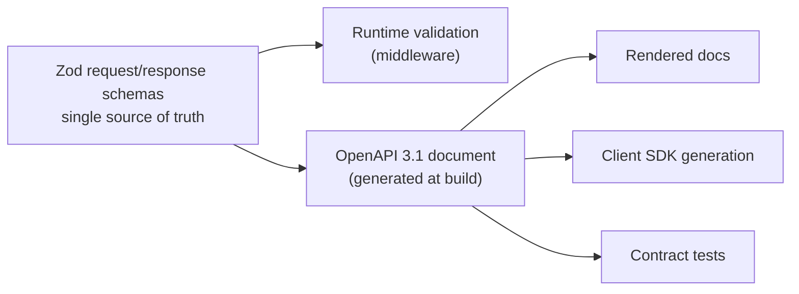

# 09 — API Design

## Principles

**The API is a contract, not a projection of the database.** Response shapes are
designed for clients and are stable independently of the storage schema. A Mongo
document is never serialised directly to a client — that would make every schema
change a breaking API change ([02](02-architecture.md#where-this-architecture-will-hurt)).

**Provider-agnostic by construction.** No endpoint, parameter, or field name
references a specific provider. A client cannot tell from the API surface which
providers exist; it discovers them from data. This is the same
provider-independence property that governs the internals, applied at the client
boundary.

**Errors are as designed as successes.** An error response carries a machine
`kind`, a human message, and a trace id. Every one of them is actionable — it
either tells the client what to do or tells the user what to fix.

**Resource-oriented, with one exception.** REST for resources; `POST /chat/stream`
is an action endpoint because streaming a completion is not a resource operation.
Forcing it into REST shape would produce a worse contract for the sake of
consistency.

## Versioning

**URL-path versioning: `/api/v1/...`**

| Approach | Why not chosen |
|---|---|
| Header versioning (`Accept: application/vnd.nova.v2+json`) | Purer, but invisible in logs, hard to curl, hard to route at a proxy, and easy to get wrong in a client |
| Query parameter (`?v=2`) | Easy to omit accidentally, and caches key on it inconsistently |
| No versioning | Every change becomes a coordination problem with every client, forever |

Path versioning is visible in every log line, routable at the edge, trivially
testable with curl, and unambiguous. Its cost — the version appears in URLs — is
cosmetic.

### What breaks a version

**Breaking (requires v2):** removing an endpoint or field; changing a field's
type or meaning; adding a required request field; changing an error `kind` for an
existing condition; changing an HTTP status for an existing condition.

**Non-breaking (ships in v1):** adding an endpoint; adding an optional request
field; adding a response field; adding a new error `kind` for a *new* condition;
adding a new SSE event type.

**The client contract that makes this work:** clients MUST ignore unknown fields
and unknown SSE event types. Stated explicitly in the API documentation, because
a client that fails on unknown fields turns every additive change into a breaking
one.

### Deprecation policy

1. Announce in the changelog and mark the endpoint `deprecated` in the OpenAPI spec.
2. Return `Deprecation` and `Sunset` headers (RFC 8594) on every response.
3. Minimum **6 months** between deprecation and removal.
4. v1 continues to be served for 6 months after v2 is generally available.

## Authentication

**Bearer JWT in the `Authorization` header.**

```
Authorization: Bearer <token>
```

| Token | Lifetime | Storage | Purpose |
|---|---|---|---|
| Access | 15 min | Memory (client) | Authorises requests |
| Refresh | 30 days | httpOnly, Secure, SameSite=Strict cookie | Obtains new access tokens |

**Why short-lived access plus long-lived refresh.** A stateless JWT cannot be
revoked before it expires. A 15-minute lifetime bounds the damage from a leaked
token to 15 minutes; the refresh token, which *can* be revoked because it is
checked against a store, is the real control point. This is the standard trade
between statelessness (performance, no per-request Redis hit) and revocability
(security), and 15 minutes is where the trade balances.

**Why the refresh token lives in an httpOnly cookie.** It is the higher-value
credential and it must be unreachable from JavaScript, which is what makes an XSS
bug non-catastrophic. The access token is intentionally *not* in a cookie: keeping
it out of cookies means requests are not authenticated by ambient credentials,
which removes CSRF as a concern for the API surface entirely.

Full threat analysis in [10](10-security.md).

### Anonymous access

`GET /api/v1/models` and `GET /api/v1/share/:shareId` are public. Everything else
requires authentication. Anonymous endpoints are rate-limited by IP.

*Why the model catalog is public:* the landing page renders it before login, and
it contains no user data and no secrets — only what the deployment can do.

## Endpoints

### Conversations

| Method | Path | Purpose |
|---|---|---|
| `GET` | `/api/v1/threads` | List the caller's threads (paginated, filterable) |
| `POST` | `/api/v1/threads` | Create a thread |
| `GET` | `/api/v1/threads/:threadId` | Thread with messages (paginated) |
| `PATCH` | `/api/v1/threads/:threadId` | Rename, pin, archive |
| `DELETE` | `/api/v1/threads/:threadId` | Soft-delete |
| `POST` | `/api/v1/threads/:threadId/duplicate` | Copy messages and settings |
| `GET` | `/api/v1/threads/:threadId/settings` | Read generation settings |
| `PUT` | `/api/v1/threads/:threadId/settings` | Replace generation settings |
| `POST` | `/api/v1/threads/:threadId/share` | Create or return a share link |
| `DELETE` | `/api/v1/threads/:threadId/share` | Revoke sharing |
| `GET` | `/api/v1/share/:shareId` | **Public** read-only view |

**Why `PUT` for settings and `PATCH` for the thread.** Settings are a complete
object the client always holds in full — `PUT` makes replacement semantics
explicit and avoids the ambiguity of "is `null` a value or an omission?". Thread
metadata is edited one field at a time (rename, pin) where `PATCH` is the honest
verb.

**Why `POST /share` is idempotent** (returns the existing link rather than
minting a new one): a double-click must not produce two share links, one of which
the user cannot see and cannot revoke.

### Chat

| Method | Path | Purpose |
|---|---|---|
| `POST` | `/api/v1/chat` | Non-streaming completion |
| `POST` | `/api/v1/chat/stream` | SSE streaming completion |
| `POST` | `/api/v1/chat/:messageId/regenerate` | Regenerate an assistant turn |

Request:

```
{
  threadId:     string   (required)
  message:      string   (required)
  attachments?: [ { type: "image"|"pdf", url|data, mimeType } ]
  model?:       string   // pin a model for this request
  settings?:    { temperature?, maxTokens?, topP?, systemPrompt?, switchPolicy? }
  tools?:       [ ToolDefinition ]
  responseFormat?: { type: "text"|"json"|"json_schema", schema? }
  idempotencyKey?: string
}
```

**Why capability requirements are not in the request.** The presence of
`attachments` implies vision; `tools` implies tool calling; `responseFormat`
implies JSON or schema output. The server derives requirements from what is
actually present ([05](05-capability-matrix.md#requirements-are-derived-not-declared)) —
a client cannot forget to declare a requirement it did not know existed, and
cannot over-declare and needlessly shrink the candidate set.

**Why `idempotencyKey` is on chat.** A user on a flaky connection retries a send.
Without idempotency they get two identical turns in their conversation and two
provider calls billed. The key is stored in Redis for 24 h; a repeat returns the
original result.

**Why regenerate is its own endpoint rather than `POST /chat` with a flag.** It
has different semantics — it *replaces* an assistant turn rather than appending —
and different validation (the target must be an assistant message, and the turns
after it are discarded). A flag that changes an endpoint's fundamental semantics
is an endpoint wearing a disguise.

### Models and providers

| Method | Path | Purpose |
|---|---|---|
| `GET` | `/api/v1/models` | **Public.** Catalog with live availability |
| `GET` | `/api/v1/models/:modelId` | Full descriptor with capabilities |
| `GET` | `/api/v1/providers` | Provider status snapshot (authenticated) |
| `GET` | `/api/v1/providers/health` | On-demand health probe (admin) |

`GET /api/v1/models` response:

```
{
  data: [ {
    id, provider, providerName, displayName,
    capabilities: { vision, streaming, json, structuredOutput, toolCalling, ... },
    limits: { contextWindow, maxOutputTokens },
    economics: { tier, costBand },
    status: "ready" | "rate_limited" | "quota_reached" | "offline" | "unconfigured",
    available: boolean,
    latencyMs: number | null
  } ],
  meta: { catalogVersion, generatedAt }
}
```

**Why availability is embedded in the catalog rather than a separate endpoint.**
The client needs both together on every render — a model list without status
cannot correctly grey out unavailable models. Two endpoints would mean two round
trips and a window where they disagree.

**`unconfigured` providers MUST NOT appear in the public response.** Which
providers a deployment has keys for is operational information; exposing it tells
an attacker exactly what to target and tells users about capabilities they cannot
use. Configured-but-unavailable models *do* appear, marked unavailable — the user
needs to know the model exists and is temporarily down.

### Operations

| Method | Path | Purpose | Auth |
|---|---|---|---|
| `GET` | `/live` | Liveness — should this process be restarted? | Public |
| `GET` | `/ready` | Readiness — should this instance receive traffic? | Public |
| `GET` | `/health` | Liveness plus dependency detail, for a human | Public |
| `GET` | `/version` | Build identity — what is actually deployed here | Public |
| `GET` | `/api/v1/usage` | Caller's usage summary | User |
| `GET` | `/api/v1/admin/metrics` | Prometheus metrics | Admin |

**Why liveness and readiness are separate, and why it matters.** Liveness answers
"should this process be restarted?" and MUST NOT check dependencies — if it did,
a Mongo blip would restart every healthy instance, turning a degraded dependency
into a full outage. Readiness answers "should this instance receive traffic?" and
does check dependencies. Conflating them is one of the most common and most
damaging orchestration mistakes.

**Why `/health` exists alongside both.** It is for a human looking at one
instance, not for an orchestrator: liveness semantics on the status code, plus
the dependency detail that explains *why* an instance is unready. Keeping it
separate from `/ready` means curiosity about dependencies can never change
traffic routing.

`/health` reports `ok`, `degraded`, `unavailable`, or `starting`. **`degraded` is
distinct from `ok`**: an instance with a non-critical dependency down is still
ready — that is the documented degradation
([13](13-deployment.md#degradation-matrix)) — but reporting it as `ok` would hide
the degradation from the one endpoint an operator opens to find it.

**Readiness aggregates by criticality, not by unanimity.** A failed *critical*
dependency (Mongo) means this instance cannot do its job and must leave
rotation. A failed non-critical one (Redis) means it is degraded but still more
useful serving than not. Requiring every dependency to be up would let a Redis
outage empty the load balancer.

**Health endpoints are unversioned** because they are consumed by
infrastructure, not clients, and must never break.

**They are served at both the root and under `/api`.** One router, two mounts.
Root is where orchestrators, uptime checks, and platform defaults look by
convention; `/api` keeps them reachable behind an ingress that routes only that
prefix. Serving both costs nothing and removes an entire class of "the probe was
configured against the wrong path" incident.

## Response format

### Success

Single resource:

```
{ "data": { ... } }
```

Collection:

```
{
  "data": [ ... ],
  "meta": { "total": 142, "limit": 20, "cursor": "eyJ0IjoxNzA..." , "hasMore": true }
}
```

**Why everything is wrapped in `data`.** A bare array cannot carry metadata, so
adding pagination later becomes a breaking change. The wrapper costs six
characters and makes every response extensible. It also removes a class of JSON
hijacking issues with top-level arrays.

**Why `meta` is separate from `data`.** Pagination state describes the response,
not the resource. Mixing them means a client cannot tell resource fields from
protocol fields.

### Error format

```
{
  "error": {
    "kind":    "quota",
    "message": "Gemini quota reached. Try again in 15 minutes or switch models.",
    "field":   null,
    "details": { "provider": "gemini", "retryAfterSeconds": 900 },
    "traceId": "01HQ8X..."
  }
}
```

| Field | Purpose |
|---|---|
| `kind` | Machine-readable. Clients branch on this, never on `message` |
| `message` | Human-readable, safe to display to an end user |
| `field` | For validation errors: which input was wrong |
| `details` | Kind-specific structured context |
| `traceId` | Correlates to server logs. **Always present** |

**Why `kind` and `message` are separate.** A client that branches on message text
breaks the moment we improve the wording. `kind` is a stable contract; `message`
is copy that can be edited, localised, or improved freely.

**Why `traceId` is on every error, including 4xx.** A user reporting "it said
something went wrong" is unactionable. A user reporting a trace id turns a
support conversation into a log query. It costs one field.

**Messages MUST be safe to display.** No stack traces, no internal hostnames, no
upstream URLs, no raw provider bodies. A provider error body can contain
account identifiers, endpoint paths, and occasionally fragments of request data
— it is never forwarded verbatim.

### Error kinds and status codes

| `kind` | Status | Meaning |
|---|---|---|
| `validation` | 400 | Malformed request; `field` names the problem |
| `unauthenticated` | 401 | Missing or invalid token |
| `forbidden` | 403 | Authenticated but not permitted |
| `not_found` | 404 | Resource does not exist, or is not the caller's |
| `conflict` | 409 | Idempotency or version conflict |
| `payload_too_large` | 413 | Body or attachment exceeds limits |
| `rate_limited` | 429 | Caller exceeded their limit; `Retry-After` set |
| `quota` | 429 | *Provider* quota exhausted — not the caller's fault |
| `unsupported_capability` | 422 | No available model can satisfy the request |
| `provider_error` | 502 | Provider rejected the request |
| `provider_unavailable` | 503 | All candidate providers are down |
| `timeout` | 504 | Request exceeded its budget |
| `internal` | 500 | Unexpected. Always logged at error level |

**Why `rate_limited` and `quota` share status 429 but differ in `kind`.** The
status is right for both — "too many requests" — but the *cause* and the *fix*
differ completely. `rate_limited` means the caller should slow down.
`quota` means a provider is exhausted and the caller should switch models or
wait; slowing down would not help. A client that only sees `429` cannot tell
these apart and will show the wrong advice.

**Why `not_found` is returned for another user's resource** rather than
`forbidden`: `403` confirms the resource exists, which is an information leak
that lets an attacker enumerate valid ids.

## Pagination

**Cursor-based, everywhere.**

```
GET /api/v1/threads?limit=20&cursor=eyJ0IjoxNzA...
```

**Why cursors and not offsets.** Threads are sorted by `updatedAt` descending,
and that ordering changes constantly as conversations receive messages. With
`?offset=20`, a thread that moves to the top between page 1 and page 2 shifts
everything down — the client sees an item twice and misses another entirely.
Cursors encode a position in the sort, so the result set stays coherent while
underlying data changes. Offset pagination also degrades badly at depth: the
database must scan and discard every skipped document.

**Cursors are opaque, base64-encoded** `{ sortValue, id }`. Documented as opaque
precisely so the encoding can change without breaking clients.

**Message pagination is reversed** — newest first, paging backwards — because a
chat UI opens at the bottom.

| Parameter | Default | Max |
|---|---|---|
| `limit` | 20 | 100 |

Requesting more than the max clamps to the max and returns a `Warning` header
rather than erroring — the client still gets useful data.

## Filtering and sorting

| Endpoint | Filters | Sorts |
|---|---|---|
| `/threads` | `archived`, `pinned`, `q` (title search), `updatedBefore/After` | `updatedAt`, `createdAt`, `title` |
| `/models` | `provider`, `tier`, `capability`, `available` | `latency`, `name` |
| `/usage` | `provider`, `model`, `from`, `to`, `outcome` | `timestamp` |

**Filters are an explicit allowlist per endpoint.** A generic filter language
(`?filter[x][gt]=1`) is expressive and is also an unbounded query surface: any
field becomes queryable, including unindexed ones, and a crafted filter becomes a
denial-of-service vector. An allowlist means every supported filter has a
supporting index ([08](08-storage.md#indexes)).

**Sorts are an allowlist for the same reason** — an unindexed sort on a large
collection is a table scan the caller chose for us.

## Rate limiting

Applied per user for authenticated requests, per IP for anonymous ones.

| Scope | Limit | Why |
|---|---|---|
| Chat (streaming or not) | 20/min, 300/hour | Provider quota is the scarce resource. This is generous for a human and cheap for a script |
| Thread reads | 120/min | Sidebar polling should never hit the limit |
| Catalog | 60/min | Cached; cheap; but not free |
| Auth (login, refresh) | 10/min per IP | Credential stuffing defence |
| Anonymous total | 30/min per IP | Bounded exposure for public endpoints |

Every response carries:

```
RateLimit-Limit: 20
RateLimit-Remaining: 14
RateLimit-Reset: 42
```

**Why limits are exposed on every response, not just on 429.** A client that only
learns its limit by hitting it can only back off reactively. Continuous headers
let a well-behaved client pace itself and never hit the limit at all — which is
better for both sides.

**Why chat limits are per-minute *and* per-hour.** A per-minute limit alone
permits 1,200 requests/hour, which would exhaust every free tier in the fleet.
The hourly limit bounds sustained consumption; the per-minute limit bounds burst.

## OpenAPI strategy

**Specification-first, and the spec is generated from validation schemas.**



**Why generated rather than hand-written.** A hand-maintained OpenAPI file drifts
from the implementation within weeks — it is a second source of truth that nobody
is forced to update, and stale API documentation is worse than none because it is
trusted. Generating from the schemas that *actually validate requests at runtime*
makes drift structurally impossible: if the spec is wrong, validation is wrong,
and tests fail.

**Why Zod as that source.** It validates at runtime, infers static types for
`tsc --checkJs`, and has mature OpenAPI generation. One declaration produces the
validator, the type, and the documentation.

**Why not code-first from JSDoc comments.** Comments are not executable, so they
drift exactly like a hand-written spec. The whole point is that the artifact
generating the docs must also be the artifact enforcing the contract.

| Practice | Rule |
|---|---|
| Spec published at | `/api/v1/openapi.json` and rendered at `/api/docs` |
| Every endpoint | MUST have a description, at least one example, and every error kind it can return |
| CI | MUST fail if the generated spec differs from the committed one |
| Breaking changes | Detected by diffing the spec against the previous release in CI |

The last two are what make the spec trustworthy: a committed spec that CI
verifies is a spec that cannot silently rot, and automated breaking-change
detection catches the accidental contract break that code review misses.
