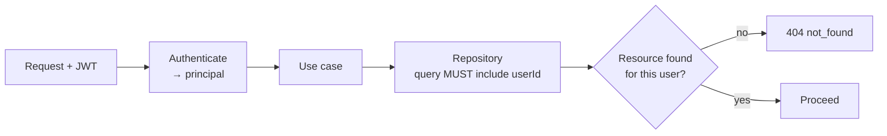
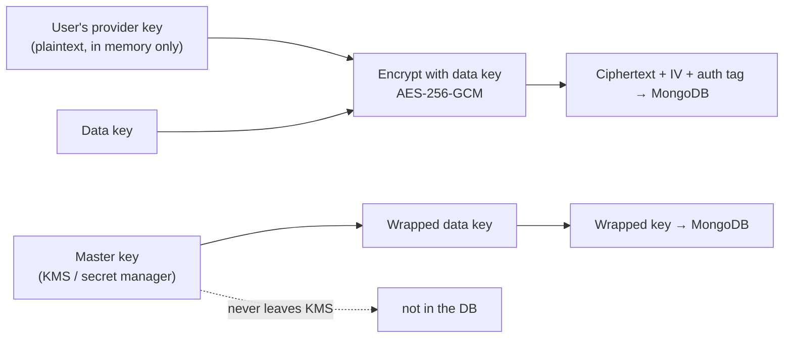

# 10 — Security

## What is actually at risk

Security effort should be proportional to what an attacker gains. For NovaGPT
there are three assets, in descending order of value:

1. **Provider API keys.** Directly monetisable. A leaked paid key is someone
   else's bill; a leaked free key is a burned quota and a terminated account.
2. **Conversation content.** Users paste code, credentials, business plans, and
   personal information into chat. A conversation database is a high-value
   disclosure target.
3. **Provider quota.** Not a secret, but a finite shared resource. An attacker who
   burns the fleet's daily quota has denied service to every user without
   breaching anything.

The third is unusual and is what makes a multi-provider free-tier platform
different from a typical CRUD backend: **abuse is as damaging as intrusion**, and
the defences are different.

## Threat model

Assessed with STRIDE. Likelihood × impact drives priority, and every entry has a
named mitigation.

| # | Threat | Category | Impact | Likelihood | Mitigation |
|---|---|---|---|---|---|
| T1 | Provider API keys leak via logs, error messages, or API responses | Information disclosure | **Critical** | High | Keys never logged; log redaction filter; provider error bodies never forwarded; `/providers` never returns keys or base URLs |
| T2 | Provider keys leak via a database breach | Information disclosure | **Critical** | Medium | Envelope encryption at rest; the data key is not in the database |
| T3 | Quota exhaustion by an abusive user | DoS | High | **High** | Per-user rate limits (minute + hour); per-user token budgets; anomaly alerting |
| T4 | Prompt injection causing unintended tool execution | Elevation of privilege | High | Medium | Tool *execution* is out of scope for Phase 1; when added, every tool is allowlisted and confirmed |
| T5 | Cross-user conversation access via IDOR | Information disclosure | **Critical** | Medium | Every query scoped by `userId`; ownership checked in the use case, never only in the controller |
| T6 | Token theft via XSS | Spoofing | High | Medium | Refresh token in an httpOnly cookie; 15-minute access tokens; strict CSP on the frontend |
| T7 | Share links guessed or enumerated | Information disclosure | Medium | Medium | 128-bit random `shareId`; no sequential ids; rate-limited and not indexed |
| T8 | SSRF via a user-supplied base URL or attachment URL | Elevation of privilege | High | Low | Provider base URLs are operator-configured only; attachment URLs validated against an allowlist with private-IP ranges blocked |
| T9 | Credential stuffing against login | Spoofing | Medium | **High** | Per-IP auth rate limits; Argon2id password hashing; breach-list rejection; lockout with backoff |
| T10 | NoSQL injection via unvalidated query input | Tampering | High | Low | All input validated by schema; no user-controlled objects reach a query; operator keys rejected |
| T11 | Malicious model output rendered as active content | XSS | Medium | Medium | Output treated as untrusted data; frontend sanitises; API never returns HTML |
| T12 | Audit log tampering to hide activity | Repudiation | Medium | Low | Append-only collection; no update or delete permission for the application role |
| T13 | Sensitive data leaking into telemetry | Information disclosure | High | **High** | Prompts and completions never logged by default; only counts, hashes, and identifiers |
| T14 | Dependency compromise (supply chain) | Tampering | High | Low | Lockfile committed; `npm audit` in CI; Dependabot; provenance checks on new dependencies |
| T15 | Cross-tenant data access once multi-tenancy lands | Information disclosure | **Critical** | Medium | `tenantId` reserved now; enforced at the repository layer, not per-query |

### Highest-priority items

**T1 and T13 rank above everything else** because they are high impact *and*
high likelihood, and because the mechanism is the same: sensitive data ending up
somewhere it was never meant to be, through a path nobody designed. Keys and
prompts leak through logs, error messages, crash reports, and debug endpoints —
not through the parts of the system anyone thought about as "the security
surface". They get structural defences ([below](#secret-management)), not
review-time vigilance.

**T3 ranks next** because it is the threat most specific to this system and the
easiest to under-defend. Nothing is breached; the attacker simply uses the
product as designed, faster than intended, until the fleet's free quota is gone.

## Authentication

**JWT, RS256, short-lived access tokens plus revocable refresh tokens.**

| Property | Value | Reasoning |
|---|---|---|
| Algorithm | RS256 | Asymmetric: the verifying service needs only the public key. Symmetric HS256 means every verifier holds the signing secret, so any read-only component becomes a token-forging component |
| Access lifetime | 15 min | Bounds the damage of a stolen token to 15 minutes without a per-request revocation lookup |
| Refresh lifetime | 30 days, rotating | Rotation makes theft detectable: reuse of a rotated token proves compromise |
| Refresh storage | httpOnly, Secure, SameSite=Strict cookie | Unreachable from JavaScript, so an XSS bug cannot exfiltrate the high-value credential |
| Access storage | Client memory only | Not in a cookie, therefore not sent ambiently, therefore CSRF is not a concern for the API |
| Revocation | Redis denylist, keyed by `jti`, TTL = remaining lifetime | Immediate revocation when needed, without a per-request lookup in the common case |
| Passwords | Argon2id, m=64MB t=3 p=4 | Memory-hard: resists GPU and ASIC cracking in a way bcrypt does not |

**Refresh token rotation, and why it is worth the complexity.** Each refresh
issues a new refresh token and invalidates the old one. If a stolen token is used
after the legitimate client has already rotated, the reuse is detected — the
entire token family is revoked and the user is notified. This turns silent,
indefinite account access into a detected, contained incident. Without rotation,
a stolen 30-day refresh token is 30 days of undetectable access.

**Why not sessions in Redis.** It would make Redis a hard availability dependency
for the entire product, contradicting "degrade, don't collapse"
([01](01-system-overview.md#guiding-principles)). The chosen design degrades
narrowly: without Redis, revocation is delayed by at most the access-token
lifetime; authentication itself keeps working.

### Amended during implementation

**The `type` claim is mandatory and checked on every verification.** Without it a
refresh token is a perfectly valid signed token and would be accepted in an
`Authorization` header — a 30-day bearer credential, which is exactly what the
15-minute access lifetime exists to prevent. Asserted in
[`test/e2e/authApi.test.js`](../../Backend/test/e2e/authApi.test.js).

**Access-token verification does load the account.** The original design said
signature-only, with no per-request lookup. Implementation added one indexed
`findById`, because two guarantees are worth more than it costs:

- a disabled account stops working immediately rather than up to 15 minutes later;
- a password change evicts tokens issued before it (`iat` is compared against
  `passwordChangedAt`), which is the single thing a user changing their password
  is trying to achieve.

The deviation is deliberate and bounded: one indexed lookup against a request
that spends seconds inside a model. If it ever shows up in a latency profile, the
answer is to cache the account's `passwordChangedAt` and `disabledAt` in the
cache port — not to drop the check.

**Password changes and lockouts are compared at second granularity**, because
`iat` is seconds. Comparing a second-precision claim against a millisecond
timestamp rejects every token minted in the same second as the account — which is
every token registration hands out.

**Lockout escalates rather than latching.** A permanent lock after N failures
hands an attacker a denial-of-service primitive: knowing an address is enough to
lock its owner out indefinitely. Escalating delays (30 s, doubling to a 15-minute
ceiling) make stuffing uneconomic while a real user who mistyped waits seconds.

## Authorization

**Resource ownership is enforced in the use case, not the controller.**

**Why in the use case rather than middleware.** Middleware-based authorization
requires every route to be correctly annotated; the failure mode is a *forgotten*
annotation, which fails **open** — the endpoint works, tests pass, and nobody
notices until data leaks. Enforcing ownership where the resource is loaded means
the check cannot be skipped, because loading the resource *is* the check.

**Why the repository query includes `userId` rather than checking after
loading.** Load-then-compare works until someone writes a new query and forgets
the comparison. Scoping at the query means the wrong user's data is never in
memory in the first place, and a forgotten scope returns nothing rather than
returning someone else's conversation.

**Why 404 instead of 403 for another user's resource.** `403` confirms the
resource exists, which permits enumeration. `404` reveals nothing.

### Roles

| Role | May |
|---|---|
| `anonymous` | Read the public catalog; read a shared conversation |
| `user` | Full CRUD on own threads; chat; read own usage |
| `admin` | All of the above; provider health probes; metrics; audit log |

Deliberately flat. Fine-grained RBAC before there is a second kind of user is
complexity with no requirement behind it; the role field exists so adding one is
cheap.

Routes name a **permission**, not a role (`requirePermission(ADMIN_METRICS)`), so
a fourth role is a row in the grant table rather than an edit to every route that
mentioned `admin`.

**The first registered account is the admin** ([ADR-023](15-decisions.md#adr-023--the-first-registered-account-is-the-operator)).
Every alternative either ships a well-known credential or requires a manual
database edit to start using the product.

### What "scoped by owner" actually means

`null` is an owner, not a wildcard
([ADR-022](15-decisions.md#adr-022--null-is-an-owner-not-a-wildcard)). Three
mechanisms hold the line, and none of them is a review rule:

| Mechanism | What it stops |
|---|---|
| `Principal.anonymous()` — `req.principal` is always an object | A missing null check becoming "no scope" |
| The owner is in every repository **filter**, including `save()` | A caller upserting over another user's conversation with a supplied id |
| A supplied thread id that exists under another owner is a **404** | Thread takeover on create, and id enumeration |

The sweep in
[`test/e2e/authorization.test.js`](../../Backend/test/e2e/authorization.test.js)
walks every endpoint that names a resource. It is a list rather than a sample on
purpose: authorization defects are *omissions*, so testing the endpoints someone
remembered to protect proves nothing.

## Secret management

### Sources, in precedence order

1. Secret manager (AWS Secrets Manager, Vault, Doppler) — **production**
2. Environment variables — development and simple deployments
3. `.env` file — local development only, git-ignored

**Never:** in source, in a container image, in a config file in the repository,
in a CI log, or in a client bundle.

### Structural defences against leakage (T1)

Vigilance does not scale. Every one of these is a mechanism, not a rule:

| Defence | Mechanism |
|---|---|
| **Secrets are objects, not strings** | Credentials are wrapped in a `Secret` type whose `toString()` and `toJSON()` return `[REDACTED]`. Accidental interpolation into a log line or an error message produces the redaction, not the key |
| **Log redaction filter** | The logger scrubs any value matching known key patterns (`sk-…`, `AIza…`, long base64 runs) from every field before emitting |
| **Provider errors are never forwarded** | Upstream bodies are mapped to a taxonomy kind and a safe message ([03](03-provider-system.md#error-taxonomy)); the raw body is never in a response and is logged at debug level only, after redaction |
| **API responses are allowlisted** | Serialisers construct responses field by field. A serialiser that spreads an internal object (`...provider`) is a review blocker |
| **Secret scanning in CI** | `gitleaks` on every commit and pull request; the build fails on a hit |
| **Boot-time validation** | Missing or malformed credentials fail at startup with a readable message that names the variable and never prints the value |

**Why the `Secret` wrapper type is the highest-value item on this list.** Every
other defence catches a leak at a specific point. The wrapper makes the *default*
behaviour safe — a developer who does the naive thing (`log.info({provider})`)
gets a redaction rather than a key in the log aggregator. Defences that work when
someone forgets are worth more than defences that require remembering.

### Rotation

| Secret | Rotation | Mechanism |
|---|---|---|
| Provider API keys | Quarterly, or immediately on suspicion | Two keys supported concurrently; new key added, traffic shifts, old key removed |
| JWT signing key | Every 90 days | `kid` in the header; the previous public key stays valid for one access-token lifetime |
| Database credentials | Quarterly | Managed rotation |
| Encryption data key | Annually | Envelope encryption: re-encrypt data keys, not data |

**Why two concurrent provider keys.** Rotating a single key means a window where
requests fail. Supporting two lets a rotation be a zero-downtime shift, which is
what makes quarterly rotation actually happen instead of being perpetually
deferred.

## API key management

Two distinct kinds of provider key, with different handling:

| Kind | Owner | Storage | Scope |
|---|---|---|---|
| **Platform keys** | The deployment operator | Secret manager, loaded at boot, held only in memory | Shared by all users |
| **User keys (BYOK)** | Individual users | Encrypted in Mongo | That user only |

### Envelope encryption for user keys

**Why envelope encryption rather than encrypting directly with a master key.**
Rotating a directly-applied master key requires decrypting and re-encrypting
every record — a long, risky, all-or-nothing migration. With envelopes, rotation
re-wraps a small number of data keys and leaves the ciphertext untouched. It also
means the key that decrypts everything never resides in the database, so a
database dump alone is not sufficient to recover any key (T2).

**Why AES-256-GCM specifically.** Authenticated encryption: tampering with the
ciphertext fails decryption rather than producing plausible garbage. A key that
silently decrypts to corruption would be sent to a provider and rejected, which
looks like an auth failure and sends debugging in entirely the wrong direction.

### Rules for user-supplied keys

- MUST be validated with a cheap probe on submission — a key that fails at first
  use is a confusing experience attributed to the platform, not the key.
- MUST be write-only through the API. `GET` returns a masked hint (`sk-…7f2a`)
  and never the value. A user who has lost their key retrieves it from the
  provider, not from us.
- MUST be deletable, and deletion MUST be immediate and complete.
- MUST NOT be used for any request other than that user's.
- Failures against a user's key MUST NOT open the shared circuit breaker for that
  provider — one user's bad key must not take a provider out of rotation for
  everyone.

That last rule is easy to miss and produces a severe, hard-to-diagnose bug: one
user pastes an expired key, the breaker opens on `auth`, and every user loses
that provider.

**Status.** The encryption half is built and tested
([`EnvelopeCipher`](../../Backend/src/infrastructure/security/EnvelopeCipher.js)):
per-record data keys, AES-256-GCM, master-key rotation that re-wraps keys without
touching a payload, and a `mask()` that is the only thing ever returned about a
stored key. It is wired into the composition root and constructed **only** when
`ENCRYPTION_MASTER_KEY` is set — generating one would encrypt user secrets under
a key that dies with the process, which is worse than refusing the feature.

The *consumption* half — a per-request credential threaded through the router
into an adapter's headers — is not built, and no BYOK endpoints are exposed. It
changes `ProviderPort`, which the shared contract suite pins across nine
adapters, so it belongs with provider expansion rather than here. Shipping a
"save your key" endpoint whose keys nothing uses would be a fake feature.

## Rate limiting

Layered, because the layers defend different things.

| Layer | Limit | Defends |
|---|---|---|
| Per IP, anonymous | 30/min | Scraping, enumeration |
| Per IP, auth endpoints | 10/min | Credential stuffing (T9) |
| Per user, chat | 20/min, 300/hour | Quota exhaustion (T3) |
| Per user, token budget | Configurable daily ceiling | A small number of huge requests |
| Per provider, global | Below the provider's published limit | Protects the shared key from our own traffic |
| Per instance, concurrency | Max in-flight streams | Memory exhaustion |

**Why a token budget in addition to a request-count limit.** Twenty requests of
400K tokens each consume vastly more quota than 20 requests of 400 tokens.
Request counting alone treats them identically, and the expensive case is exactly
what an abuser would choose.

**Why a global per-provider limit.** Our own users can collectively exceed a
provider's rate limit without any individual user misbehaving. Self-limiting
below the published ceiling means we shed our own load gracefully rather than
having the provider shed it for us — which would open a circuit breaker and
degrade routing for everyone.

**Algorithm: sliding-window counter in Redis.** A fixed window permits a double
burst at the boundary (full quota at 11:59:59 and again at 12:00:00). A token
bucket allows bursts we do not want against fixed provider quotas. Sliding window
is the accurate choice at modest cost.

**Fail-open or fail-closed when Redis is down?** **Fail-open for chat**, with
per-instance limits as a fallback, and an alert. Rate limiting protects a
resource; refusing all traffic to protect quota is a self-inflicted outage that
is worse than the abuse it prevents. **Fail-closed for auth endpoints**, where
the thing being protected is credentials, and refusing logins for a few minutes
is better than permitting unlimited credential stuffing.

That asymmetry forced a change to `CachePort`. `increment` used to report `1` when
Redis was unreachable — a plausible-looking count that hid the outage and quietly
chose "open" for every rule. It now returns **`null`**, because *whether an
uncountable request is permitted is a policy question the rule owns*, and the two
rules answer it differently. The per-rule `failClosed` flag is the answer, and
both branches are asserted.

**What is implemented, and where.** The window arithmetic is pure
([`RateLimitRule`](../../Backend/src/domain/security/RateLimitRule.js)) and the
counting is I/O
([`RateLimiter`](../../Backend/src/application/security/RateLimiter.js)), which is
what makes every threshold and both failure modes testable without a Redis. The
per-provider global limit and the per-user token budget are **not** built: the
first belongs with the provider health system and the second needs usage records
that do not exist yet. Both are still the right design; neither is claimed as
present.

## Encryption

| Layer | Mechanism |
|---|---|
| In transit, client ↔ API | TLS 1.3, HSTS with a 1-year max-age |
| In transit, API ↔ providers | TLS 1.2+ enforced; certificate validation never disabled |
| In transit, API ↔ Mongo/Redis | TLS required in production |
| At rest, database | Volume-level encryption plus field-level encryption for keys |
| At rest, backups | Encrypted with a separate key |

**Conversation content is not field-level encrypted in Phase 1.** Stated
explicitly rather than left ambiguous: encrypting message bodies at the field
level would prevent server-side search, complicate every read path, and provide
protection only against a partial breach — the application must be able to
decrypt, so an application compromise defeats it. Volume-level encryption plus
strict access control is the appropriate level for Phase 1. Users needing
stronger guarantees are better served by client-side encryption, which is a
different product decision, not a backend setting.

## Input validation

| Rule | Why |
|---|---|
| Every request body, query, and param validated against a schema at the edge | Nothing unvalidated reaches a use case, so no downstream code needs defensive parsing |
| Unknown fields rejected, not stripped | Silently ignoring a misspelled field means a client "sets" a value that never applies — a bug that surfaces far from its cause |
| Strings length-capped; messages capped at 100K characters | Bounds memory and prevents a single request consuming a whole context window |
| Attachments capped by count and size; MIME sniffed, not trusted | A declared `image/png` that is actually a 200 MB zip is a trivial attack |
| Objects rejected where a string is expected | The NoSQL injection vector (T10): `{"$ne": null}` in place of a string id |
| Attachment URLs allowlisted; private IP ranges blocked | SSRF (T8) — otherwise the API fetches `http://169.254.169.254/` on request |

**Why unknown fields are rejected rather than stripped.** Stripping is friendlier
and is the wrong default here: a client sending `temperture: 0.9` gets silent
default behaviour and a confusing bug report. Rejection turns a silent
misconfiguration into an immediate, specific error.

## Audit logging

Append-only. What is recorded, and nothing more.

| Event | Recorded |
|---|---|
| Authentication | Login, logout, refresh, failure, lockout |
| Authorization | Any denied access to a resource |
| Key management | Add, delete, rotate a provider key (**never the value**) |
| Data lifecycle | Thread deleted, shared, unshared, exported |
| Admin actions | Provider enabled/disabled, config changed, metrics accessed |
| Anomalies | Rate limit exceeded, suspicious pattern detected |

Each entry: `timestamp, actorId, actorIp, action, resourceType, resourceId,
outcome, traceId`.

**Never recorded:** message content, prompts, completions, key values, passwords.

**Why the audit log excludes content.** An audit log answers *who did what to
which resource*. Including content would make the audit log itself a
high-value disclosure target (T13) and would make its 1-year retention
([08](08-storage.md#retention-and-ttl)) a privacy liability rather than a
security asset.

**Why append-only is enforced at the database role, not in code.** The
application's database user has insert permission on `audit_log` and no update or
delete permission. An attacker with application-level code execution still cannot
erase their trail (T12). Enforcement in code is defeated by the same compromise
that made the log worth tampering with.

The port has an `append` and a `query` and deliberately no update and no delete —
not as the enforcement, but so a future reader does not add the missing method
and quietly remove the property. The in-process implementation used by tests has
the same shape, because a test double that permitted deletion would let a test
assert behaviour the real implementation cannot have.

**A failed audit write never fails the request.** An audit trail is a derivative
concern; refusing a login because the trail could not be written trades a
visibility gap for an availability outage. It is logged at `error` level, which
is what makes the gap noticed.

**Retention is a TTL index, not a job.** One year, applied by Mongo. A cleanup
job that has to be remembered is a cleanup job that eventually is not.

## Security in the development lifecycle

| Stage | Control |
|---|---|
| Pre-commit | `gitleaks` secret scanning |
| Pull request | Dependency audit; CodeQL; security-relevant changes require review |
| CI | Fail on high-severity advisories; fail on secret detection |
| Dependencies | Lockfile committed; Dependabot; new dependencies justified in the PR |
| Release | Container image scanned; SBOM generated |
| Runtime | Structured logs to an aggregator; alerts on auth-failure spikes and anomalous usage |
| Quarterly | Threat model review; key rotation; access review |

**Why new dependencies require justification in the pull request.** Every
dependency is code we ship and cannot audit, and the supply chain (T14) is the
attack path with the worst effort-to-impact ratio for an attacker. A one-line
justification is a small tax that prevents the casual addition of a
transitive-dependency-heavy package to save fifteen lines of code.
