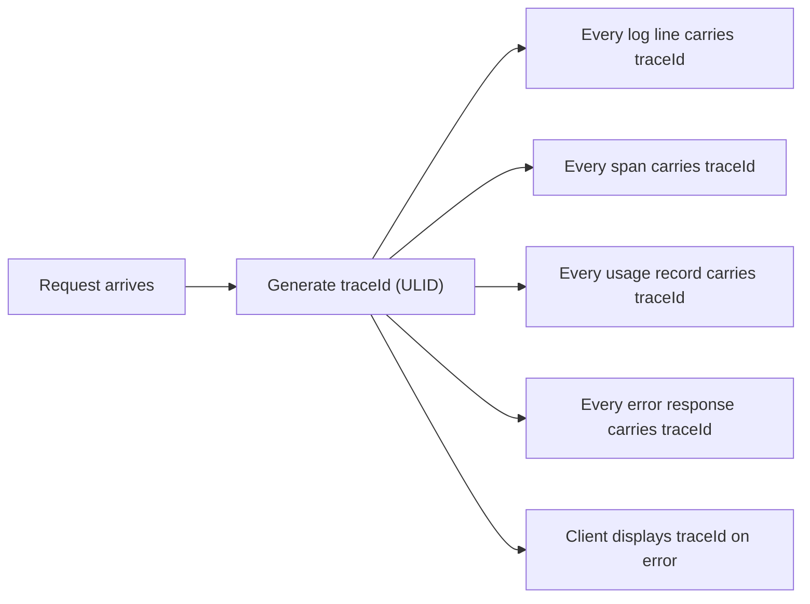
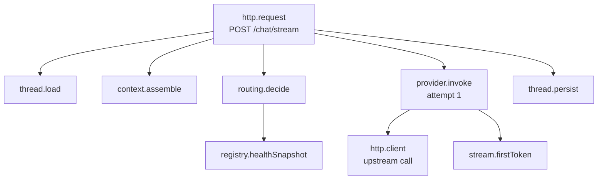

# 11 — Observability

## The question this system must answer

> A user says "NovaGPT was slow and gave me a weird answer at 3pm."

Answering that requires knowing: which model answered, why that model was
chosen, whether a failover happened, how long each stage took, how much context
was sent, whether it was trimmed, and what the provider returned. If the system
cannot reconstruct all of that from one identifier, it is not observable — and
every incident becomes a guess.

Multi-provider routing makes this harder than in a typical backend, because the
same request can behave completely differently depending on the state of eight
external services at that moment. **State that is not recorded is state that is
gone.**

## The three signals, and what each is for

| Signal | Answers | Cost | Retention |
|---|---|---|---|
| **Logs** | What happened in this specific request? | High per event | 30 days |
| **Metrics** | What is happening across all requests? | Very low | 15 months |
| **Traces** | Where did the time go, and in what order? | Medium (sampled) | 7 days |

**The rule that keeps costs sane: do not use one signal to do another's job.**
Counting occurrences by querying logs is expensive and slow; a counter is nearly
free. Debugging a single request from metrics is impossible; that is what logs and
traces are for. Most observability cost overruns come from logging what should
have been a metric.

## Correlation

Everything hangs off one identifier.



**Why ULID rather than UUID.** ULIDs are lexicographically sortable by time, so a
list of trace ids is chronologically ordered without a separate timestamp field,
and they index better in time-ordered stores.

**Why the trace id is returned to the client on error**
([09](09-api-design.md#error-format)): it converts "something went wrong" into a
single log query. This is the highest-leverage observability feature in the
system per line of code.

**Why usage records carry it** ([08](08-storage.md#usage_records)): three usage
records sharing a trace id with ascending attempt numbers *are* the failover
story, queryable without touching logs.

## Logging

### Structured JSON, always

```
{ "level":"info", "time":"2026-07-29T14:03:11.412Z", "traceId":"01HQ8X...",
  "userId":"u_8821", "threadId":"t_44a1", "event":"routing.decided",
  "model":"llama-3.3-70b-versatile", "provider":"groq",
  "reason":"primary healthy, free tier, lowest latency",
  "consideredCount":9, "durationMs":2 }
```

**Why structured and not human-readable text.** Logs are read by machines far
more often than by people — filtered, aggregated, alerted on. `grep` on
free-form text is a search that breaks whenever the message wording changes.
Structured fields are queryable, and a log viewer renders them readably anyway.

**Why `event` is a stable dotted name, not a sentence.** `event:
"routing.decided"` is a contract that alerts and dashboards can depend on.
`message: "Routing decided to use groq"` is copy, and copy changes.

### Levels, with explicit criteria

| Level | Use | Examples |
|---|---|---|
| `error` | Requires human attention; may page | Unhandled exception, auth failure against a platform key, all providers down |
| `warn` | Anomalous but handled | Failover occurred, context truncated, rate limit hit, breaker opened |
| `info` | Significant state changes | Request completed, provider recovered, thread created |
| `debug` | Development diagnosis; off in production | Full routing candidate list, raw provider frames |

**Provider quota errors are `warn`, not `error`.** They are expected behaviour on
free tiers and the system handles them by design. Logging them as errors trains
operators to ignore errors — which is how the one genuine error gets missed.
`error` MUST mean "a human needs to look at this".

### What is never logged

| Never | Why |
|---|---|
| Prompt or completion content | The largest privacy exposure in the system (T13, [10](10-security.md)). Log token *counts*, never text |
| API keys or credentials | Structurally prevented by the `Secret` wrapper and the redaction filter |
| Raw provider error bodies at info level or above | May contain account identifiers or request fragments. Debug level only, after redaction |
| Full request bodies | Same as prompt content |
| Personal data beyond a user id | The id is sufficient for correlation; the rest is exposure with no diagnostic value |

**Content logging is opt-in, per-deployment, off by default, and logged as an
audit event when enabled.** Some deployments genuinely need it for debugging.
Making it a deliberate, recorded operator action rather than a config flag
someone flips and forgets is the difference between a tool and a liability.

### Events that MUST be logged

```
request.received       request.completed      request.failed
routing.decided        routing.failover       routing.exhausted
provider.success       provider.failure       provider.breaker_opened
provider.breaker_closed  provider.recovered
context.assembled      context.trimmed        context.compressed
stream.started         stream.completed       stream.cancelled  stream.stalled
auth.succeeded         auth.failed            auth.revoked
ratelimit.exceeded     quota.exhausted
```

**`routing.decided` is the most important log line in the system.** It carries
the chosen model, the reason, the number of candidates considered, and the top
rejected candidates with their reasons. It is what makes "why did my request go
to Groq?" answerable in one query instead of unanswerable forever.

## Tracing

W3C Trace Context propagation, with the collection and sampling written in this
repository rather than pulled in from an OpenTelemetry SDK
([ADR-024](15-decisions.md#adr-024--tracing-is-collected-in-process-not-through-an-opentelemetry-sdk)).

**Implemented in** [`Tracer`](../../Backend/src/infrastructure/telemetry/Tracer.js)
and [`SamplingPolicy`](../../Backend/src/domain/observability/SamplingPolicy.js).
Spans nest through async local storage, so no function signature carries a
parent. Sampled traces are exported as `trace.sampled` log events — the log
pipeline already exists, already redacts, and already retains, and a trace that
lands beside the log lines from the same request is more useful during an
incident than one in a separate tool. Introducing a tracing backend means
implementing the same one-method exporter interface.

### Span structure

Spans nest to mirror the call path:



A representative timing breakdown for one 4.2-second streaming request — this is
what the trace makes visible, and what a single log line cannot:

| Span | Start | Duration | Note |
|---|--:|--:|---|
| `http.request` | 0 ms | 4,200 ms | Total |
| `thread.load` | 20 ms | 45 ms | Mongo |
| `context.assemble` | 65 ms | 30 ms | 42 messages, no trimming |
| `registry.healthSnapshot` | 95 ms | 3 ms | Redis |
| `routing.decide` | 98 ms | 2 ms | 9 candidates |
| `provider.invoke` | 105 ms | 4,050 ms | Groq, attempt 1 |
| ↳ `stream.firstToken` | 105 ms | 380 ms | **TTFT — the number users feel** |
| `thread.persist` | 4,160 ms | 35 ms | Mongo |

**The value of the breakdown is proportion.** Here 96% of the request is the
provider generating tokens, which means no amount of backend optimisation will
make it faster — the only lever is routing to a faster model. Without the trace,
"the request took 4.2 seconds" invites optimising the 3% that is ours.

### Span attributes

| Span | Attributes |
|---|---|
| `http.request` | method, route, status, user id, trace id |
| `context.assemble` | message count, estimated tokens, trimmed count, compressed spans, budget |
| `routing.decide` | preference, requirements, candidates considered, chosen model, reason |
| `provider.invoke` | provider, model, attempt number, outcome, failure kind, latency, TTFT |
| `db.query` | collection, operation, duration |

**Attribute values MUST be low-cardinality identifiers.** A model id is fine; a
prompt is not — both for privacy and because high-cardinality attributes make a
tracing backend expensive and slow.

### Sampling

| Category | Rate | Why |
|---|---|---|
| Errors and failovers | **100%** | These are exactly what we need traces for; sampling them away defeats the purpose |
| Slow requests (>p95) | 100% | The tail is where problems live |
| Normal successful requests | 5% | Enough for latency distribution; a full trace of every fast request is pure cost |

**Tail-based sampling, not head-based.** The decision to keep a trace is made
*after* the request completes, when we know whether it failed or was slow.
Head-based sampling decides at the start, when we know nothing — and therefore
throws away exactly the traces that turn out to matter.

### Amended during implementation

**"Slow" is a configured threshold, not a live p95.** A percentile computed from
the traces you decided to keep is circular. `TRACE_SLOW_MS` is a number an
operator can reason about and change.

**A 5xx is an error even when nothing threw.** The HTTP layer records the status
as a span *attribute* rather than failing the root span, because ending a span
early to mark it would freeze its duration before the response finished. The
sampler reads the attribute. 4xx is deliberately not an error: keeping every
validation failure at 100% would bury the traces that are about the system.

**A successful failover is kept at 100%.** It carries no error, so nothing else
would distinguish it from an ordinary request — and it is one of the most
informative traces the system produces. The executors mark the root span with
`routing.switched` for exactly this.

**Traces are bounded at `TRACE_MAX_SPANS`, and say how many they dropped.** A
retry storm must not grow a trace without limit, and a truncated trace must not
pretend to be whole.

**First token is an event, not a span.** A child span would imply generation
paused there. It is a point in time, and `stream.first_token` carries the TTFT.

## Metrics

Prometheus format, exposed at `/api/v1/admin/metrics`.

### Request metrics

| Metric | Type | Labels |
|---|---|---|
| `nova_requests_total` | counter | route, method, status |
| `nova_request_duration_seconds` | histogram | route, method |
| `nova_active_streams` | gauge | — |
| `nova_stream_duration_seconds` | histogram | provider, model |
| `nova_stream_ttft_seconds` | histogram | provider, model |

**Time-to-first-token is tracked separately from total duration, and it is the
metric that matters most for perceived speed.** A 30-second generation that
starts in 300 ms feels fast; a 3-second generation that starts after 2.5 s feels
broken. Total duration averages these into a number that describes neither.

### Provider metrics

| Metric | Type | Labels |
|---|---|---|
| `nova_provider_requests_total` | counter | provider, model, outcome |
| `nova_provider_failures_total` | counter | provider, kind |
| `nova_provider_latency_seconds` | histogram | provider, model |
| `nova_provider_health` | gauge (0–1) | provider |
| `nova_provider_breaker_state` | gauge (0/0.5/1) | provider |
| `nova_provider_tokens_total` | counter | provider, model, direction |
| `nova_provider_cost_usd_total` | counter | provider, model |

### Routing metrics

| Metric | Type | Labels |
|---|---|---|
| `nova_routing_decisions_total` | counter | model, provider, mode |
| `nova_routing_failovers_total` | counter | from, to, reason |
| `nova_routing_exhausted_total` | counter | reason |
| `nova_routing_candidates` | histogram | — |

**`nova_routing_candidates` is a leading indicator worth watching closely.** A
falling candidate count means the fleet is quietly degrading — providers are
dropping out one at a time — and it is visible *before* requests start failing.
It is the difference between preventing an incident and responding to one.

### Context metrics

| Metric | Type |
|---|---|
| `nova_context_tokens` | histogram |
| `nova_context_trimmed_total` | counter |
| `nova_context_compressions_total` | counter |
| `nova_token_estimate_error_ratio` | histogram |

**`nova_token_estimate_error_ratio`** (estimated ÷ actual) validates the
heuristic in [06](06-context-engine.md#token-estimation). Consistent
underestimation causes provider rejections; consistent overestimation wastes
context. Without this metric, the estimator's accuracy is an assumption nobody
ever checks.

### What is implemented

Every metric in the tables above exists and is emitted. That sentence needed a
mechanism behind it: **seven of them were emitted and silently discarded**
because they had never been declared — including `nova_stream_ttft_seconds`,
the one this document calls the metric that matters most for perceived speed.
Nothing failed. Prometheus simply never saw them, and the first person to notice
would have been someone during an incident, looking at a panel reading "No data".

[`test/unit/metricsCatalog.test.js`](../../Backend/test/unit/metricsCatalog.test.js)
is the mechanism, and it checks three directions:

| Check | Catches |
|---|---|
| Every emitted name is declared | The defect above |
| Every declared name is emitted | A panel that always reads zero, which looks like an idle system |
| Every name referenced by `ops/` exists | An alert that can never fire, and a panel that shows "No data" |

`nova_wasted_tokens_total` and `nova_traces_sampled_total` are additions beyond
the tables above: the first is what makes "wasted spend" a measured number, and
the second is what stops "we saw fewer error traces" being confused with "there
were fewer errors".

### Cardinality discipline

Labels MUST be bounded: provider (8), model (~25), route (~20), outcome (3),
failure kind (6). **Never** user id, thread id, or trace id as a label. Each
distinct label combination is a separate time series; a user-id label on a
five-metric set with 10,000 users is 50,000 series, which is how a metrics bill
becomes larger than a compute bill.

## Dashboards

### Provider dashboard — "is the fleet healthy?"

| Panel | Shows | Why it matters |
|---|---|---|
| Provider status grid | Breaker state per provider, colour-coded | The single most useful view during an incident |
| Success rate | Per provider, 5-minute window | Degradation before total failure |
| Latency percentiles | p50/p95/p99 per provider | Which provider is slow *right now* |
| TTFT percentiles | Per provider | Perceived speed |
| Failure breakdown | Stacked by kind | Distinguishes "we're out of quota" from "they're down" |
| Request share | Traffic distribution across providers | Reveals over-reliance on one provider |
| Breaker timeline | Open/close events over time | Flapping is visible as a pattern here and nowhere else |

**Request share is the concentration-risk panel.** If 80% of traffic goes to one
provider, the fleet has silently become single-provider and the failover design
is theoretical. It usually happens gradually — that provider is fastest, so
ranking keeps choosing it — and it is invisible without this panel.

### Health dashboard — "is the system healthy?"

Request rate and error rate by route; active streams; p50/p95/p99 latency; stream
cancellation rate; stream stall rate; database and Redis latency; event-loop lag;
memory and CPU.

**Event-loop lag is the Node-specific vital sign.** Rising lag means the process
is CPU-bound and *every* request is slowing, including health checks — which is
how an instance ends up marked healthy while serving nothing.

### Cost dashboard — "what is this costing?"

| Panel | Shows |
|---|---|
| Spend by provider | Daily and month-to-date |
| Free vs paid token share | Is the free-tier premise holding? |
| Cost per conversation | Trend over time |
| Wasted spend | Tokens consumed by failed and cancelled attempts |
| Free-tier headroom | Estimated remaining daily quota per provider |

**"Wasted spend" is the panel that justifies routing work.** If 15% of tokens are
consumed by attempts that failed or were cancelled, that is a concrete,
quantified case for tuning retry policy or timeouts — the kind of number that
turns an engineering opinion into a decision.

**Free-tier headroom is estimated, not measured**, because providers do not
expose remaining quota. It is derived from observed usage against documented
limits, and is explicitly labelled as an estimate on the dashboard. A number
presented as authoritative when it is inferred is worse than no number.

### Context dashboard

Token distribution; trim and compression rates; estimation error; context
utilisation (used ÷ available window).

## Cost monitoring

**Cost is computed from measured token counts, never estimated from request
counts.** Every usage record carries actual `promptTokens` and
`completionTokens` from the provider where available, multiplied by a per-model
price table.

| Rule | Why |
|---|---|
| Free-tier usage is recorded with `cost = 0` but tokens are still counted | Free tiers have limits. Token consumption is the resource, whether or not it is billed |
| Failed and cancelled attempts are recorded | They consume real quota. Excluding them understates consumption exactly where waste lives |
| Prices live in a versioned table with an effective date | Provider prices change; historical cost must not retroactively change |
| Cost is attributed to user, thread, and provider | Enables per-user budgets and per-feature cost analysis |

**Implemented** as [`UsageRecord`](../../Backend/src/domain/usage/UsageRecord.js)
plus [`UsageRecorder`](../../Backend/src/application/usage/UsageRecorder.js),
written from both executors — the orchestrator would have been the tidier place
and is the wrong one, because only the executors see the attempts that *failed*.

Three distinctions the implementation holds and a naive version would not:

- **`null` cost is not zero cost.** An unpriced model records `null`; collapsing
  it to `0` would silently understate spend every time a model ships without a
  price. Free-tier models record a real `0`, and their tokens are still counted.
- **Cancelled is not failed.** Lumping them together makes "wasted spend" read
  as provider unreliability, pointing tuning at the retry policy when the cause
  is users closing tabs.
- **Recording never fails a request.** The write is off the critical path and
  its failure is logged at `error`. Refusing a user's answer because the spend
  row could not be written trades a reporting gap for an outage.

Records are read **by trace id**, which sorts by attempt — an unscoped list
sorts newest-first, and two attempts a millisecond apart then come back
reversed.

## Alerting

**Alert on symptoms users feel, not on causes.** A provider going down is not an
alert-worthy event — that is the system working as designed. *Users being unable
to get an answer* is.

### Paging alerts (wake someone up)

| Alert | Condition | Why it pages |
|---|---|---|
| Service down | Health check failing 2 min | Total outage |
| All providers unavailable | `nova_routing_candidates` = 0 for 2 min | No user can chat |
| Error rate critical | 5xx > 5% for 5 min | Widespread failure |
| Database unreachable | Mongo connection down 2 min | Conversations cannot be saved |
| Platform key rejected | Any `auth` failure on a platform key | A key is dead; nothing recovers without a human |

### Warning alerts (notify, do not page)

| Alert | Condition |
|---|---|
| Provider degraded | Any provider's success rate < 80% for 15 min |
| Elevated failover | Failover rate > 20% for 15 min |
| Candidate pool shrinking | Available providers < 3 for 10 min |
| Latency regression | p95 TTFT > 2× the 7-day baseline |
| Free-tier exhaustion | Estimated headroom < 20% |
| Cost anomaly | Daily spend > 2× the 7-day average |
| Stream stall rate | > 5% of streams stalling |

**Why "all providers unavailable" pages but "one provider down" does not.** The
entire architecture exists so that one provider going down is a non-event. Paging
on it would mean paging on the system working correctly — and an on-call rotation
that is woken for non-events stops responding to real ones.

**Every paging alert MUST have a runbook** linked from the alert itself: what it
means, how to confirm it, what to do, and how to verify recovery. An alert
without a runbook is a notification that someone else's night is ruined, with no
information about how to fix it.

The rules live in [`ops/prometheus/alerts.yml`](../../ops/prometheus/alerts.yml)
and the runbooks in [`ops/runbooks/`](../../ops/runbooks/).
[`test/unit/alerting.test.js`](../../Backend/test/unit/alerting.test.js) asserts
the rule rather than trusting it: every paging alert links a runbook, every
linked runbook exists and contains all four sections, no per-provider alert
pages, and every paging alert has a `for` clause — except a rejected platform
key, which pages immediately because nothing recovers without a human.

Dashboards are in [`ops/grafana/`](../../ops/grafana/): providers, health, cost
and context, matching the four described above.

## Retention and cost control

| Signal | Retention | Rationale |
|---|---|---|
| Logs (info+) | 30 days | Covers a full incident retrospective |
| Logs (debug) | Not retained in production | Off by default |
| Traces | 7 days | Used for active debugging, not history |
| Metrics (raw) | 15 days | Full resolution for recent analysis |
| Metrics (5-min rollup) | 15 months | Year-over-year comparison at low cost |
| Usage records | 90 days, then monthly rollup | [08](08-storage.md#retention-and-ttl) |
| Audit log | 1 year | Compliance floor |

**Observability cost MUST stay below 10% of infrastructure cost.** Stated as a
budget because observability spend grows silently — a new debug log line in a hot
path can double log volume with no code review flag. The controls are: sampling
for traces, aggressive cardinality discipline for metrics, and log levels
enforced in code review. When the budget is exceeded, the fix is to cut volume,
not to raise the budget.
