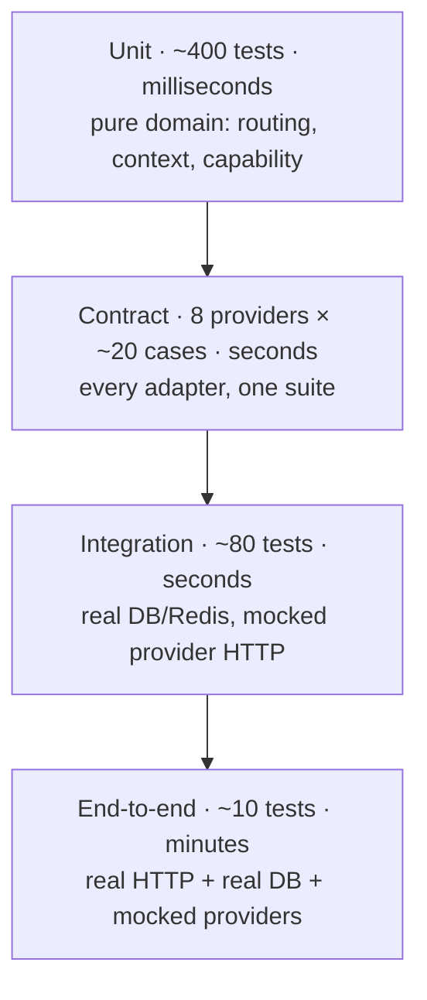
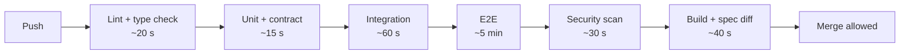

# 12 — Testing

## Philosophy

**A test exists to let us change code with confidence.** Every test either
enables a future change or it is overhead. Tests that assert implementation
details do the opposite: they make refactoring expensive, so they get deleted or
worked around, and coverage numbers stay high while confidence falls.

Three rules follow from that, and they shape everything below.

**1. Test behaviour, not structure.** Assert what a component does, not how it
does it. A test that breaks when a private method is renamed is a liability.

**2. The hexagonal boundary is the test boundary.** The architecture
([02](02-architecture.md)) exists partly so that the interesting logic — routing,
context assembly, capability matching — is pure and testable without any
infrastructure. Tests should exploit that, not ignore it by spinning up a server
for everything.

**3. Test the failure paths harder than the success paths.** NovaGPT's value is
what it does when providers fail. Success is one path; failure is dozens, and it
is the one users notice. Most of this document is about failure.

## The test pyramid, sized for this system



| Layer | Count | Runtime | Runs on |
|---|---|---|---|
| Unit | ~400 | < 2 s total | Every save |
| Contract | ~160 | < 10 s | Every commit |
| Integration | ~80 | < 60 s | Every push |
| End-to-end | ~10 | < 5 min | Every pull request |

**Why the pyramid is unusually wide at the contract layer.** In most backends the
"integration with external services" band is thin. Here it is the core risk:
eight external APIs, each with its own error behaviour, each of which the router's
correctness depends on. The contract suite is where the assumptions the router
makes are actually verified.

## Tooling

| Tool | Purpose | Why |
|---|---|---|
| `node:test` | Runner | Built into the runtime. No dependency, no configuration, no ESM friction, fast startup |
| `node:assert/strict` | Assertions | Built in; strict equality by default |
| `undici` MockAgent | HTTP interception | Intercepts at the `fetch` layer, so adapter code runs unmodified — including its own retry, timeout, and error mapping |
| `mongodb-memory-server` | Real Mongo, in-process | Actual Mongo semantics — real indexes, real query behaviour — without a container |
| `ioredis-mock` | Redis fake | Redis is used simply enough that a fake is sufficient |
| `autocannon` | Load testing | Simple, scriptable, adequate |

**Why not Jest.** Heavy, slow to start, its ESM support is still awkward, and its
module mocking encourages exactly the wrong kind of test — mocking internal
modules to make a unit test pass, which couples tests to structure and hides
integration bugs.

**Why intercept HTTP rather than mock the adapter.** Mocking an adapter tests
that the *mock* behaves as expected. Intercepting `fetch` means the adapter's real
parsing, real error mapping, and real retry logic run against a controlled
response — which is what we actually need to verify.

## Unit testing

**Scope: the domain layer.** Routing policy, capability matching, context
assembly, token estimation, error classification, the circuit-breaker state
machine.

These are pure functions, so tests are fast, deterministic, and need no setup.
This is the layer where coverage should be near-total, because it is where the
system's logic lives and where tests are cheapest.

### What gets exhaustive coverage

| Component | Cases |
|---|---|
| **Routing policy** | Every row of the 20-row decision table ([04](04-router.md#every-routing-decision-enumerated)) — one test each, by number |
| **Ranking** | Every criterion decides correctly in isolation; every tiebreak order; stability under equal inputs |
| **Capability matching** | Each requirement filters correctly; combinations; the empty-candidate case |
| **Context assembly** | Each trimming stage in order; every invariant ([06](06-context-engine.md#the-invariants)); budget arithmetic; pinned-message cap |
| **Token estimation** | English, CJK, code, mixed; the calibration clamp bounds |
| **Circuit breaker** | Every transition; threshold asymmetry; cooldown per kind; half-open probe outcomes |
| **Error classification** | Every status and body shape maps to the right kind |

**The decision table is tested row by row, and each test is named for its row
number.** When a routing bug is found, the fix is: add or correct a row in
[04](04-router.md), then add or correct the test with that number. Documentation
and tests stay in lockstep because they share an index.

### Time and randomness are injected

The domain never calls `Date.now()` or `Math.random()` directly; both arrive
through ports. Testing a 15-minute quota cooldown is then one line advancing a
fake clock, rather than a fake-timer library or a real 15-minute wait.

## The shared provider contract suite

**The single most valuable test asset in the system.** One suite, run against
every adapter, asserting the guarantees the router depends on.

**Why it must be shared rather than per-adapter.** The router's correctness
depends on *every* adapter behaving identically at the boundary. Per-adapter
tests drift — adapter 7 gets written by someone who tests slightly different
things, and the one guarantee they skipped is the one the router relies on. A
shared suite means a new adapter cannot be merged until it behaves like all the
others.

### Two tiers, and why

The suite is split by what it needs to run:

**Framework cases** hold for any adapter regardless of transport — interface
conformance, capability honesty, error typing, cancellation, stream shape. They
run against the mock adapter from Phase 2 onward, which proves the suite is
*satisfiable* before a real adapter exists. A contract nothing has ever passed
is a guess about what adapters can do, and it is usually wrong in the direction
of being impossible to meet.

**Transport cases** (rows 4–17 below) need a real HTTP adapter and attach in
Phase 3. They are listed in code as `TRANSPORT_CASES` so the gap is a value the
suite asserts on rather than a comment someone deletes.

### What every adapter must prove

| # | Case | Assertion |
|---|---|---|
| 1 | Successful completion | Returns `{ text, usage, model }` |
| 2 | Successful stream | Yields normalised `StreamEvent`s ending in `done` |
| 3 | Empty stream | Raises `outage`, never returns success |
| 4 | `429` with a quota body | Maps to `kind: "quota"` |
| 5 | `429` without a quota body | Maps to `kind: "rate_limit"` |
| 6 | `429` with `Retry-After` | `retryAfter` is populated |
| 7 | `401` / `403` | Maps to `kind: "auth"` |
| 8 | `500` / `502` / `503` | Maps to `kind: "outage"` |
| 9 | `400` | Maps to `kind: "api_error"` |
| 10 | Connection refused | Maps to `kind: "outage"` |
| 11 | Timeout | Maps to `kind: "timeout"` within the budget |
| 12 | Abort mid-stream | Stops within 100 ms; upstream reader released |
| 13 | Abort before first token | No further network activity |
| 14 | Malformed SSE frame | Skipped; the stream continues |
| 15 | Frame split across TCP chunks | Buffered and parsed correctly |
| 16 | Provider terminator (`[DONE]`) | Not emitted as content |
| 17 | Empty delta frames | Dropped, not forwarded |
| 18 | Unsupported capability | Throws `UnsupportedCapabilityError` |
| 19 | Any error | Is a `ProviderError`; no raw SDK error escapes |
| 20 | No error message | Contains a credential or key fragment |

**Case 15 deserves special mention.** TCP splits SSE frames at arbitrary byte
boundaries, and a naive parser silently drops the split frame's content. It
almost never reproduces locally, appears under real network conditions as
"occasionally missing words", and is nearly impossible to diagnose from a bug
report. It must be tested deliberately, with a mock that splits mid-frame.

**Case 20 is a security test in the test suite.** Error message construction is
where credentials leak (T1, [10](10-security.md)), and the leak is invisible until
someone reads a log.

## Integration testing

**Scope: use cases with real infrastructure, mocked provider HTTP.**

Real Mongo (in-memory), real repository code, real middleware, real Express
routing. Only outbound provider calls are intercepted.

**Why real Mongo rather than a repository fake.** A repository fake tests that the
fake works. Real Mongo catches the bugs that actually happen: an index not used,
a `$push` racing with a concurrent update, an ESR-violating compound index
forcing an in-memory sort ([08](08-storage.md#indexes)). Those are exactly the
failures that only appear under production data volumes.

### Scenarios

| Area | Scenarios |
|---|---|
| Chat | Send, persist, and return; concurrent sends to one thread; idempotency-key replay |
| Streaming | Full stream; client disconnect mid-stream; provider failure mid-stream; empty stream |
| Failover | Each `switchPolicy`; failover across all three attempts; every provider exhausted |
| Context | Long thread triggers trimming; compression trigger; pinned messages survive |
| Threads | CRUD; pagination cursors under concurrent writes; share and revoke |
| Auth | Login, refresh, rotation, revocation, expiry |
| Rate limiting | Limit enforced; headers correct; degradation when Redis is unavailable |
| Degradation | Mongo down (catalog still serves); Redis down (chat still works) |

**The degradation scenarios are not optional.** [13](13-deployment.md) makes
specific promises about behaviour when a dependency is down. An untested
degradation path is a guess, and it will be discovered to be wrong during the
incident it was designed for.

## Provider mocks

Three fidelity levels, each for a different purpose.

| Level | What it is | Used by |
|---|---|---|
| **Fake provider** | An in-memory `ProviderPort` implementation with scriptable behaviour | Unit and use-case tests |
| **HTTP mock** | `undici` MockAgent returning recorded provider-shaped responses | Contract and integration tests |
| **Recorded fixtures** | Real captured responses, credentials scrubbed | Contract tests |

### Fixtures are captured, not written by hand

A hand-written fixture encodes what a developer *believes* a provider returns.
Real providers return surprising things — `200` with an error body, usage in an
unexpected frame, non-standard SSE comments, inconsistent `finish_reason` values.
Fixtures are captured from live calls with a recording harness, scrubbed of
credentials, and committed.

**Fixtures are re-captured quarterly.** Provider APIs change; a stale fixture
means the contract suite passes against a provider that no longer exists in that
form. The re-capture is a scheduled task, not an aspiration.

### Scriptable failure

The fake provider supports a behaviour script so a test can express a scenario
directly:

```
fake.script([
  { attempt: 1, fail: "quota" },
  { attempt: 2, fail: "timeout" },
  { attempt: 3, succeed: "final answer" },
])
```

This is what makes complex failover scenarios readable. The alternative —
stateful mock setup spread across a test's arrange block — is where multi-attempt
tests become unreadable and therefore untrusted.

## Streaming tests

Streaming has failure modes that only appear under specific timing and chunking,
so they must be constructed deliberately.

| Scenario | Assertion |
|---|---|
| Normal stream | Events in order; exactly one terminal event |
| Frame split across chunks | No content lost |
| Multiple frames in one chunk | All parsed |
| Keep-alive comments interleaved | Ignored, stream continues |
| Malformed JSON frame | Skipped, stream continues |
| Stream ends without a terminator | Treated as complete if content was received |
| Empty stream | `outage`, triggers failover |
| Client disconnect at token 1 | Upstream aborted; nothing persisted |
| Client disconnect at token 500 | Same; no failover attempted |
| Provider fails at token 50, `auto` | `switched` emitted; buffer reset; no concatenation |
| Provider stalls (no token for 30 s) | Inter-token timeout fires; failover |
| Slow consumer | Backpressure applied; memory bounded |
| Consumer stops reading entirely | Overflow limit aborts the stream |

**The buffer-reset assertion is the highest-value streaming test.** The failure it
prevents — two models' partial outputs concatenated into nonsense
([07](07-streaming-engine.md#failover-mid-stream)) — is severe, user-visible, and
easy to reintroduce during a refactor because the correct behaviour looks like a
missing feature.

## Failure testing

Systematic fault injection against the failure taxonomy.

### Injected faults

| Fault | Expected |
|---|---|
| Every failure kind, per provider | Correct classification, retry, breaker, and failover behaviour |
| All providers failing simultaneously | One clear error listing every provider tried and why |
| Provider returns malformed JSON | `api_error`, no crash |
| Provider returns HTML (a captive portal or error page) | `outage`, no crash |
| Provider hangs indefinitely | Timeout fires at the budget |
| Provider returns an enormous response | Bounded by max output tokens; memory stable |
| Mongo unavailable | Catalog and models still serve; chat returns a clear error |
| Redis unavailable | Chat works; limits fall back to per-instance |
| Both unavailable | Health endpoint reports unready; liveness still passes |
| Clock skew between instances | Breaker cooldowns still behave sanely |

### Chaos exercises

Run against staging, quarterly:

1. Disable each provider in turn — chat MUST keep working.
2. Disable all but one — routing MUST converge on it.
3. Restart Redis under load — breakers rebuild; no request fails.
4. Kill an instance mid-stream — the client sees a clean error, not a hang.
5. Saturate one provider's rate limit — traffic MUST shift away automatically.

**Exercise 5 is the one that validates the product thesis.** If saturating one
provider does not shift traffic, the health-driven ranking is not working and the
entire multi-provider premise is decorative.

### Automated, not quarterly

All five live in [`test/chaos/chaos.test.js`](../../Backend/test/chaos/chaos.test.js)
and run on every commit. A quarterly manual exercise is the one that gets
skipped in a busy quarter — and that is the quarter the behaviour regressed. The
deploy pipeline runs the same file against staging, where the failures are real
processes rather than substituted ones.

**Exercise 5 caught a real defect the first time it ran.** The retry policy
attempted a same-provider retry before considering failover, so a rate-limited
provider consumed the entire attempt budget and the request failed with 429
while a healthy provider sat idle — the exact opposite of the documented
requirement. The distinction the fix draws: a timeout is a blip worth an
immediate second attempt; a rate limit is a stated refusal with an enforced
wait, so with an alternative available the router fails over rather than waiting.

## Performance testing

| Test | Target |
|---|---|
| Routing decision latency | p99 < 5 ms |
| Context assembly, 100 messages | p99 < 50 ms |
| Token estimation, 10K characters | p99 < 5 ms |
| Thread load (Mongo) | p99 < 30 ms |
| Catalog endpoint (cached) | p99 < 10 ms |
| Memory per active stream | < 2 MB |

**Why routing latency has such a tight target.** It runs on every request,
including failover attempts, and it competes for the event loop with active
streams. A routing decision that takes 50 ms adds latency to every user *and*
delays token delivery on every concurrent stream — a coupling that is invisible
in single-request testing.

## Load testing

| Scenario | Profile | Validates |
|---|---|---|
| Sustained chat | 100 concurrent streams, 10 min | Memory stability, event-loop lag |
| Burst | 0 → 500 requests in 10 s | Rate limiting, graceful shedding |
| Long streams | 50 streams of 5+ min each | No leaks, keep-alives working |
| Mixed | Streaming + catalog + thread reads | No starvation of short requests |
| Provider degradation under load | 200 concurrent while a provider fails | Failover works at scale, breakers do not thrash |

**Memory is the metric that matters most under load**, not throughput. Every
active stream holds a buffer, a reader, and an open socket. A slow leak invisible
at 10 concurrent streams becomes an out-of-memory kill at 200 — and the crash
looks unrelated to its cause.

### Implemented

[`test/load/`](../../Backend/test/load/), run with `npm run test:load`. Kept out
of the default suite: these take tens of seconds and measure timing, which is
the wrong shape for a pre-commit run. `LOAD_SCALE=20` runs the documented
profile against staging.

The harness is written here rather than being k6 or autocannon for two reasons.
The scenarios need an SSE-aware client that counts *frames* rather than bytes,
and the assertions are about the server process's heap and event-loop lag, which
an external tool cannot see. Throughput numbers from a generator sharing a laptop
with the server are noise anyway.

**The heap assertion took three attempts, and each failure was the test rather
than the server.** Worth recording in full, because at every step the tempting
fix was to loosen the threshold — which would have left a check that runs, looks
green, and catches nothing.

| Attempt | Reported | What was actually wrong |
|---|---|---|
| Last sample ÷ first sample | — | A single sample either side of a garbage collection makes a two-point comparison meaningless |
| Second-half **mean** ÷ first-half mean | 2.0×, then 1.4–1.8× run to run | The harness retained every log line and every span tree. Fixed by turning telemetry retention off for load runs and draining the substituted stores mid-run — then the *metric* proved too noisy: peaks track allocation rate and move with wherever GC lands |
| Second-half **floor** ÷ first-half floor | 2.0×, consistently | The right metric — a sawtooth's troughs are retained memory and only a leak raises them — measured across the ramp. V8 growing its heap to fit the working set read as a leak |
| Floor, after a warm-up phase | 1.0–1.1× | Correct. Threshold now 1.3×, which is tight *because* the metric is stable |

The general lesson is the one worth keeping: **a noisy metric forces a threshold
loose enough to be useless.** Fixing the measurement is what buys a tight bound.

## Security testing

Authorization defects are **omissions**, which makes them different from every
other class of bug in this document. A suite that tests the endpoints someone
remembered to protect proves nothing about the one they forgot — and the one
they forgot is the incident.

So the authorization suite
([`test/e2e/authorization.test.js`](../../Backend/test/e2e/authorization.test.js))
is a **generated sweep**, not a sample. Every route that names a resource is in
one table, and every entry is asserted to answer `404` for a second account.
Adding a route without adding it to that table is the mistake the file exists to
catch.

| Suite | Proves |
|---|---|
| `test/unit/jwt.test.js` | `alg: none`, algorithm confusion, foreign keys, expiry, issuer, key rotation. Mostly attacks, not features |
| `test/unit/identity.test.js` | Password and email rules, lockout escalation, the hash never reaching the API shape, Argon2id round-trip and rehash detection |
| `test/unit/rateLimit.test.js` | Window arithmetic, boundary carry-over, per-subject isolation, and both failure modes |
| `test/unit/envelope.test.js` | Envelope encryption, tamper detection, master-key rotation, cookie flags |
| `test/e2e/authApi.test.js` | Registration, login, refresh **rotation and reuse detection**, logout revocation, password change ending other sessions |
| `test/e2e/authorization.test.js` | The IDOR sweep, the response-surface credential sweep, operator-route permissions |
| `test/integration/rateLimit.http.test.js` | That the rules are mounted, on the right routes, counting the right subject |

Two properties are asserted structurally rather than by inspection, because both
are things review misses:

- **No response anywhere contains a credential.** A single regex over the bodies
  of every read endpoint, including an error body. This is the check that would
  have caught a serialiser spreading an internal object (T1).
- **The test password hasher is a real hasher.** A stub returning the password
  would let every authentication test pass while the code under test compared
  plaintext, so `FastHasher` is scrypt with the cost turned down — salted,
  derived, constant-time compared.

## Regression testing

**Every bug gets a test before it gets a fix.** The test must fail against the
unfixed code — a test written after the fix proves nothing about whether it
reproduces the bug.

| Regression class | Kept as |
|---|---|
| Routing decisions | A row in the decision table + its numbered test |
| Provider quirks | A captured fixture + a contract-suite case |
| Streaming edge cases | A chunking scenario in the streaming suite |
| Context bugs | An invariant assertion in the context suite |
| Security issues | A test asserting the vulnerable path is closed |

**Provider-quirk regressions are permanent.** When a provider returns something
unexpected, the fixture that captured it stays in the suite forever — even after
the provider fixes it. Providers regress, and a removed fixture is a bug waiting
to return silently.

## CI pipeline



Ordered fastest-first so failures surface in seconds, not minutes.

### Merge gates

| Gate | Requirement |
|---|---|
| Lint and type check | Zero errors |
| Architecture rules | No dependency-direction violations ([02](02-architecture.md#enforcement)) |
| Unit + contract | 100% pass; domain coverage ≥ 90% |
| Integration | 100% pass |
| E2E | 100% pass |
| Secret scan | Zero findings |
| Dependency audit | Zero high or critical |
| OpenAPI | Committed spec matches generated; no undeclared breaking change |

**Coverage is required on the domain layer only, and deliberately not
system-wide.** A global coverage target drives tests written to cover lines
rather than to verify behaviour — trivial getter tests that raise the number and
prove nothing. The domain is where coverage correlates with confidence, so that
is where it is enforced.

### Not in CI

Live provider tests require real credentials and consume real quota. They run
**nightly**, against a dedicated key set, and their failure opens an issue rather
than blocking a merge.

**Why they must not gate merges:** a provider outage would block every pull
request in the repository, making the team's velocity dependent on eight external
services' uptime. Nightly runs catch real API drift without holding development
hostage to it.
