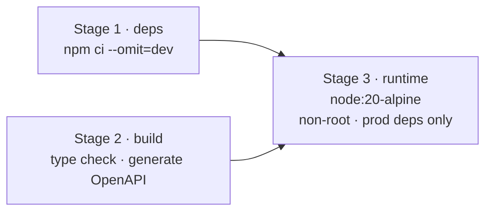
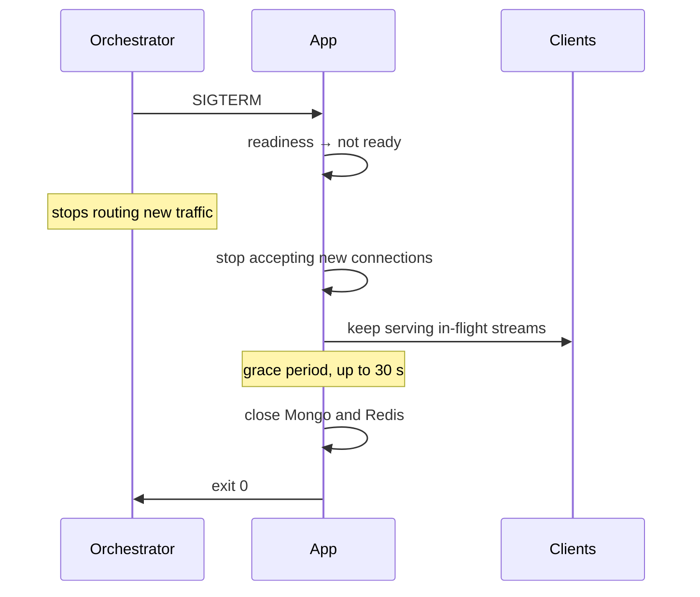
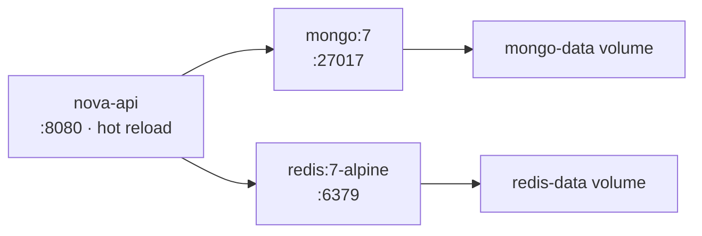
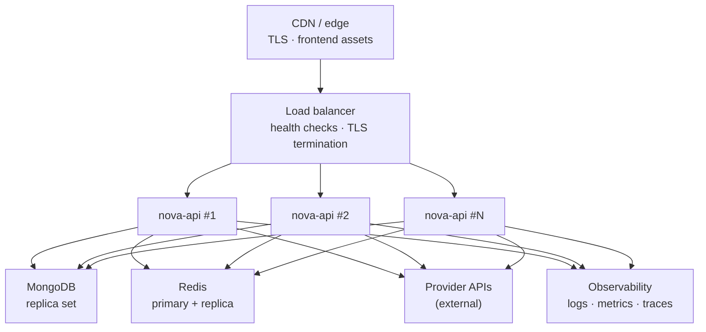
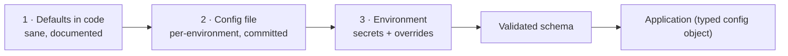
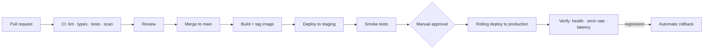

# 13 — Deployment

## Deployment philosophy

**Runtime-agnostic.** Nothing in the design assumes Kubernetes, or any specific
cloud. The unit of deployment is an OCI container that reads configuration from
the environment and exposes HTTP. It runs on Kubernetes, ECS, Fly.io, Railway,
Render, or a single VM with Docker Compose.

**Why this constraint matters for an open-source project.** NovaGPT's premise is
zero-cost operation ([01](01-system-overview.md#vision)). A deployment that
requires a Kubernetes cluster contradicts that premise for the majority of people
who would run it. The architecture must not make a hobbyist deployment
second-class.

**Stateless application, stateful dependencies.** Instances hold nothing that
cannot be lost. All durable state is in Mongo; all shared ephemeral state is in
Redis. Any instance can be killed at any moment, and the only cost is the
in-flight streams on it.

## Container design

### Multi-stage build

| Decision | Reasoning |
|---|---|
| `node:20-alpine` base | ~50 MB vs ~350 MB for the full image. Smaller image = faster pulls, faster scaling, smaller attack surface |
| Multi-stage | Build tooling and dev dependencies never reach the runtime image |
| Non-root user (`node`) | A container escape starts from an unprivileged account. Free to do, expensive to retrofit |
| Read-only root filesystem | The application writes nothing to disk. Enforcing it blocks a whole class of persistence attacks |
| No shell in the final image (where feasible) | Removes the most convenient post-compromise tool |
| `dumb-init` as PID 1 | Node as PID 1 does not reap zombies and handles signals incorrectly — leading to containers that ignore `SIGTERM` and get `SIGKILL`ed, killing in-flight streams |
| `.dockerignore` covering `.env`, `.git`, `node_modules`, `test` | Prevents accidentally baking secrets into a layer, where they persist even if a later layer deletes them |

**Health check in the image**, hitting `/api/health` with a 30 s interval and a
10 s timeout, so any runtime gets liveness semantics without extra configuration.

### Graceful shutdown

Critical for a streaming service, and commonly wrong.

**Why readiness flips before the server stops accepting.** Load balancers take
seconds to notice a removed backend. Closing the listener immediately means
requests routed during that window are refused. Flipping readiness first drains
traffic *before* the socket closes, so no request is dropped.

**Why the grace period is 30 s and not longer.** A long generation can exceed
any grace period, so some in-flight streams will always be cut. 30 s covers the
large majority while keeping deploys fast. Streams cut at shutdown receive a
clean `error` event ([07](07-streaming-engine.md#error-propagation)) rather than
a dropped connection, so the client can retry immediately.

### Draining, as implemented

The first implementation aborted **every** in-flight generation at shutdown,
which made a rolling deploy cut conversations that were two seconds from
finishing. `StreamRegistry.drain(budgetMs)` now waits for live streams and
aborts only what is left when the budget runs out; the composition root gives it
60% of the grace period, leaving room for the rest of the sequence.

Two properties matter and are both tested:

- **The wait is not `unref`'d.** An unref'd timer lets Node decide there is
  nothing left to do and exit mid-drain — the same defect that was found in the
  drain delay during Phase 0.
- **`terminationGracePeriodSeconds` must exceed `SHUTDOWN_GRACE_MS` plus the
  preStop pause.** If it does not, Kubernetes SIGKILLs the process partway
  through, which cuts *every* stream instead of the stragglers — the exact
  outcome draining exists to avoid.

### Artefacts

| | |
|---|---|
| [`Backend/Dockerfile`](../../Backend/Dockerfile) | Three stages: dependencies, **verification**, runtime. The middle one runs the suite against the same lockfile the runtime layer installs — a pipeline that tested different dependencies from the ones shipped is not a green pipeline. Built from the repository root, because the suite reads `ops/` |
| [`docker-compose.yml`](../../docker-compose.yml) | Development. `read_only: true` here as well as in production, so the flag is exercised daily rather than found broken at deploy time |
| [`ops/deploy/kubernetes/`](../../ops/deploy/kubernetes/) | Deployment, service, PDB, HPA, ingress. The HPA scales on `nova_active_streams` as well as CPU: Node can show moderate CPU while the event loop is saturated by open streams |
| [`ops/deploy/smoke.sh`](../../ops/deploy/smoke.sh) | Nine checks, exercising the real product path. One counts **SSE frames** — more than one frame is the only check here that catches a buffering proxy |
| [`ops/backup/`](../../ops/backup/) | Encrypted backup, and a restore that is **verified into a scratch database on every run** |

## Docker Compose (development)

One command brings up the full stack: API, MongoDB, Redis.

| Choice | Reasoning |
|---|---|
| Source mounted as a volume | Hot reload; edit-to-effect in under a second |
| Named volumes for data | `docker compose down` does not destroy the local database |
| Health-check dependencies | The API waits for Mongo to be *ready*, not merely started — otherwise the first boot always logs a connection error |
| `.env` file, git-ignored | Real keys never enter the repository |
| No provider keys required to start | The stack comes up and the catalog renders with zero keys. **The critical onboarding property**: a new contributor sees a working system in one command, then adds keys incrementally |

**Optional profiles** for the observability stack (Prometheus, Grafana, Jaeger),
off by default. Most development does not need them, and forcing four extra
containers on every contributor makes the local stack heavy enough that people
stop using it.

## Production topology

| Component | Minimum | Reasoning |
|---|---|---|
| API instances | 2 | One is a single point of failure and makes zero-downtime deploys impossible |
| MongoDB | 3-node replica set | Survives one node loss; enables rolling maintenance |
| Redis | Primary + replica | Loss degrades rather than breaks ([08](08-storage.md#redis-must-be-optional-and-what-that-costs)) |
| Load balancer | Any HTTP LB with SSE support | Must not buffer responses |

### Load balancer requirements — the streaming-specific ones

| Requirement | Why |
|---|---|
| Response buffering **disabled** | A buffering proxy delivers the entire stream at once, defeating streaming completely. This is the single most common SSE deployment failure |
| Idle timeout ≥ 300 s | A long generation looks idle to a proxy that only watches for request activity |
| HTTP/1.1 keep-alive, or HTTP/2 | SSE needs a persistent connection |
| No response compression on `text/event-stream` | Compression buffers to fill its window, which adds latency to every token |
| Sticky sessions **not** required | Instances are stateless. Requiring stickiness would prevent even load distribution |

**These belong in the deployment runbook as a checklist**, because every one of
them produces the same user-visible symptom — "streaming doesn't work, everything
arrives at the end" — with a different cause, and the debugging cost is high.

## Scaling

### Horizontal

The application scales horizontally without limit. **Redis-backed shared state is
a hard prerequisite for more than one instance**
([03](03-provider-system.md#distributed-state)).

**Why it is a prerequisite and not an optimisation:** with per-instance breaker
state, a quota exhaustion discovered by instance A is unknown to B..N. Each
instance independently sends doomed requests until it learns the same lesson —
N× the wasted quota and N× the user-visible errors. On free tiers, where quota is
the scarce resource, this is not a minor inefficiency; it is the difference
between the fleet working and not.

| Trigger | Metric | Action |
|---|---|---|
| Scale out | CPU > 70% for 5 min, or event-loop lag > 100 ms | Add an instance |
| Scale out | Active streams > 200 per instance | Add an instance |
| Scale in | CPU < 30% for 15 min | Remove an instance (respecting the drain period) |

**Why event-loop lag is a scaling signal alongside CPU.** Node can show moderate
CPU while the loop is saturated by many concurrent streams. Lag measures what
actually degrades user experience — the delay before the process can service the
next chunk — which CPU percentage does not capture.

**Active streams matter more than request rate.** A stream occupies a connection
and memory for its entire duration. 200 concurrent 60-second streams is a
completely different load profile from 200 requests per second of short calls.

### Vertical

| Resource | Baseline | Reasoning |
|---|---|---|
| Memory | 512 MB per instance | ~2 MB per stream ([12](12-testing.md#performance-testing)) plus the base process. 512 MB comfortably handles 200 streams |
| CPU | 0.5 vCPU | The workload is I/O-bound; CPU is spent on JSON parsing and SSE framing |

### The real scaling limit

**Provider rate limits, not our infrastructure.** Twenty instances can serve far
more requests than eight free tiers can absorb. Scaling the application beyond
the point where providers become the bottleneck adds cost with no capacity gain.

This is why `nova_routing_candidates` and free-tier headroom
([11](11-observability.md)) are capacity metrics, not just health metrics. When
capacity is short the fix is usually **more providers**, not more instances.

## Environment variables

### Categories

| Category | Examples | Required |
|---|---|---|
| **Core** | `NODE_ENV`, `PORT`, `LOG_LEVEL` | Yes |
| **Data** | `MONGODB_URI`, `REDIS_URL` | Mongo yes, Redis strongly recommended |
| **Auth** | `JWT_PRIVATE_KEY`, `JWT_PUBLIC_KEY`, `ENCRYPTION_MASTER_KEY` | Yes |
| **Providers** | `GEMINI_API_KEY`, `GROQ_API_KEY`, … | All optional, independently |
| **Tuning** | Timeouts, retry counts, rate limits | No — defaults documented |
| **Observability** | `OTEL_EXPORTER_OTLP_ENDPOINT`, `METRICS_ENABLED` | No |

### Rules

| Rule | Why |
|---|---|
| Validated at boot; the process exits on a missing required variable | A configuration error must fail at deploy time with a readable message, never inside a request at 3am |
| Provider keys are individually optional | A deployment with one key works. This is what makes incremental setup possible |
| Every variable has a documented default, or is required | An undocumented default is a behaviour nobody can predict without reading source |
| Secrets never appear in logs, including at boot | Boot logs report *which* providers are configured, never any value |
| `.env.example` lists every variable with a comment | It is the authoritative catalogue; a variable missing from it does not exist as far as operators are concerned |

**Why the boot report lists configured providers.** A misconfiguration — a
typo'd variable name, a key that did not reach the container — is otherwise
invisible until a user hits a routing failure. A boot line reading `● groq  ○
gemini (no key — skipped)` makes it obvious immediately.

## Configuration strategy

Three tiers, in precedence order:

**Why not environment variables for everything.** Fifty environment variables for
timeouts and thresholds are unreadable, undiffable, and get out of sync across
environments. Non-secret configuration belongs in a committed file where it can
be reviewed and its history seen.

**Why not a config file for everything.** Secrets must not be committed, and they
must be injectable by a secret manager at runtime.

**The split:** secrets and per-deployment overrides in the environment;
behavioural configuration in files; sane defaults in code so that a deployment
with neither still works.

**Configuration is validated once and passed as a typed object.** After boot,
`process.env` is read nowhere ([02](02-architecture.md#the-composition-root)).

## CI/CD

### Pipeline decisions

| Decision | Reasoning |
|---|---|
| Deploy on merge to `main` | Small, frequent deploys. Large batched deploys make it hard to tell which change broke something |
| Staging deploys automatically | If staging needs approval, it stops being used, and its value is being *continuously* representative |
| Production requires approval | This is a chat product with real conversations. A human confirming is a cheap circuit breaker on a bad automated decision |
| Rolling deploy, one instance at a time | Zero downtime; the blast radius of a bad build is one instance |
| Automatic rollback on regression | Error rate above baseline for 3 minutes triggers rollback. Faster and more reliable than a human noticing |
| Images tagged with the commit SHA | Every deployed artifact traces to exactly one commit. `latest` in production makes "what is actually running?" unanswerable |
| Migrations run before deploy, backward-compatible | An instance running old code must survive the new schema, because during a rolling deploy both versions run simultaneously |

**The backward-compatible migration rule is the one most often violated.**
During a rolling deploy, old and new code run at once against one database. A
migration that removes a field breaks every instance still running old code. The
discipline is expand-then-contract: add the new field, deploy code that writes
both and reads new-with-fallback, backfill, then remove the old field in a
*later* release.

### Environments

| Environment | Purpose | Data | Provider keys |
|---|---|---|---|
| Local | Development | Disposable | Developer's own |
| CI | Automated tests | Ephemeral, in-memory | None — all mocked |
| Staging | Pre-production verification | Anonymised or synthetic | A dedicated key set |
| Production | Live | Real | Platform keys |

**Staging uses a separate provider key set.** Sharing production keys would let a
staging load test exhaust the production quota — a self-inflicted outage caused
by testing.

## Security prerequisites for a production deploy

Three of these are enforced at boot — the process refuses to start rather than
starting and then behaving wrongly, because a deployment that runs and rejects
every login is far harder to diagnose than one that says which variable is
missing ([10](10-security.md)).

| Requirement | Enforced by | Why it cannot be skipped |
|---|---|---|
| `JWT_PRIVATE_KEY` / `JWT_PUBLIC_KEY` | Boot validation | An ephemeral pair invalidates every token on restart and cannot be verified by a second instance |
| `AUTH_REQUIRED=true` | Boot validation | Off leaves every conversation endpoint open |
| `CORS_ORIGINS` is not `*` | Boot validation | A wildcard lets any origin drive the API with a user's credentials |
| The audit collection is insert-only for the application role | Database grant | Enforcement in code is defeated by the same compromise that made the log worth tampering with (T12) |
| `/api/v1/admin/metrics` restricted at the ingress | Ingress config | It already requires the `admin:metrics` permission; this is depth, not a replacement |
| `ENCRYPTION_MASTER_KEY` set before any user key is stored | Operator | The cipher is only constructed when it is present; adding it later does not retroactively protect anything |

**The audit grant, concretely.** The application's database user needs `insert`
and `find` on the audit collection and nothing else. Granting `update` or
`remove` there — even briefly, even for a migration — removes the one property
the log has.

## Degradation matrix

What happens when each dependency fails. **These are promises, and each one is
covered by a test** ([12](12-testing.md#failure-testing)).

| Dependency down | Chat | Model catalog | Thread history | Auth | Overall |
|---|---|---|---|---|---|
| **One provider** | ✅ Works — routes elsewhere | ✅ Marked unavailable | ✅ | ✅ | Fully operational |
| **All providers** | ❌ Clear error naming each provider | ✅ All marked unavailable | ✅ | ✅ | Read-only |
| **MongoDB** | ❌ Cannot persist; clear error | ✅ Works | ❌ Unavailable | ⚠️ Existing tokens work | Degraded |
| **Redis** | ✅ Works | ✅ Works | ✅ | ✅ | Degraded: per-instance limits and breakers |
| **Mongo + Redis** | ❌ | ✅ Works | ❌ | ⚠️ | Catalog only |
| **Observability** | ✅ | ✅ | ✅ | ✅ | Fully operational, blind |

**The row that matters most: MongoDB down, catalog still serving.** It is why
`connectMongo` runs in the background rather than blocking startup. A database
blip must not blank the model list and make the product look completely broken
when most of it still works.

**Observability failing MUST NOT affect serving.** Telemetry export is
fire-and-forget with a bounded buffer. A monitoring outage that takes down the
service it monitors is a self-inflicted incident, and it happens more often than
it should.

## Operational runbooks

Each is a document with: symptoms, diagnosis steps, resolution, and verification.
Every paging alert links to one ([11](11-observability.md#alerting)).

| Runbook | Trigger |
|---|---|
| All providers unavailable | Paging alert |
| Platform key rejected | Paging alert |
| Database unreachable | Paging alert |
| Elevated error rate | Paging alert |
| Streaming broken (everything arrives at once) | User report — check LB buffering first |
| Provider rate limits exceeded | Warning alert |
| Cost anomaly | Warning alert |
| Rollback a deploy | Manual |
| Rotate a provider key | Scheduled |
| Restore from backup | Disaster |

**The backup restore runbook is rehearsed monthly**
([08](08-storage.md#backups-and-disaster-recovery)). A runbook that has never
been executed is a document, not a procedure — and the first execution always
finds a step that is wrong.
