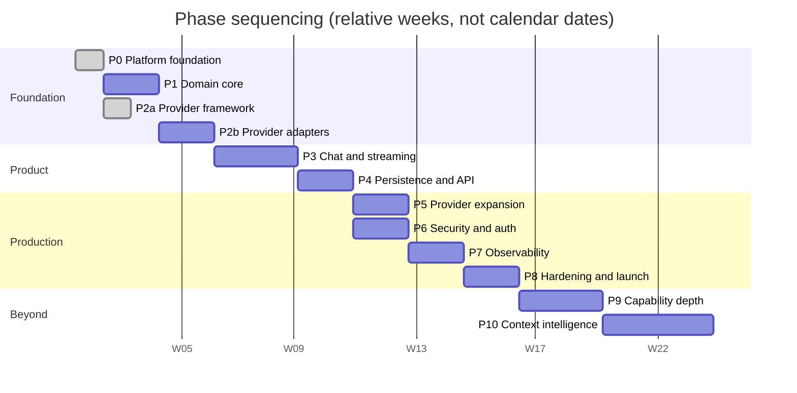

# 14 — Roadmap

## Sequencing principle

Phases are ordered by **what unblocks what**, not by what is most visible.

The consequence is that the first two phases produce nothing a user can see.
That is deliberate: the platform shell and then the domain model, port
definitions, and error taxonomy are the assumptions every later phase builds on.
Getting them wrong and discovering it in Phase 5 means rewriting Phases 2
through 4. Getting them wrong early costs a week.

**Effort is expressed in engineer-weeks for one experienced engineer.** These are
planning estimates, not commitments, and they assume the documentation in this
folder is treated as decided — the estimates do not include re-litigating
architecture during implementation.

*The start date is a placeholder. Only the ordering, the durations, and the
dependencies are meaningful — P5 and P6 both depend on P4 and can run in
parallel, which the chart shows as overlapping bars.*

---

## Phase 0 — Platform foundation ✅ *delivered*

**Effort: 1 week** · **Dependencies: none**

### Why this phase was inserted

The original plan opened with Domain core, on the reasoning that the domain
model is what everything else depends on. Implementation showed that ordering
was half right: the domain layer does come first *conceptually*, but it cannot
be **run**. Routing policy and the context engine are pure functions with no
process around them — no configuration, no logging, no wiring, no way to observe
them, and no health surface to prove the service is up.

Building the domain first would therefore have meant several weeks with nothing
deployable, and every operational concern retrofitted afterwards. Retrofitting
observability and lifecycle management is the specific failure this handbook
exists to prevent: they are the concerns that must be structural rather than
added late.

Phase 0 delivers the runnable shell. It is deliberately empty of business logic.

### Deliverables

| # | Deliverable |
|---|---|
| 0.1 | `src/` restructured to the layout in [16](16-repository-structure.md), with the dependency rule holding |
| 0.2 | Configuration: schema-validated at boot, typed, frozen; secrets wrapped |
| 0.3 | Composition root — explicit, hand-written wiring |
| 0.4 | Structured JSON logger with two-layer credential redaction |
| 0.5 | Error taxonomy: `ErrorKind`, `AppError`, `ProviderError` with the six failure kinds, `UnsupportedCapabilityError` (roadmap item 1.3, pulled forward) |
| 0.6 | Port definitions: `ClockPort`, `LoggerPort`, `CachePort`, `MetricsPort`, `HealthProbePort` |
| 0.7 | Mongo connection: background connect with backoff, never blocking startup |
| 0.8 | Cache: Redis implementation plus the in-process implementation used when Redis is absent |
| 0.9 | Health endpoints: `/live`, `/ready`, `/health`, `/version` |
| 0.10 | Request, correlation, and W3C trace propagation via async local storage |
| 0.11 | Prometheus metrics with an enforced label allowlist |
| 0.12 | Graceful shutdown: unready → drain → close listener → close resources → exit |
| 0.13 | Test suite covering all of the above |

### Risks, and how they landed

| Risk | Outcome |
|---|---|
| A credential leaks through a log line | Mitigated structurally by the `Secret` wrapper plus a redaction filter; asserted by test, including a live boot check that a Mongo password never reaches stdout |
| Liveness and readiness get conflated | Kept separate and tested: with Mongo unreachable, `/live` is 200 and `/ready` is 503 |
| The degraded path is designed but never exercised | The in-memory cache is a real port implementation, so degradation is covered by ordinary tests rather than by inspection |
| Shutdown looks graceful but is not | Caught during implementation: an unref'd drain timer let the process exit mid-drain, skipping resource cleanup. Found by test, fixed, and now regression-covered |

### Acceptance criteria

- [x] `domain/` imports nothing from `application/`, `infrastructure/`, or `interfaces/`
- [x] `process.env` is read only in `config/` and `main.js`
- [x] The service boots and serves `/live` with every dependency unreachable
- [x] `/ready` reports 503 for a failed critical dependency, 200-degraded for a non-critical one
- [x] SIGTERM drains and exits zero, closing every resource in order
- [x] No credential appears in any log line, asserted by test and by a live boot check
- [x] Full suite green

### What this phase deliberately does not contain

No providers, no router, no streaming, no context engine, no conversations, no
AI endpoints. Those are Phases 1–4 below. Phase 0 is the process they will run
inside.

---

## Phase 1 — Domain core

**Effort: 2 weeks** · **Depends on: Phase 0**

### Objectives

Establish the pure domain layer and the architectural boundaries everything else
depends on. No I/O, no framework, no providers.

### Deliverables

| # | Deliverable |
|---|---|
| 1.1 | *(delivered in Phase 0 — structure, ports, error taxonomy)* |
| 1.2 | Domain entities: `Thread`, `Message`, `ModelDescriptor`, `ConversationSettings` |
| 1.3 | *(delivered in Phase 0)* |
| 1.4 | Remaining port interfaces: `ThreadRepositoryPort`, `RetrievalPort` (`CachePort`, `ClockPort`, `LoggerPort` in Phase 0; `ProviderPort` in Phase 2a) |
| 1.5 | *(delivered in Phase 2a — capability model, registry, matching)* |
| 1.6 | `RoutingPolicy` — pure ranking and decision logic |
| 1.7 | *(delivered in Phase 2a as `ProviderState`, which merges the breaker with the lifecycle — see [03](03-provider-system.md#one-state-object-not-two))* |
| 1.8 | Context engine: assembly, budgeting, trimming, token estimation |
| 1.9 | Model catalog data for the Phase 1 eight (the registry that holds it landed in Phase 2a) |
| 1.10 | ESLint architecture rules enforcing dependency direction |
| 1.11 | Unit tests: all 20 routing decisions, all trimming invariants, all breaker transitions |

### Risks

| Risk | Impact | Mitigation |
|---|---|---|
| Port interfaces designed wrong; discovered in Phase 2 | High — every adapter changes | Write one throwaway adapter against the draft port before finalising it |
| The team treats the restructure as optional and keeps the old layout | High — the whole architecture is aspirational | Lint rules land in the same PR as the structure, so violations fail CI on day one |
| Over-engineering the domain before real requirements | Medium — wasted effort | Every domain type must be required by a decision already documented here. Speculative types are rejected in review |

### Acceptance criteria

- [ ] `domain/` has zero imports from `application/`, `infrastructure/`, `interfaces/` — enforced by CI
- [ ] The full unit suite runs in under 2 seconds
- [ ] All 20 routing decisions from [04](04-router.md) pass as numbered tests
- [ ] Domain-layer coverage ≥ 90%
- [ ] `RoutingPolicy` can be exercised with zero fixtures, zero mocks, and zero I/O

---

## Phase 2 — Provider layer

**Effort: 3 weeks** · **Depends on: Phase 1**

> **Split during implementation.** The framework and the integrations turned out
> to be separable, and separating them is strictly better: the framework can be
> proven against a mock before any real API is touched, so a contract bug is
> found once rather than eight times.
>
> **2a — Framework ✅ delivered.** Interface, capability model, registries,
> discovery/loader/factory, state machine, health manager, manager, mock
> adapter, contract suite. No network calls exist in the codebase.
>
> **2b — Integrations.** The eight adapters, the OpenAI-dialect base, the shared
> HTTP client, and the transport half of the contract suite.

### Objectives

Implement all eight Phase 1 providers behind `ProviderPort`, plus the factory,
registry, health system, and the shared contract test suite.

### Deliverables

| # | Deliverable |
|---|---|
| 2.0a | ✅ Capability model, capability registry, model registry, provider descriptor |
| 2.0b | ✅ `ProviderPort` + `BaseProvider`, with every capability defaulting to `UnsupportedCapabilityError` |
| 2.0c | ✅ `ProviderState` — lifecycle and circuit breaker as one clock-injected machine |
| 2.0d | ✅ Discovery, loader, factory, registry, health manager, manager |
| 2.0e | ✅ Mock adapter and the framework half of the contract suite |
| 2.1 | Shared HTTP client: timeout, retry with jitter, cancellation, error mapping |
| 2.2 | `OpenAIDialectProvider` base — request building, SSE parsing, error mapping |
| 2.3 | Seven OpenAI-dialect adapters: Groq, DeepSeek, Qwen, Mistral, OpenRouter, Zhipu, NVIDIA |
| 2.4 | Gemini adapter (bespoke SDK) |
| 2.5 | `ProviderFactory` — config-driven construction |
| 2.6 | `ProviderRegistry` — instances, breaker state, latency samples, status projection |
| 2.7 | Health monitor — passive recording plus active probes for suspect providers |
| 2.8 | **The shared contract suite** — transport cases added to the framework cases, × 8 adapters |
| 2.9 | Recorded fixtures captured from live APIs, credentials scrubbed |
| 2.10 | Configuration schema and boot-time validation |

### Risks

| Risk | Impact | Mitigation |
|---|---|---|
| A provider's real error behaviour differs from its documentation | High — misclassification breaks routing | Live verification is a mandatory onboarding step ([03](03-provider-system.md#provider-onboarding-process)); fixtures are captured, never hand-written |
| A free tier changes terms or disappears mid-phase | Medium | Eight providers means one loss is absorbable; the contract suite makes replacement cheap |
| The shared base class over-fits the first adapter written | Medium — later adapters fight it | Implement three dialect adapters before extracting the base |
| SSE frame-splitting bug ships undetected | High — intermittent missing content | Contract case 15 is mandatory and split-chunk mocks are required |

### Acceptance criteria

- [ ] All eight adapters pass all 20 contract cases
- [ ] Cancellation propagates to the upstream socket within 100 ms, verified per adapter
- [ ] No raw SDK error escapes any adapter, asserted by test
- [ ] No error message contains a credential fragment, asserted by test
- [ ] The service boots with zero provider keys and reports its configuration clearly
- [ ] A live verification run against all eight providers is documented and signed off

---

## Phase 3 — Chat and streaming

**Effort: 3 weeks** · **Depends on: Phase 2**

### Objectives

Deliver the core product path: a message goes in, a routed streaming answer comes
out, with working failover.

### Deliverables

| # | Deliverable |
|---|---|
| 3.1 | `SendMessage` use case — non-streaming |
| 3.2 | `StreamMessage` use case — streaming with per-attempt buffering |
| 3.3 | `RoutingExecutor` — invoke, observe, retry, fail over |
| 3.4 | `StreamEvent` protocol and the SSE serialiser |
| 3.5 | Cancellation path, end to end |
| 3.6 | Backpressure handling and the overflow limit |
| 3.7 | Keep-alive pings |
| 3.8 | Context assembly wired into the chat path |
| 3.9 | All three switch policies |
| 3.10 | Streaming and failure test suites ([12](12-testing.md)) |

### Risks

| Risk | Impact | Mitigation |
|---|---|---|
| Mid-stream failover concatenates two models' output | **Critical** — visibly broken output | Per-attempt buffer reset is an explicit test with a dedicated assertion |
| Cancellation does not reach the provider | High — silent quota burn | Asserted in the contract suite and again end to end |
| Stream readers leak on early exit | High — connection exhaustion under load | `finally`-block release is a contract case; verified by the load test |
| Backpressure mishandled; memory grows unbounded | High — out-of-memory kills | Slow-consumer and stopped-consumer load scenarios |

### Acceptance criteria

- [ ] A streaming chat works end to end against at least three real providers
- [ ] Killing the primary provider mid-stream produces a clean switch with no concatenation
- [ ] Client disconnect aborts upstream within 100 ms and persists nothing
- [ ] 100 concurrent streams for 10 minutes: memory stable, no leaks
- [ ] Every scenario in [12](12-testing.md#streaming-tests) passes

---

## Phase 4 — Persistence and API

**Effort: 2 weeks** · **Depends on: Phase 3**

### Objectives

Durable conversations and the public HTTP contract the frozen frontend consumes.

### Deliverables

| # | Deliverable |
|---|---|
| 4.1 | Mongo repositories implementing the repository ports |
| 4.2 | Schemas and indexes per [08](08-storage.md) |
| 4.3 | Thread CRUD, settings, duplicate, share |
| 4.4 | Cursor pagination |
| 4.5 | REST controllers for every endpoint in [09](09-api-design.md) |
| 4.6 | Zod validation schemas |
| 4.7 | Generated OpenAPI 3.1 spec, committed and CI-verified |
| 4.8 | Error envelope and status mapping |
| 4.9 | Usage records written per provider call |
| 4.10 | Frontend compatibility verified against the frozen client |

### Risks

| Risk | Impact | Mitigation |
|---|---|---|
| API contract does not match what the frozen frontend expects | High — visible breakage | Contract verified against the real frontend before the phase closes |
| Missing or wrong indexes surface only at data volume | Medium | Every documented query has a test asserting index usage via `explain()` |
| Thread documents approach the BSON limit | Low now, high later | The overflow design exists ([08](08-storage.md)); implement the counter and the threshold check now, the archive move later |

### Acceptance criteria

- [ ] The frozen frontend works end to end with no frontend changes
- [ ] Every documented query uses an index, verified by `explain()`
- [ ] Cursor pagination is stable while data changes underneath it
- [ ] The committed OpenAPI spec matches the generated one in CI
- [ ] Mongo down: the catalog still serves; chat returns a clear error

---

## Phase 5 — Provider expansion

**Effort: 2 weeks** · **Depends on: Phase 4** · *Can run in parallel with Phase 6*

### Objectives

Prove the onboarding process is genuinely cheap by exercising it, and close the
capability gaps identified in [05](05-capability-matrix.md#coverage-analysis--why-this-set-is-sufficient).

### Deliverables

| # | Deliverable |
|---|---|
| 5.1 | **A second large-context provider** — closes the Gemini-only single point of failure above 256K |
| 5.2 | Bring pre-existing adapters outside the Phase 1 eight up to contract, or remove them ([ADR-013](15-decisions.md#adr-013--handling-adapters-that-predate-this-plan)) |
| 5.3 | Ollama support for local inference |
| 5.4 | User-supplied keys (BYOK) with envelope encryption |
| 5.5 | Dark-launch mechanism and the promotion gate |
| 5.6 | Provider onboarding guide validated by a dry run |

### Risks

| Risk | Impact | Mitigation |
|---|---|---|
| Onboarding turns out to cost days, not hours | Medium — invalidates a core design claim | Treat it as a design defect: fix the abstraction, do not absorb the cost |
| A user's bad key opens the shared breaker for everyone | High | Per-user key failures are isolated from the shared breaker ([10](10-security.md#rules-for-user-supplied-keys)) |
| Provider count grows past what can be maintained | Medium | Every provider needs an ADR justifying what it adds; redundancy alone is not enough |

### Acceptance criteria

- [ ] An engineer unfamiliar with the codebase adds an OpenAI-dialect provider in under one hour using only the documentation
- [ ] Every capability has at least two providers, including large context
- [ ] BYOK keys are encrypted at rest and never retrievable through the API
- [ ] Every shipped adapter passes the full contract suite

---

## Phase 6 — Security and authentication

**Effort: 2 weeks** · **Depends on: Phase 4**

### Objectives

Make the platform safe to expose publicly.

### Deliverables

| # | Deliverable |
|---|---|
| 6.1 | JWT authentication: RS256, access plus rotating refresh |
| 6.2 | Argon2id password hashing; registration and login |
| 6.3 | Resource ownership enforced at the repository layer |
| 6.4 | Rate limiting: per user, per IP, per provider, token budgets |
| 6.5 | The `Secret` wrapper type and the log redaction filter |
| 6.6 | Envelope encryption for user keys |
| 6.7 | Audit logging, append-only at the database role level |
| 6.8 | Input validation hardening; SSRF and NoSQL-injection defences |
| 6.9 | `gitleaks`, dependency audit, and CodeQL in CI |
| 6.10 | Threat model reviewed and signed off |

### Risks

| Risk | Impact | Mitigation |
|---|---|---|
| An authorization check is forgotten on a new endpoint | **Critical** — cross-user data access | Ownership is enforced in the repository query, so a forgotten check returns nothing rather than someone else's data |
| Keys leak through a path nobody anticipated | **Critical** | Structural defences ([10](10-security.md#structural-defences-against-leakage-t1)) rather than review vigilance |
| Rate limits too tight; legitimate users blocked | Medium | Limits are configurable; the first month is monitored and tuned |

### Acceptance criteria

- [ ] No endpoint returns another user's data — verified by an automated IDOR test across every endpoint
- [ ] No log line, error response, or API response contains a credential — verified by test
- [ ] Auth rate limits fail closed when Redis is down; chat limits fail open
- [ ] The audit log cannot be modified by the application's database role
- [ ] Zero high or critical dependency advisories

---

## Phase 7 — Observability

**Effort: 2 weeks** · **Depends on: Phase 6**

### Objectives

Make the system diagnosable in production.

### Deliverables

| # | Deliverable |
|---|---|
| 7.1 | Structured logging with trace-id correlation |
| 7.2 | OpenTelemetry tracing with tail-based sampling |
| 7.3 | Prometheus metrics: request, provider, routing, context |
| 7.4 | Provider, health, cost, and context dashboards |
| 7.5 | Alert rules with runbooks for every paging alert |
| 7.6 | Cost attribution from measured token counts |
| 7.7 | Log redaction verified end to end |

### Risks

| Risk | Impact | Mitigation |
|---|---|---|
| Prompt content leaks into telemetry | **Critical** | Content logging is off by default and is an audited operator action |
| Metric cardinality explodes | Medium — cost | Label allowlist enforced in the metrics wrapper, not by convention |
| Alert fatigue from over-alerting | High — real alerts get ignored | Alert on symptoms users feel; a single provider failing never pages |

### Acceptance criteria

- [ ] One trace id reconstructs a full request across all layers, including every failover attempt
- [ ] `routing.decided` explains any routing outcome without further investigation
- [ ] Every paging alert has a linked, tested runbook
- [ ] Observability cost is under 10% of infrastructure cost
- [ ] A synthetic incident is diagnosed end to end using only dashboards and logs

---

## Phase 8 — Hardening and launch

**Effort: 2 weeks** · **Depends on: Phase 7**

### Objectives

Prove the system survives production conditions, then run it.

### Deliverables

| # | Deliverable |
|---|---|
| 8.1 | Production container image: non-root, read-only root, minimal |
| 8.2 | Graceful shutdown with stream draining |
| 8.3 | Docker Compose for development; production deployment manifests |
| 8.4 | CI/CD with staging, approval, rolling deploy, automatic rollback |
| 8.5 | Load testing to target ([12](12-testing.md#load-testing)) |
| 8.6 | Chaos exercises, all five |
| 8.7 | Backup and verified restore |
| 8.8 | All runbooks written and rehearsed |
| 8.9 | Public documentation and contribution guide |

### Risks

| Risk | Impact | Mitigation |
|---|---|---|
| Load balancer buffers SSE; streaming silently broken in production | High — core feature appears broken | An explicit LB checklist ([13](13-deployment.md#load-balancer-requirements--the-streaming-specific-ones)) verified in staging |
| A memory leak appears only at sustained load | High | 10-minute sustained load test with memory assertions |
| Restore procedure does not work | **Critical** | Rehearsed before launch, then monthly |

### Acceptance criteria

- [ ] All five chaos exercises pass
- [ ] Sustained load at target with stable memory and acceptable event-loop lag
- [ ] Zero-downtime rolling deploy demonstrated, including under active streams
- [ ] Backup restored to a scratch environment and smoke-tested
- [ ] Every degradation-matrix row verified in staging

---

## Phase 9 — Capability depth

**Effort: 3 weeks** · **Depends on: Phase 8**

### Objectives

Extend beyond text chat along the capability axis
([01](01-system-overview.md#future-expansion-strategy), Axis 2).

### Deliverables

Vision (image attachments, capability-aware routing); native PDF input; tool
calling as a first-class request path; embeddings endpoint; structured output
with schema enforcement and validation.

### Risks

| Risk | Mitigation |
|---|---|
| Attachments become an SSRF and resource-exhaustion vector | Allowlisted URLs, private ranges blocked, size and count caps, MIME sniffing |
| Tool calling drifts toward tool *execution* | Execution stays out of scope; the boundary is stated in the phase definition |
| Vision requests exhaust the small pool of vision providers | Capability-fit ranking plus per-capability rate limits |

### Acceptance criteria

- [ ] A vision request routes only to vision-capable models and fails over between them
- [ ] Tool-call responses are normalised identically across every tool-capable provider
- [ ] Schema-enforced output is validated server-side before it reaches the client

---

## Phase 10 — Context intelligence

**Effort: 4 weeks** · **Depends on: Phase 9**

### Objectives

Improve answer quality by improving context
([01](01-system-overview.md#future-expansion-strategy), Axis 3).

### Deliverables

Automatic conversation compression; long-term memory extraction; RAG with a
vector store chosen against a real workload; prompt-prefix caching exploiting the
stable-first injection order ([06](06-context-engine.md#injection-order-and-why-it-is-fixed));
resumable streams if `stream_disconnect_rate` justifies them.

### Risks

| Risk | Mitigation |
|---|---|
| Compression loses something users needed | Non-destructive by design; originals retained; the context report shows what changed |
| RAG retrieves irrelevant content and degrades answers | Relevance thresholds; retrieval is budgeted; A/B measured before default-on |
| The vector store is chosen wrong and must be migrated | The decision is deliberately deferred until a real corpus and query pattern exist |

### Acceptance criteria

- [ ] Compression maintains answer quality on a held-out evaluation set
- [ ] Retrieved context is attributed and visible in the context report
- [ ] Prompt caching produces a measurable latency and cost reduction

---

## Cross-phase risks

| Risk | Impact | Mitigation |
|---|---|---|
| **A free tier is withdrawn or its terms change** | High — the zero-cost premise weakens | Eight providers with overlapping capabilities; adding a replacement is hours of work; terms are reviewed quarterly |
| **A provider changes its API without notice** | Medium | Nightly live tests catch drift within 24 h; adapters are isolated |
| **Scope creep from "just one more provider"** | Medium — dilutes depth | Every provider needs an ADR stating what it adds; redundancy alone does not qualify |
| **Documentation drifts from implementation** | High — this handbook stops being trustworthy | Decisions are amended here *before* implementation; a PR that contradicts a document must update it |
| **The architecture is abandoned under delivery pressure** | **Critical** | Lint rules make violations fail CI rather than depending on discipline |
| **A single maintainer becomes a bottleneck** | Medium | The onboarding dry-run in Phase 5 is a real test of whether the documentation stands alone |

## What is deliberately not on this roadmap

| Not planned | Why |
|---|---|
| Fine-tuning or training | Out of scope ([01](01-system-overview.md#scope)) |
| An OpenAI-compatible public API | [ADR-012](15-decisions.md#adr-012--novagpt-does-not-expose-an-openai-compatible-public-api) |
| Autonomous agent loops | Tool execution is a separate trust and sandboxing problem |
| Billing and payments | No requirement yet; the data model does not preclude it |
| Mobile or desktop clients | The frontend is frozen; this is a backend plan |
| Microservice decomposition | [ADR-003](15-decisions.md#adr-003--modular-monolith-over-microservices). Revisit only when a component's scaling profile genuinely diverges |
